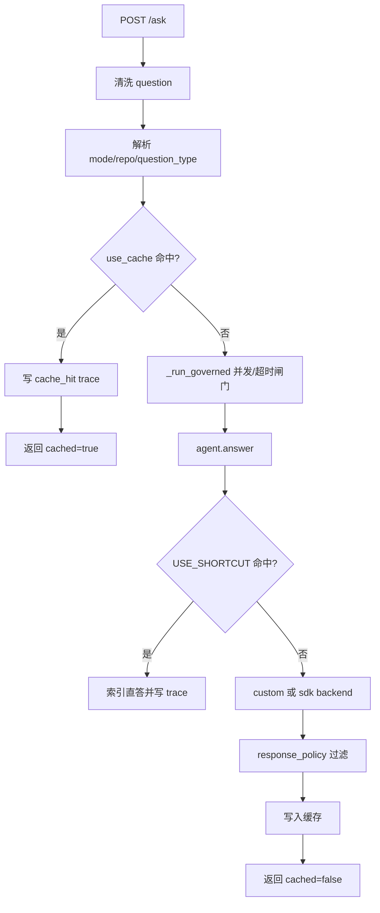
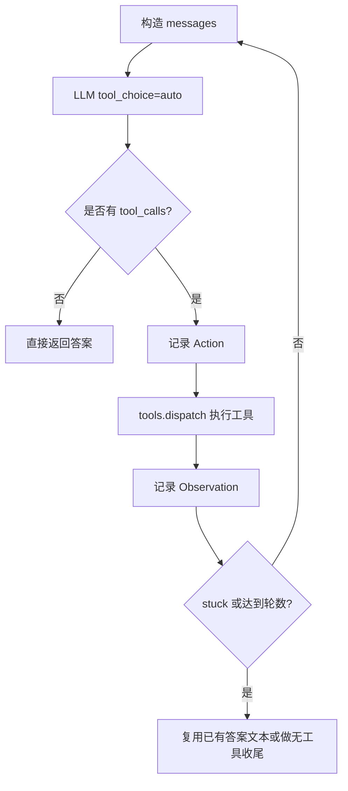
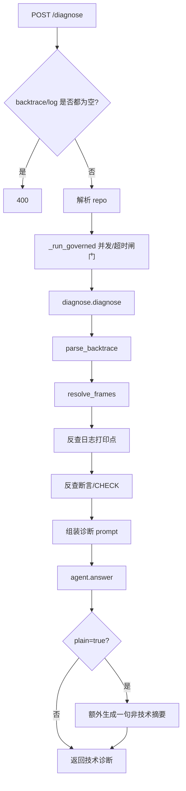

# `/ask` 与 `/diagnose` 处理链路

本文档说明当前服务如何处理自然语言提问、crash 堆栈、宕机日志，以及 `/ask`
什么时候看代码、什么时候使用知识图谱。

## 总体结论

`/ask` 不是在“代码”和“知识图谱”之间二选一。

当前链路是：

1. 先按请求参数确定 `repo`、回答模式和问题类型。
2. 满足缓存或 shortcut 时直接返回，不进入完整 Agent loop。
3. 进入完整 Agent loop 时，先把知识图谱、模块知识卡、仓库概览等上下文注入
   system prompt。
4. 模型再按问题决定是否调用代码工具，例如 `repo_overview`、`grep_code`、
   `find_symbol`、`read_file`、`find_assert_context`、`find_log_source`。
5. `technical` / `edit` 答案会追加确定性的 `关键线索`，列出命中的知识卡、文件、符号、日志和断言；`plain` 答案默认隐藏这些内部线索，只给渐进式纲要。

因此，知识图谱是“开局导航”，代码工具是“按需核实”。当前实现没有硬编码强制
每个 `/ask` 都必须读代码；是否读代码由 Agent loop 中的模型工具调用决定。

## `/ask` 入口

入口实现：`server/app.py` 的 `ask()`。

请求字段：

| 字段 | 作用 |
|------|------|
| `question` | 用户问题，空字符串直接返回“问题不能为空”。 |
| `use_cache` | 是否启用进程内 LRU 答案缓存。 |
| `mode` | 回答模式：`plain`、`technical`、`edit`。 |
| `repo` | 目标代码库，来自 `CODE_REPOS`。 |
| `question_type` | 问题类型覆盖值；为空时自动识别。 |

处理流程：

### 什么时候不看代码

以下情况不会进入完整代码检索：

| 场景 | 行为 |
|------|------|
| 空问题 | 直接返回固定提示。 |
| `/ask` 缓存命中 | 返回缓存答案，只写 `cache_hit` trace，不占并发槽，不调 LLM。 |
| `USE_SHORTCUT=1` 且命中精确符号定义问题 | 通过索引直接回答“某符号定义在哪里”，跳过 LLM loop。 |
| 模型直接回答 | 进入了 Agent loop，但首轮 LLM 没有发起 tool call，直接返回回答。 |

最后一类是当前需要注意的边界：如果问题很泛，或者知识卡内容已经足够，模型可能
直接回答。系统提示词要求“结论必须继续用工具核实”，但这是提示词约束，不是代码级
硬性门禁。

### 什么时候使用知识图谱

进入完整 Agent loop 后，只要 `CODE_KNOWLEDGE_MAP_ENABLED=1`，系统会尝试加载
`docs/code-knowledge/<repo>/` 和 `docs/code-knowledge/common/` 下的知识卡，构造
“代码知识库地图”并注入 system prompt。

知识图谱注入规则：

| 条件 | 行为 |
|------|------|
| 没有知识卡 | 不注入知识图谱文本。 |
| 有知识卡且开关开启 | 调用 `knowledge_graph.format_map_for_prompt()`。 |
| 有卡片匹配问题关键词 | 优先注入匹配卡片，最多 `CODE_KNOWLEDGE_MAP_MAX_CARDS` 张。 |
| 匹配卡片不足 | 用其他卡片补齐到上限，作为导航候选。 |
| `CODE_KNOWLEDGE_MAP_ENABLED=0` | 不注入知识图谱。 |

图谱摘要只包含稳定导航信息，例如：

- `title`
- `type`
- `description`
- `resource`
- `symbols`
- `logs`
- `asserts`
- `question_types`
- `part_of`
- `supplements`
- `contradicts`
- `supersedes`
- `depends_on`

它不会替代代码读取。注入文本中明确写着：结论必须继续用工具核实。

### 什么时候使用模块知识卡正文

除了图谱摘要，`/ask` 还会调用 `module_knowledge.format_for_prompt(question)`。

模块知识卡规则：

| 条件 | 行为 |
|------|------|
| 问题为空 | 不召回模块知识卡。 |
| 卡片与问题得分为 0 | 不注入该卡。 |
| 有相关卡片 | 注入最多 3 张卡片正文。 |
| 单张卡片过长 | 截断到约 2600 字符。 |

这部分比图谱摘要更“重”，会把知识卡正文作为稳定框架或排查手册提供给模型。

### 什么时候看代码

代码读取发生在 Agent loop 中的工具调用阶段。

常见触发：

| 问题类型 | 期望工具行为 |
|----------|--------------|
| `crash_stack` | `resolve_frame`、`read_file`，读取栈帧上下文。 |
| `outage_log` | `find_assert_context` 或 `find_log_source`，再 `read_file` 追错误分支。 |
| `feature_impl` | `repo_overview`、`glob`、`grep_code`、`find_symbol`、`read_file`。 |
| `config_impl` | `glob` 找配置文件，`grep_code` 查字段/表名，`read_file` 看加载和使用点。 |
| `general` | 先判断更像哪类问题，再低成本缩小范围。 |

实际调用由模型决定。一次 `/ask` 可能：

- 只用知识上下文后直接回答；
- 先看知识图谱，再查代码；
- 多轮查代码；
- 查到重复工具调用后触发 stuck 检测并收尾；
- 达到最大轮数后用已有观察结果总结。

### Agent loop

默认 custom backend 的核心实现是 `code_agent/core/agent.py` 的 `CodeAgent`。

每轮逻辑：

`messages` 的 system 部分按顺序追加：

1. 当前回答模式的基础 prompt。
2. `question_intent.prompt()` 生成的问题类型最佳实践。
3. 仓库概览 `repo_profile`。
4. 知识图谱摘要。
5. 命中的模块知识卡正文。
6. 命中的 Assert 结构化排障知识，来自
   `docs/code-knowledge/<repo>/asserts/assert-catalog.json`。
7. 动态问答沉淀召回内容，只有 `USE_KNOWLEDGE=1` 时启用。

### `/ask` 与知识沉淀

当 `USE_KNOWLEDGE=1` 时，`CodeAgent.run()` 会在回答后尝试把本次问答和引用文件
写入动态知识库。这个 flywheel 默认关闭，与版本化 Markdown 知识卡不同。

版本化知识卡默认参与 `/ask`：

- 路径：`docs/code-knowledge/<repo>/`
- 开关：`CODE_KNOWLEDGE_MAP_ENABLED`
- 用途：稳定模块框架、排查手册、图谱导航

动态问答沉淀默认不参与：

- 路径：`index/knowledge.db`
- 开关：`USE_KNOWLEDGE`
- 用途：运行期积累问答经验，命中后作为线索召回

## `/diagnose` 入口

入口实现：`server/app.py` 的 `diagnose_endpoint()`。

请求字段：

| 字段 | 作用 |
|------|------|
| `backtrace` | crash 栈；可以为空，但不能和 `log` 同时为空。 |
| `log` | 相关日志片段。 |
| `plain` | 是否额外返回一句非技术摘要。 |
| `repo` | 目标代码库，来自 `CODE_REPOS`。 |

处理流程：

`/diagnose` 和 `/ask` 的关键区别：

| 维度 | `/ask` | `/diagnose` |
|------|--------|-------------|
| 输入 | 自然语言问题 | backtrace + log |
| 缓存 | 支持 `use_cache` | 不使用答案缓存 |
| 问题类型 | 支持 `question_type` 覆盖或自动识别 | 先由诊断模块构造 prompt，再进入 `agent.answer` |
| 预处理 | 不预解析代码线索 | 先解析栈帧、日志打印点、断言位置 |
| 返回字段 | `answer`、`cached` | `answer`、`frames`、`resolved`、`total_frames`、`plain` |
| 回答策略 | 按请求 `mode` 执行 | 强制按 technical policy 保留文件、函数、行号 |

### `/diagnose` 如何看代码

`/diagnose` 在调用 Agent 之前会先做确定性预解析：

1. `parse_backtrace()` 解析 gdb 风格栈帧。
2. `resolve_frames()` 用符号索引把函数名映射到候选代码位置。
3. `find_log_source()` 把日志文本反查到打印点。
4. `find_assert_context()` 把 ASSERT/CHECK/断言失败反查到断言上下文。
5. 若 Assert 知识库命中，会附加对应问题、上下文、原因和排查/修复步骤。
6. 把这些候选位置放入诊断 prompt。
7. 再调用 `agent.answer()` 继续分析，必要时仍可调用工具读代码。

因此，`/diagnose` 比 `/ask` 更偏“先定位再分析”，适合 crash 堆栈和宕机日志。

## 选型建议

| 用户输入 | 推荐入口 | 原因 |
|----------|----------|------|
| “这个功能怎么实现？” | `/ask`，`question_type=feature_impl` | 需要按模块入口、调用链和数据结构调查。 |
| “这个配置怎么配？字段含义是什么？” | `/ask`，`question_type=config_impl` | 需要找配置来源、加载链路和运行时使用点。 |
| “这里有一段错误日志，帮我定位” | `/ask` 或 `/diagnose` | 单纯日志可用 `/ask`；要返回结构化诊断字段时用 `/diagnose`。 |
| “这里有 core/backtrace” | `/diagnose` | 会先解析栈帧和候选代码位置。 |
| “某个符号在哪里定义？” | `/ask` | shortcut 可能直接用索引回答。 |

## 当前边界

- `/ask` 的知识图谱注入是确定性的，但代码工具调用是模型决策。
- `/ask` 缓存是进程内 LRU，服务重启后清空。
- `/ask` 缓存 key 包含 `repo`、`mode`、`question_type`、`question`。
- `/diagnose` 不使用答案缓存。
- `/diagnose plain=true` 会多一次模型调用。
- 栈帧、日志、断言定位质量依赖索引和知识卡元数据；行号漂移时应优先看符号、
  函数名、日志短语和周边上下文。
- 知识卡是线索，不是最终事实；用户问具体代码行为时，答案应尽量绑定当前代码位置。

## 相关文件

| 文件 | 作用 |
|------|------|
| `server/app.py` | HTTP 入口、缓存、并发闸门、repo/mode 解析。 |
| `code_agent/core/agent.py` | `agent.answer()`、custom Agent loop、知识注入、工具调用、trace。 |
| `code_agent/core/question_intent.py` | 问题类型识别和各类型最佳实践 prompt。 |
| `code_agent/diagnostics/diagnose.py` | backtrace/log/assert 预解析和诊断 prompt。 |
| `code_agent/kb/knowledge_graph.py` | OKF-style 知识卡读取、图谱构建、卡片打分、prompt 摘要。 |
| `code_agent/kb/module_knowledge.py` | 模块知识卡正文召回和 system prompt 注入。 |
| `docs/code-knowledge/` | 版本化代码知识库。 |
