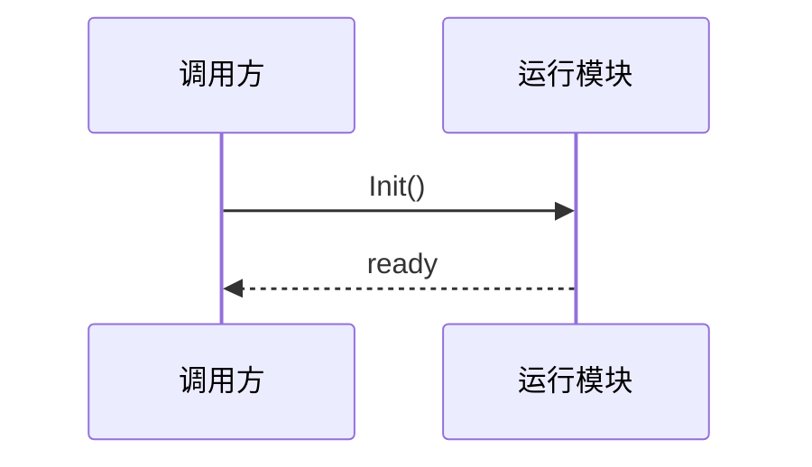

# 代码知识库规范与落地计划

## 目标

代码知识库用于沉淀稳定的模块框架、配置链路、日志/断言排查手册和跨仓库关系，避免
code-agent 每次回答都从零遍历代码。它服务四类高频问题：

- 程序 crash 堆栈：快速定位栈帧所属模块、生命周期、常见空指针/状态错误。
- 宕机/错误日志：用日志关键字、assert/check 文案命中模块卡，再反查打印点和上下文。
- 功能实现：先给模块地图和入口，再用工具核实调用链。
- 配置实现：先给配置表、加载类、运行时使用点，再核实字段和数据流。

## 与 OKF 的关系

采用 **OKF-compatible 子集 + 代码扩展字段**。

保留 OKF 的核心优点：

- 每个概念是一份 UTF-8 Markdown 文件。
- 文件顶部使用 YAML frontmatter，正文使用结构化 Markdown。
- 文件可进入 git，支持 diff、review、blame。
- 通过 Markdown 链接表达模块之间的关系。
- `index.md` 用于渐进导航，避免一次性加载全量知识。

不原样照搬 OKF 的原因：

- OKF 面向通用知识/数据资产目录，代码问答需要额外字段来匹配符号、日志、断言和问题类型。
- 当前实现的模块知识卡读取器还是轻量解析器，不依赖完整 YAML 库；frontmatter 要保持简单。
- 代码知识卡必须持续提示“具体结论仍需用工具核实”，不能把卡片当作最终事实。

## OKF-style 标准

这里的 OKF-style 不是完整复制上游 OKF v0.1，而是固定一组可执行约定：

### 知识包 Bundle

`docs/code-knowledge/<repo>/` 是一个知识包。它包含多个 Markdown 概念文件和一个可选
`index.md`。整个目录可被 git review、被前端浏览、被 agent 召回。

### 概念 Concept

每个非保留 `.md` 文件是一条概念。概念可以是：

- `Code Module`：代码模块，如场景、关卡、Buff、ECS。
- `Config Chain`：配置链路，如怪物技能配置、tableload。
- `Code Playbook`：从优秀问答沉淀的排查手册。
- `Reference`：外部或跨模块参考资料。

概念 ID 当前使用文件名，例如 `combat-framework.md`。如果未来改成分层目录，概念 ID
会使用 bundle 内相对路径。

### 实体 Entity

实体是概念正文或 header 中被描述的具体对象。代码知识库常见实体：

- 模块路径：`gameserver/combat`
- 类/函数/符号：`CombatEnemy`、`SkillConfig::GetEnemySkillConfigX`
- 配置表/字段：`SkillListForEnemy`、`SkillStatisticsID`
- 日志/断言：`enemy conf skill`、`CHECK_COND(false)`
- 资源路径：`gameserver/unit/enemy.cpp`

第一阶段实体不单独建文件；它们记录在 frontmatter 字段和正文里。图谱会把概念和标签可视化，
后续可把高价值实体提升为单独节点。

### 关系 Relation

关系有两种来源：

- 显式关系：Markdown 内部链接，例如 `[单位、属性与技能](unit-skill-attr.md)`。
- 派生关系：frontmatter 中的 tags、resource、symbols 等字段。

当前图谱落地十二类边：

- `links_to`：概念通过 Markdown 内部链接指向另一个概念。
- `tagged_with`：概念带有某个 tag。
- `owns_symbol`：概念声明关键类、函数或类型。
- `emits_log`：概念声明常见日志关键字或错误文本。
- `checks_assert`：概念声明常见断言、CHECK 或错误条件。
- `answers_question_type`：概念声明适用问题类型。
- `documents_resource`：概念声明主要模块路径或代码资源。
- `part_of`：A 是 B 的组成部分。
- `supplements`：A 补充 B 的细节、示例或背景。
- `contradicts`：A 与 B 存在冲突，需要人工复核。
- `supersedes`：A 取代 B，B 不再是最新有效信息。
- `depends_on`：理解 A 需要先了解 B。

### 文件 Header / Frontmatter

每个概念文件应以 YAML-like frontmatter 开头：

```yaml
---
type: Code Module
title: 战斗框架
description: 战斗模块地图。覆盖目标、伤害、战斗单位。
repo: marvel
module: gameserver/combat
resource: gameserver/combat
tags: combat, battle, unit, skill
symbols: XCombat, CombatUnit, SkillMgr
logs: Combat, UnitLogErr
asserts: CHECK_COND
question_types: crash_stack, outage_log, feature_impl, config_impl
depends_on: tableload-config.md, unit-skill-attr.md
supplements: monster-config.md
updated_at: 2026-06-18
---
```

前端卡片预览会展示 header；agent 召回会读取 `title/tags/body`，后续索引会读取更多字段。
语义关系字段可直接写卡片文件名或相对路径；当前只对已存在的知识卡片建边。

## 文件布局

当前落地使用平铺目录：

```text
docs/code-knowledge/
  common/
  marvel/
    index.md
    gameserver-overview.md
    combat-framework.md
    ...
```

后续如果需要更强 OKF 兼容，可演进为分层目录：

```text
docs/code-knowledge/marvel/
  index.md
  gameserver/
    index.md
    combat.md
    scene.md
  ecs/
    index.md
    xecs-runtime.md
```

## Frontmatter

推荐字段：

```yaml
---
type: Code Module
title: 战斗框架
description: 战斗管理、目标选择、伤害效果和战斗单位的模块地图
repo: marvel
module: gameserver/combat
resource: gameserver/combat
tags: combat, battle, unit, skill
symbols: XCombat, CombatUnit, SkillMgr
logs: Combat, UnitLogErr
asserts: CHECK_COND
question_types: crash_stack, outage_log, feature_impl, config_impl
updated_at: 2026-06-18
---
```

字段约定：

| 字段 | 用途 |
|------|------|
| `type` | 卡片类型，如 `Code Module`、`Code Playbook`、`Config Chain` |
| `title` | UI 展示名和 prompt 注入标题 |
| `description` | 短摘要，用于索引、列表和召回片段；优先用 1-2 个短句，避免长句 |
| `repo` | 对应 `CODE_REPOS` 里的 repo 名 |
| `module` | 模块路径或逻辑模块名 |
| `resource` | 主要代码路径 |
| `tags` | 召回关键词；当前解析器支持逗号分隔和 `[a, b]` |
| `symbols` | 关键类/函数/类型名，供人工维护和后续索引增强 |
| `logs` | 常见日志关键词 |
| `asserts` | 常见断言/check 关键词 |
| `question_types` | 适用问题类型 |
| `part_of` | 本卡属于哪些上层知识卡 |
| `supplements` | 本卡补充哪些知识卡 |
| `contradicts` | 本卡与哪些知识卡存在冲突 |
| `supersedes` | 本卡取代哪些旧知识卡 |
| `depends_on` | 阅读本卡前建议先了解哪些知识卡 |
| `updated_at` | 人工更新日期 |

## 正文模板

```md
# 模块名

## 卡片说明

| 项 | 内容 |
| --- | --- |
| 用途 | 回答哪些问题。 |
| 覆盖范围 | 只写本卡覆盖的模块。 |
| 不覆盖 | 明确排除项。 |
| 使用要求 | 具体结论需工具核实。 |

## 入口文件

## 核心职责

## 关键流程

## 配置与数据来源

## 常见日志/断言

## 常见提问

## 排查顺序

## 相关卡片
```

## 图表约定

每个稳定功能卡片不只写字段说明，还应补对应图表：

- 模块关系：优先用 `flowchart` 表达上下游依赖。
- 运行流程：优先用 `flowchart TD` 表达入口、条件分支和结果。
- 调用时序：跨对象调用必须用 `sequenceDiagram`。
- 状态/生命周期：状态切换可用 `stateDiagram-v2` 或流程图。
- 数据模型：配置表、实体、字段关系可用 `erDiagram` 或流程图。

前端 Markdown 预览支持 Mermaid fenced block，会按暗色/亮色主题渲染，并在加载失败时显示源码：

````md

````

可使用的 Mermaid 类型包括 `flowchart`、`sequenceDiagram`、`classDiagram`、
`stateDiagram-v2`、`erDiagram`、`gantt`、`pie`、`mindmap`、`timeline`、`journey`
和 `gitGraph`。推荐统一使用 ```` ```mermaid ```` 作为 fence 语言，避免不同 Markdown
工具对非标准 fence 的兼容差异。

## 描述写法

- `description` 只写短摘要。
- 不把范围、限制和使用要求塞进一个长句。
- 正文开头固定使用 `卡片说明` 表格。
- 模块职责优先用列表或表格。
- 每条描述只表达一个事实。

## 召回策略

当前实现位于 `code_agent/module_knowledge.py`：

1. 按当前 repo 加载 `docs/code-knowledge/common/` 和 `docs/code-knowledge/<repo>/`。
2. 从用户问题抽取中英文词、符号名和中文短语。
3. 按 title、tags、body 简单打分，取最多 3 张卡片注入 prompt。
4. Agent 必须把知识卡当作导航和排查手册，最终仍通过工具读取代码核实。

后续增强：

- 递归读取子目录，支持完整 OKF bundle。（已支持）
- 给 frontmatter 建 SQLite/FTS 索引，提升日志、符号、assert 命中率。
- UI 图谱展示模块链接、标签、符号、日志、断言、问题类型、资源路径和语义关系。
- CI 校验 frontmatter 必填字段、内部链接、重复 tags。

## 第一阶段落地范围

先覆盖 `marvel` 聚合仓库的大模块：

- `gameserver` 总览
- `gameserver/tableload` 配置加载
- `gameserver/scene` 场景
- `gameserver/level` 关卡/刷怪/脚本桥
- `gameserver/combat` 战斗核心
- `gameserver/unit` 单位/属性/技能
- `gameserver/buff` Buff
- `gameserver/ai` AI
- `gameserver/role` 玩家角色
- `gameserver/network` / `gameserver/protocol` 网络协议
- `ecs/XEcs/ecs` ECS 组件/系统/工具库

第一版只做模块地图和常见排查入口；第二版再按真实问题补充具体配置链路和日志手册。
