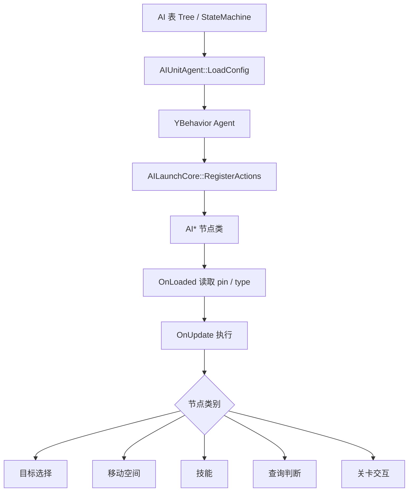

# AI 编辑器节点枚举

## 卡片说明

| 项 | 内容 |
| --- | --- |
| 目标 | 建立“AI 编辑器节点名 -> C++ 节点类 -> 关键 pin -> 用途”的索引。 |
| 节点来源 | `AILaunchCore::RegisterActions()` 注册的 `AI*` 类。 |
| 运行框架 | YBehavior 行为树 / 状态机。 |
| 关键边界 | 注册表里注释掉的节点不能按可用节点处理。Unit-only 节点需要 `AIUnitAgent`。 |

## 运行模型

## 基础结构

| 类型 | 作用 | 注意点 |
| --- | --- | --- |
| `AIBaseNode` | 所有通用 AI 叶子节点基类。 | `OnUpdate(AIAgent*)` 适用于场景 / Unit 等 Agent。 |
| `AIUnitNode` | Unit 专用节点基类。 | 会转成 `AIUnitAgent*`；Scene AI 不能随意使用。 |
| `AIBaseNodeContext` | 带状态的上下文节点基类。 | 用于移动、计时、等待技能结束等跨 tick 节点。 |
| `AIUnitNodeContext` | Unit 专用上下文节点基类。 | 移动类节点主要使用它。 |
| `AIAgent` | AI Agent 基类。 | 承接行为树、共享变量、消息和执行上下文。 |
| `AIUnitAgent` | Unit AI Agent。 | 提供目标、移动、技能、巡逻、战斗状态能力。 |

## 目标选择节点

| 节点 | 关键 pin / 类型 | 用途 |
| --- | --- | --- |
| `AIDetectEnemyInSight` | `Range` | 检查视野范围内是否存在敌人。 |
| `AISearchEnemy` | `Type=Search/Attack` | 搜索敌人或进入攻击搜索逻辑。 |
| `AICheckSight` | `Index`, `Target` | 检查指定 sight 配置和目标。 |
| `AIGetEnemy` | `Type=EnmityListTops/Top/AllOpponents`, `Output` | 获取仇恨最高、首个或全部敌对目标。 |
| `AIGetAlly` | `Type=AllAllies/Partner`, `Output` | 获取友方或伙伴目标。 |
| `AIGetUnits` | `Type=All/Others/Role/Monster/Owner/FinalOwner/Plat/Substitutes/Robot`, `Input`, `Output` | 从场景或输入对象派生 Unit 集合。 |
| `AIFilterEntityBySpace` | `Input`, `Center`, 角度、半径、高度区间 | 按空间扇形 / 环形 / 高度过滤实体。 |
| `AIFilterEntityByState` | `Immortal`, `Obstacle`, `Dead`, `Air` | 按无敌、阻挡、死亡、空中状态过滤。 |
| `AIFilterEntityByNumber` | `Type=Template/Tag/Buff/StatisticsType`, `Number` | 按模板、Tag、Buff 或统计类型过滤。 |
| `AIDoSelectEntity` | `Type=Farthest/Nearest`, `Obstacle`, `Index` | 从集合中选最远、最近或指定序号目标。 |
| `AIGetBattling` | `Input`, `Output` | 获取正在战斗的对象。 |
| `AIGetTarget` | `Input`, `Output` | 获取目标对象。 |

## 移动和空间节点

| 节点 | 关键 pin / 类型 | 用途 |
| --- | --- | --- |
| `AIMove` | `Dest`, `Radius`, `WallNormal`, `Wait` | 移动到目标点或目标实体附近。 |
| `AIMoveDir` | `Dir`, `WallNormal`, `Wait` | 按方向移动。 |
| `AIMoveDest` | `Dest`, `Face`, `WallNormal`, `Wait` | 移动到目标点并设置朝向。 |
| `AICalSpace` | `Start`, `Face`, `Target`, `Distance`, `Angle` | 计算两者空间距离和角度。 |
| `AICalPlane` | `Start`, `Face`, `Target`, `Normal`, `Projection` | 计算平面投影、距离和角度。 |
| `AIPatrol` | `MoveDir`, `IsGoForward`, `InGap`, `NextDest` | 按巡逻配置移动并输出下一点。 |
| `AITransformEntity` | `Target`, `Position`, `Face` | 传送或改变实体位置朝向。 |
| `AIGenRandPositionNew` | `Center`, `Guarantee`, 角度、半径、高度、`Ground` | 生成随机位置。 |
| `AIEnvQueryPosition` | `Entity`, `Target`, `Random`, `Output` | 根据实体和目标做环境查询位置。 |
| `AICanReach` | `Dest` | 检查 Unit 是否可到达目标点。 |
| `AIFindSafePosition` | `Output` | 寻找安全位置。 |
| `AICheckObstacle` | `Position`, `Face`, `Dir`, `Distance`, `CheckGrid`, `CheckDynamicWall` | 检查栅格和动态墙阻挡。 |
| `AIIsInShape` | `Input`, `Center`, `HalfWidth`, `HalfHeight`, `Rotation` | 判断点是否在形状内。 |
| `AIIsNear` | `Start`, `Target`, `Radius` | 判断是否接近目标。 |
| `AICompass` | `Center`, `Face`, `Target`, `Distances`, `Angles` | 方位盘判断，输出距离 / 角度分段和左右侧。 |

## 技能节点

| 节点 | 关键 pin / 类型 | 用途 |
| --- | --- | --- |
| `AICastSkillByName` | `Caster`, `Target`, `Name`, `UseAttackField`, `Random`, `Stop`, `Wait` | 按技能脚本名选择并释放技能。 |
| `AICastSkillByType` | `Caster`, `Target`, `AISkillType`, `Importance`, include / exclude | 按 AI 技能类型和权重释放技能。 |
| `AICastSpecifiedSkill` | `Type=Physical/MoveLeft/MoveRight/MoveBack/MoveForward/Dash/TurnLeft/TurnRight/PvP`, `Param` | 释放指定内置技能类型。 |
| `AIStopSkill` | `StopImportance` | 停止当前技能或按重要级别停止技能。 |

## 查询和判断节点

| 节点 | 关键 pin / 类型 | 用途 |
| --- | --- | --- |
| `AIIsInState` | `Type=CastingSkill/Fighting/Immortal/InCombo/InJACombo/BeHit/NavGap/CastingAttackSkill/HitWall/Resist/BK/InAir/Alive/Jump/Fly/SquadToken`, `Target`, `Output` | 判断目标是否处于某类状态。 |
| `AIIsCastingSpecifiedSkill` | `Target`, `Turn`, `Move`, `Others` | 判断是否正在释放指定类别技能。 |
| `AIIsInAttackRange` | `Target` | 判断目标是否在攻击范围。 |
| `AIWasAttacked` | `Attacker` | 判断最近是否被攻击，并可输出攻击者。 |
| `AIIsHitWall` | `Face` | 判断移动或朝向是否撞墙。 |
| `AIHasRelation` | `Type=InCastRangeY`, `From`, `To` | 判断两个实体之间的关系。 |
| `AIHasBuff` | `Type=ID/Type`, `Number`, `Target` | 判断目标是否有指定 Buff ID 或 Buff 类型。 |
| `AIHasTag` | `Target`, `Tag`, `Or` | 判断目标是否有指定 Tag。 |
| `AIValueHP` | `Target`, `MinRatio`, `MaxRatio` | 判断 HP 比例范围。 |
| `AIGetElapsedTime` | `Type=SinceBirth/ActiveOnly`, `Output` | 获取出生后或激活后的经过时间。 |
| `AIGetEntityInfo` | `Target`, `Position`, `Face`, `Template`, `HPRatio`, `Name`, `WaveIndex`, `PartnerType`, `UID` | 读取实体基础信息。 |
| `AIGetStateID` | `Output` | 获取当前状态 ID。 |
| `AIGetAttr` | `Target`, `ID`, `Output` | 获取目标属性。 |
| `AIGetBuffInfo` | `Target`, `ID`, `Level`, `Layer`, `LeftTime` | 读取 Buff 信息。 |
| `AIGetSkillInfo` | `Target`, `SkillType`, `PvPType` | 读取目标技能信息。 |
| `AIReadUnitAIConfig` | `State` | 读取 Unit AI 配置状态字段。 |
| `AIGetSkillCD` | `Target`, `Ready`, `Total` | 读取技能 CD 就绪数量和总数。 |

## 通用动作节点

| 节点 | 关键 pin / 类型 | 用途 |
| --- | --- | --- |
| `AISendEvent` | `Target`, `Event`, `Delay`, 可变参数 | 向 AI 消息通道发送事件。 |
| `AISwitchRole` | `Target`, `Substitute` | 切换角色或替身。 |
| `AIAddBuff` | `Target`, `ID`, `Level`, `Delay` | 给目标添加 Buff。 |
| `AIRemoveBuff` | `Target`, `ID`, `Delay` | 移除目标 Buff。 |
| `AICallMonster` | `MonsterID`, `CopyID`, `Position`, `Angle`, `MaxNum`, `Delay`, `LifeTime`, `HPRatio`, `Output` | 召唤怪物。 |
| `AIKillMonster` | `Targets`, `Delay`, `Disappear` | 击杀或清理怪物。 |
| `AISetPatrol` | `Target`, `ID` | 设置目标巡逻 ID。 |
| `AISomethingNotify` | `Type=Notice`, `Role`, `Value`, `Time` | 发送特殊通知。 |
| `AIChangeAttr` | `Type=Add/Set`, `Target`, `ID`, `Value`, `Min`, `Max`, `Output` | 修改属性值。 |
| `AIGetSharedVariable` | `Target`, `Name`, `Output` | 获取共享变量。 |
| `AISetSharedVariable` | `Target`, `Name`, `Input` | 设置共享变量。 |
| `AIProjectVector3` | `Input`, `X`, `Y`, `Z` | 拆分 Vector3。 |
| `AISetVector3` | `X`, `Y`, `Z`, `Output` | 组合 Vector3。 |
| `AISwitchPlat` | `Target`, `Plat`, `Position`, `Face` | 切换或绑定平台位置。 |
| `AITimer` | `Timer`, `Time`, `TriggerAtStart`, `Wait` | 计时器节点。 |
| `AIBind` | `Type`, `Child`, `Parent` | 绑定父子实体。 |
| `AITrySetFSMCond` | `Condition`, `Set` | 设置 FSM 条件。 |
| `AIEnterFight` | `Target` | 让 Unit 进入战斗。 |
| `AILeaveFight` | 无显式 pin | 让 Unit 离开战斗。 |
| `AIReturnSquadToken` | `Target` | 归还小队 token。 |

## 关卡交互节点

| 节点 | 关键 pin / 类型 | 用途 |
| --- | --- | --- |
| `AILevelStateNotify` | `Value0`, `Value1` | 通知关卡状态。 |
| `AIGetDoodad` | `Distance`, `UId`, `Vector3` | 获取范围内 Doodad。 |
| `AIPickDoodad` | `UId` | 拾取 Doodad。 |
| `AIPreCastItem` | `UId` | 道具预释放。 |
| `AICastItem` | `UId` | 释放道具。 |

## 未注册节点

| 节点 | 状态 | 处理方式 |
| --- | --- | --- |
| `AICastTurn` | 在 `AILaunchCore::RegisterActions()` 中被注释。 | 不应按当前可用节点答复，除非代码重新注册。 |
| `AIBeHit` | 头文件中整段注释，注册处也注释。 | 不应按当前可用节点答复。 |

## 常见排查

| 现象 | 优先检查 |
| --- | --- |
| 编辑器节点找不到 | `AILaunchCore::RegisterActions()` 是否注册，节点类是否有 `TREENODE_DEFINE`。 |
| 节点 pin 为空或类型不对 | 节点 `OnLoaded` 如何创建 pin，AI 编辑器导出 XML 字段是否匹配。 |
| Scene AI 使用 Unit 节点失败 | 节点是否继承 `AIUnitNode` 或 `AIUnitNodeContext`。 |
| AI 搜不到目标 | `AIDetectEnemyInSight`、`AISearchEnemy`、`AIGetEnemy`、阵营和 sight 配置。 |
| AI 走不到点 | `AIMove` / `AIMoveDest`、`AICanReach`、`AICheckObstacle`、导航和动态墙。 |
| AI 不放技能 | `AICastSkillByName` / `AICastSkillByType`、`SkillMgr`、技能名、CD、攻击范围。 |
| 行为树卡住 | 上下文节点的 `Wait`、技能等待、移动等待和 timer 状态。 |

## 关键代码

| 文件 | 作用 |
| --- | --- |
| `gameserver/ai/ailaunchcore.cpp` | 注册当前服务端可用 AI 节点。 |
| `gameserver/ai/ainodes.h` | AI 节点基类和上下文节点基类。 |
| `gameserver/ai/aigeneralnodes.h/cpp` | 通用动作、Buff、召唤、变量、计时、战斗状态节点。 |
| `gameserver/ai/aitargetnodes.h/cpp` | 目标选择和过滤节点。 |
| `gameserver/ai/aispacenodes.h/cpp` | 移动、空间计算、阻挡和位置查询节点。 |
| `gameserver/ai/aiskillnodes.h/cpp` | 技能释放和停止节点。 |
| `gameserver/ai/aigetnodes.h/cpp` | 状态、属性、Buff、技能、实体信息查询节点。 |
| `gameserver/ai/ailevelnodes.h/cpp` | 关卡和 Doodad 交互节点。 |
