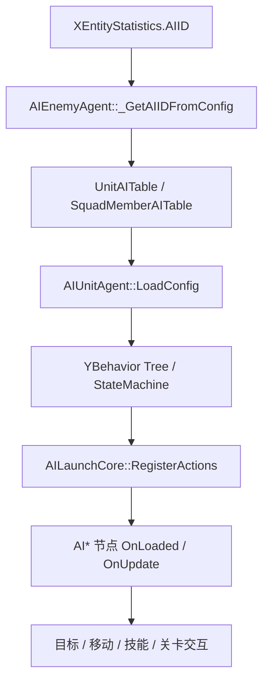

# AI 层索引

## 卡片说明

| 项 | 内容 |
| --- | --- |
| 用途 | 作为 AI 体系目录，指向 AI 配置、Agent 生命周期和编辑器节点知识。 |
| 覆盖 | `AIEntity`、`AIAgent`、`AIUnitAgent`、`AIEnemyAgent`、YBehavior 行为树、AI 节点注册。 |
| 关联层 | Enemy 通过 `AIEnemyAgent` 选择 AI 表；Skill 负责实际技能对象；Level 可通过 AI 节点交互。 |
| 使用要求 | 节点是否可用以 `AILaunchCore::RegisterActions()` 为准。 |

## 范围

覆盖代码：

- `gameserver/ai/`
- `gameserver/unit/ai-entity.*`
- `gameserver/tableload/aiconfig.*`
- `gameserver/combat/aimsgchannel.*`
- `gameserver/unit/skill/`

关联配置：

- `XEntityStatistics.AIID`
- `UnitAITable`
- `SceneAITable`
- `SquadAITable`
- `SquadMemberAITable`
- `PatrolTable`
- `SightTable`
- `SkillCombo`

## 细分卡片

| 子卡 | 重点 | 适用问题 |
| --- | --- | --- |
| [AI 编辑器节点枚举](ai-editor-nodes.md) | `AILaunchCore` 注册节点、节点分类、关键 pin 和排查入口。 | AI 节点含义、节点找不到、行为树不执行。 |
| [AI 配置](../common-qa/ai-config.md) | AIID、AI 表、视野、巡逻、技能选择链路。 | 怪物 AI 怎么配。 |
| [AIEntity AI 容器](../unit/ai-entity.md) | Unit 挂接 Agent、tick、启停。 | AI 不运行、AI 生命周期。 |
| [AIEnemyAgent 怪物 AI](../enemy/enemy-ai-agent.md) | 怪物 AI 表选择、行为树、视野、巡逻。 | 怪物不索敌、不攻击。 |
| [Skill 层索引](../skill/index.md) | AI 节点最终依赖的技能对象和配置。 | AI 会选技能但释放失败。 |

## 总体链路

## 排查入口

| 现象 | 优先看 |
| --- | --- |
| AI 表加载失败 | `XEntityStatistics.AIID`、`AIConfig`、`UnitAITable` / `SquadMemberAITable`。 |
| 节点找不到 | `AILaunchCore::RegisterActions()` 是否注册对应 `AI*` 类。 |
| 怪物不索敌 | 视野、阵营、Target 节点、`AIEnemyAgent`。 |
| 怪物不移动 | Move / Space 节点、导航、动态墙、等待 pin。 |
| 怪物不放技能 | Skill 节点、`SkillMgr`、AI 技能名、CD、距离和条件。 |
