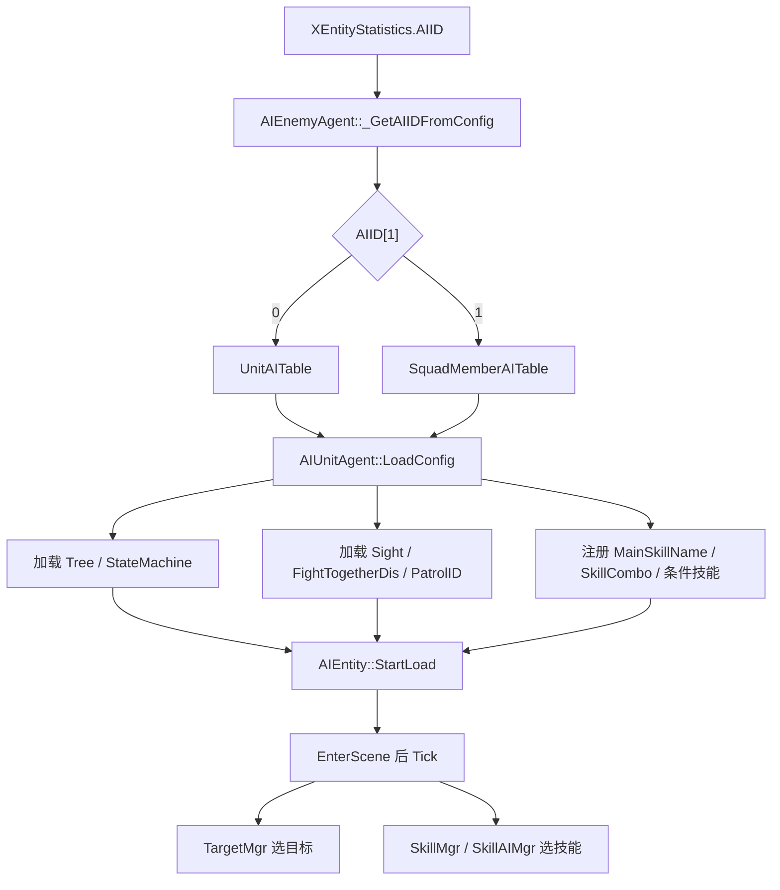

# AI 配置

AI 配置决定单位什么时候索敌、怎么巡逻、进入战斗后如何选择技能。
首轮只需要确认 `XEntityStatistics.AIID` 指向哪张 AI 表，再检查 AI 表里的行为树、视野、巡逻和技能字段。

## 配置明细

| 配置面 | 对应表 / 配置项 | 核心字段 | 字段用途 |
| --- | --- | --- | --- |
| AI 入口 | XEntityStatistics | AIID[0], AIID[1] | AIID[0] 是配置 ID；AIID[1] 决定读 UnitAITable 还是 SquadMemberAITable。 |
| 单兵 AI | UnitAITable | Tree, StateMachine, Sight, FightTogetherDis, PatrolID, CustomVariables | 配置普通单位的行为树、状态机、索敌范围、协同距离、巡逻和自定义变量。 |
| 小队成员 AI | SquadMemberAITable | Tree, StateMachine, Sight, FightTogetherDis, SkillComboID | 配置小队成员的行为树、状态机、协同战斗和技能组合。 |
| 巡逻与视野 | PatrolTable, SightTable | PatrolID, Sight | 巡逻路径和可发现目标的范围。 |
| 技能选择 | UnitAITable / SquadMemberAITable + SkillCombo | MainSkillName, SkillComboID, HPSkills, StageSkills | 给 AI 注册可用技能、技能组合、血量阈值技能和阶段技能。 |

## 运行时链路

## 常见排查

| 现象 | 优先检查 |
| --- | --- |
| 怪物不索敌 | `AIID` 是否指向存在的 AI 表；`Sight` 是否合理；`Fightgroup` 是否敌对。 |
| 怪物站着不动 | 行为树 / 状态机是否能加载；`AIEntity::StartLoad` 是否执行；AI 是否被禁用。 |
| 怪物不巡逻 | `PatrolID` 是否存在；关卡刷怪参数是否覆盖了模板巡逻。 |
| 怪物不放技能 | AI 表里的技能名是否能在 Skill 配置中查到；`SkillComboID` 是否有效；技能条件是否满足。 |
| 小队 AI 异常 | `AIID[1]` 是否为 1；`SquadMemberAITable` 和 Squad 配置是否匹配。 |

## 继续追问方向

- 问“字段怎么填”，应展开 `AIID`、`UnitAITable`、`SquadMemberAITable` 的字段表。
- 问“怪物为什么不攻击”，应同时检查 AI、阵营、目标选择和技能可用性。
- 问具体日志或断言时，应先定位 `AIConfig` / `AIUnitAgent::LoadConfig` 附近的加载失败点。
