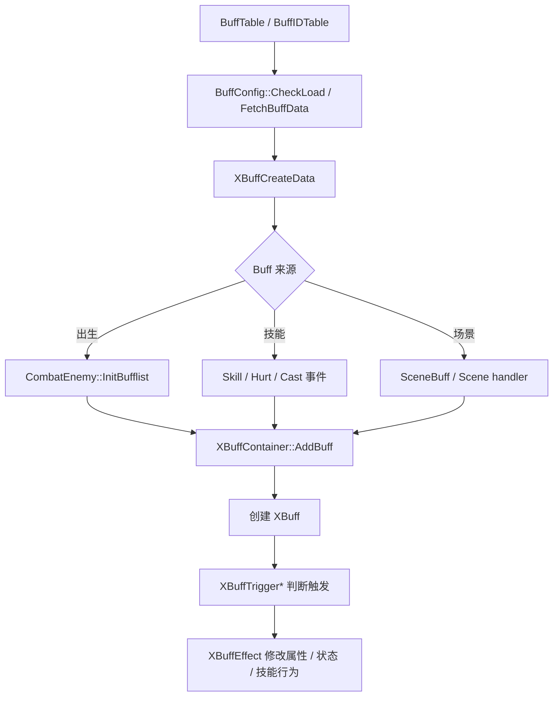

# Buff 配置

Buff 配置分两层：表里定义 Buff 本体、触发器和效果；运行时由 `XBuffContainer` 挂到 Unit 上并响应技能、伤害、属性变化等事件。
首轮排查先确认 Buff ID 和等级，再看它是出生添加、技能触发还是场景触发。

## 配置明细

| 配置面 | 对应表 / 配置项 | 核心字段 | 字段用途 |
| --- | --- | --- | --- |
| Buff 基础定义 | BuffTable | BuffID, Level, BuffType, Time, Interval, Priority | 定义 Buff 身份、等级、类型、持续时间、触发间隔和优先级。 |
| Buff ID 映射 | BuffIDTable | BuffID, Name, Group / Tag | 给 Buff 建立可读名称、分组或标签，辅助查找和分类。 |
| 运行时数据 | BuffConfig | XBuffCreateData, FetchBuffData, GetBuffInfo | 把表数据转换成 `XBuffContainer` 可创建的运行时数据。 |
| 出生 Buff | XEntityStatistics | InBornBuff | 怪物或单位初始化时自动添加的 Buff 列表。 |
| 技能触发 Buff | Skill 配置 + Buff 配置 | SkillID / SkillScript, BuffID, Trigger, Effect | 技能开始、结束、命中、伤害等事件触发 Buff 或 Buff 效果。 |
| 场景 Buff | SceneBuff / Scene handler | Scene buff id, Trigger | 场景级规则添加或清理 Buff。 |

## 运行时链路

## 常见排查

| 现象 | 优先检查 |
| --- | --- |
| Buff 没有加上 | `BuffID` 和等级是否存在；`BuffConfig::FetchBuffData` 是否能取到数据；添加入口是否执行。 |
| 出生 Buff 缺失 | `XEntityStatistics.InBornBuff` 是否配置；`CombatEnemy::InitBufflist` 是否执行。 |
| 技能 Buff 不触发 | 技能事件是否转发到 `XBuffContainer`；触发器条件和技能 ID / 技能名是否匹配。 |
| Buff 生效但数值不对 | `XBuffEffect`、属性类型、叠加规则、优先级和持续时间是否正确。 |
| Buff 断言或加载错误 | 检查 Buff ID 上限、等级上限、BuffTable / BuffIDTable 是否一致。 |

## 继续追问方向

- 问“某个 Buff 字段怎么填”，应展开 BuffTable / BuffIDTable 的字段含义。
- 问“技能为什么没挂 Buff”，应从技能事件、触发器、Buff 添加入口三段查。
- 问具体日志时，应先定位 `BuffConfig::GetBuffInfo`、`FetchBuffData` 或 `XBuffContainer::AddBuff`。
