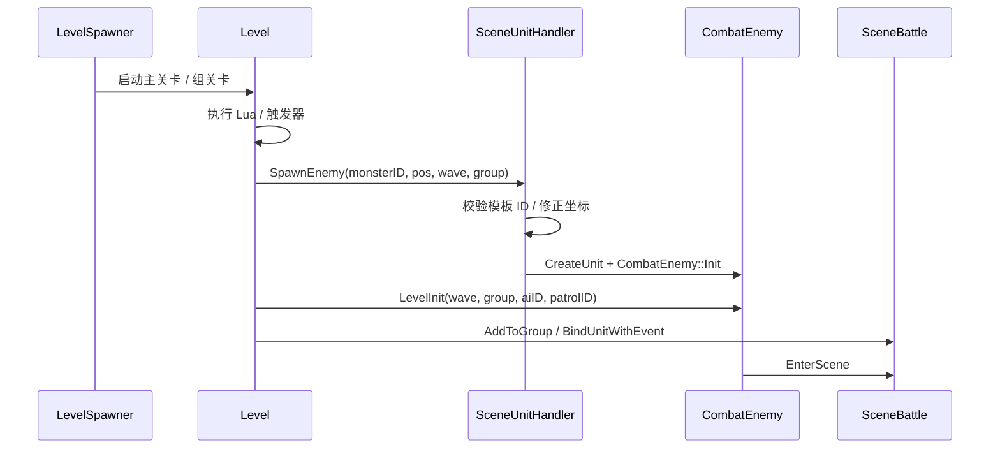

# 关卡 Level 配置

关卡配置负责驱动场景内流程、刷怪、事件、地图切换和结算。
首轮排查先确认关卡入口是否启动，再看刷怪参数是否能创建到正确的 Unit。

## 配置明细

| 配置面 | 对应表 / 配置项 | 核心字段 | 字段用途 |
| --- | --- | --- | --- |
| 关卡入口 | LevelSpawner / Level 配置 / Lua 关卡脚本 | level id, trigger, timeline, state | 创建主关卡或组关卡，驱动关卡状态和触发器。 |
| 刷怪参数 | Level::SpawnEnemy | monsterID, pos, waveID, waveIndex, groupID | 指定刷出的怪物模板、坐标、波次和分组。 |
| 进场初始化 | CombatEnemy::LevelInit | level, keepMapNum, aiID, patrolID, customAI | 写入关卡上下文，并可覆盖怪物默认 AI / 巡逻。 |
| 事件绑定 | LevelEventHandler / BindUnitWithEvent | event id, unit uid, wave, group | 将单位死亡、进出场、Buff、数量变化等事件绑定到关卡逻辑。 |
| 地图与剧情 | LevelSpawner / Level | map id, cutscene, plot, Transfer, ChangeMap | 处理地图显示、传送、剧情和场景切换。 |
| 结算 | Level::Victory / Level::Fail / SceneEnd | condition, result, time limit | 控制胜利、失败、超时和场景结算。 |

## 运行时链路

## 常见排查

| 现象 | 优先检查 |
| --- | --- |
| 关卡没有开始 | `LevelSpawner` 是否创建 Level；触发器或状态是否满足启动条件。 |
| 怪物刷不出来 | `monsterID` 是否存在于 XEntityStatistics；坐标是否有效；`SceneUnitHandler::CreateUnit` 是否失败。 |
| 怪物刷出来但不归组 | `waveID`、`waveIndex`、`groupID` 是否传入；`AddToGroup` 是否执行。 |
| 刷出的怪 AI 不对 | `LevelInit` 传入的 `aiID` / `patrolID` 是否覆盖模板默认值。 |
| 关卡不结算 | 事件绑定、怪物死亡事件、时间限制和 `Victory` / `Fail` 调用是否正确。 |

## 继续追问方向

- 问“怎么刷怪”，应展开 `Level::SpawnEnemy` 参数和 `CombatEnemy::LevelInit` 字段。
- 问“关卡卡住”，应按 Level 状态、事件绑定、剩余怪物、结算条件逐步排查。
- 问具体日志时，应先定位 `LevelSpawner`、`Level`、`SceneUnitHandler::CreateUnit`。
