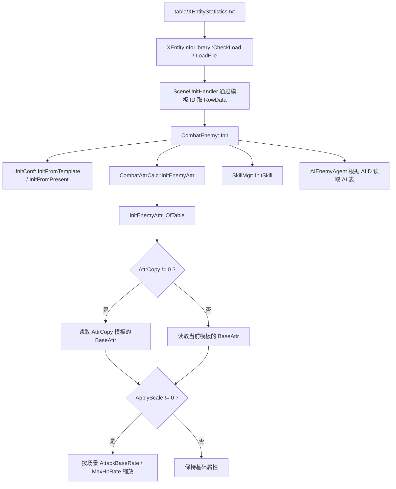

# 怪物配置

怪物配置不是单表完成，而是由模板、表现、属性、技能和 AI 共同驱动。
首轮排查时优先确认模板 ID，再按下面几类配置逐步核对。

## 配置明细

| 配置面 | 对应表 / 配置项 | 核心字段 | 字段用途 |
| --- | --- | --- | --- |
| 基础模板 | XEntityStatistics | ID, Type, Fightgroup, DefaultLevel, DeadDisappearTime | 定义怪物模板、类型、阵营、默认等级和死亡消失规则。 |
| 表现与体型 | XEntityStatistics + XEntityPresentation / UnitPhysicsConf | PresentID | 关联模型表现、动作资源、碰撞体和受击体型。 |
| 属性初始化 | XEntityStatistics | BaseAttr, AttrCopy, ApplyScale | BaseAttr 给基础数值；AttrCopy 复制另一个模板的基础属性；ApplyScale 非 0 时参与场景缩放。 |
| 技能配置 | XEntityStatistics + SkillListForEnemy | AppearSkill, OtherSkills, XEntityStatisticsID, SkillScript | 配置登场技能、常规技能，以及怪物模板到技能脚本的映射。 |
| AI 行为 | XEntityStatistics + UnitAITable / SquadMemberAITable | AIID, Sight, FightTogetherDis, PatrolID | 决定索敌、协同、巡逻和行为树参数。 |

## 运行时链路

## 常见排查

| 现象 | 优先检查 |
| --- | --- |
| 怪物无法生成 | 场景引用的模板 ID 是否存在于 XEntityStatistics。 |
| 怪物不攻击 / 不索敌 | Fightgroup 是否敌对，AIID 是否指向正确 AI 表，Sight 是否合理。 |
| 怪物技能找不到 | OtherSkills / AppearSkill 是否配置；SkillListForEnemy 是否存在 XEntityStatisticsID + 技能 hash 对应行。 |
| 怪物血量或攻击异常 | BaseAttr、AttrCopy、ApplyScale 是否符合预期；ApplyScale 非 0 才走场景缩放。 |

## 继续追问方向

- 问“怪物技能怎么配置”，应展开 SkillListForEnemy 和 GetEnemySkillConfigX 的查表规则。
- 问“怪物 AI 怎么配置”，应展开 AIID、UnitAITable、SquadMemberAITable。
- 问具体日志时，应优先定位日志或断言点，再核对对应配置字段。
