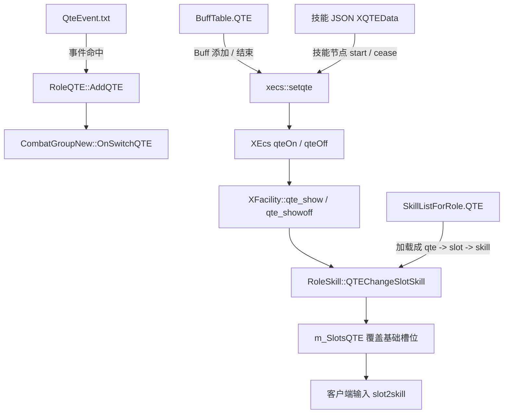
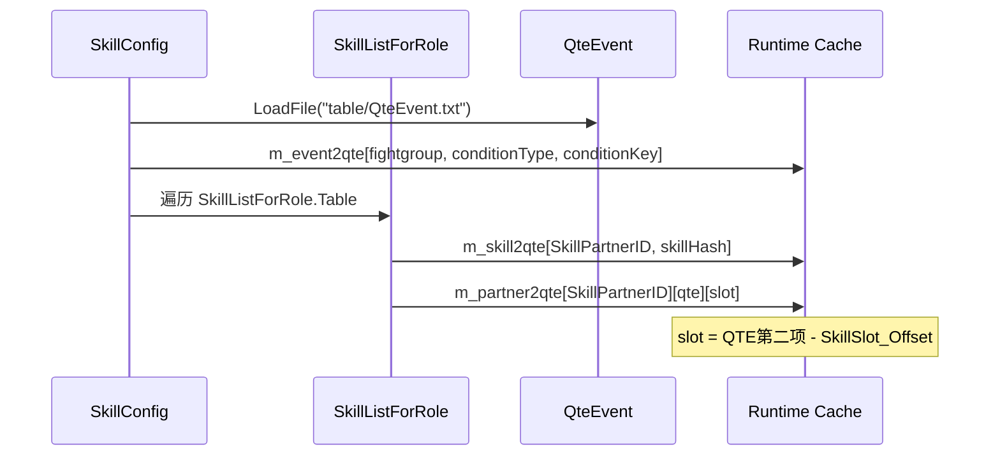
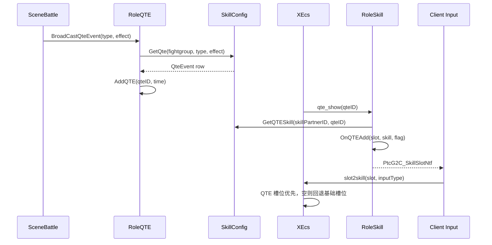

# QTE 配置

QTE 不是单表配置。先判断要配的是哪一种：

| 目标 | 主要配置 | 作用 |
| --- | --- | --- |
| 战斗事件触发 QTE | `QteEvent.txt` | 根据受击、韧性、Buff 等事件生成一个 QTE id，并设置持续时间。 |
| QTE 期间替换按键技能 | `SkillListForRole.QTE` | QTE id 生效时，把某个输入槽位临时替换成指定技能。 |
| Buff 直接开关 QTE 状态 | `BuffTable.QTE` | Buff 添加时打开 QTE 状态，Buff 结束时关闭。 |
| 技能脚本内部打开 QTE | 技能 JSON 的 QTE 节点 | 技能运行中通过 `XQTEData` / `XQTEDisplayData` 打开或展示 QTE。 |
| 切人 QTE | `QteEvent` + 角色切换技能 | QTE id 写入战斗组切换状态，非出战角色如果有对应切换技能就可触发切人。 |

## 配置明细

| 配置面 | 字段 | 用途 | 注意点 |
| --- | --- | --- | --- |
| 事件触发 | `QteEvent.fightgroup` | 限定触发双方关系。 | 运行时 `RoleQTE::CheckQTE` 计算：`0` 表示自己或同组角色，`1` 表示敌对单位，`2` 表示非敌对单位。 |
| 事件触发 | `QteEvent.condition` | 二元组：事件类型和事件 key。 | 事件类型来自 `QteEventType`：`0` 韧性相关，`1` 被击，`2` Buff。事件 key 是广播进来的 effect。 |
| 事件结果 | `QteEvent.qte` | 三元组：QTE id、持续时间、覆盖持续时间。 | `qte[0]` 是 QTE id；`qte[1]` 是默认持续时间；`qte[2]` 非 0 时会覆盖持续时间。 |
| 槽位覆盖 | `SkillListForRole.SkillPartnerID` | 限定角色技能模板。 | 必须和角色运行时 `SkillMgr::GetSkillTemplateId()` 一致。 |
| 槽位覆盖 | `SkillListForRole.SkillScript` | QTE 生效时要放到槽位上的技能。 | 加载时会 `xecs::hash(SkillScript)`，并按该行技能归属到角色技能模板。 |
| 槽位覆盖 | `SkillListForRole.QTE` | 多组三元组：QTE id、槽位、flag。 | 槽位是 1-based，代码会减 `SkillSlot_Offset` 转为内部 0-based。 |
| 槽位覆盖 | `QTE.flag` | 控制添加 QTE 技能时是否额外校验。 | `flag == 2` 时会检查技能条件和 CD，不满足就不会覆盖槽位。 |
| Buff 开关 | `BuffTable.QTE` | Buff 生效时打开指定 QTE id。 | `XBuffQte` 在 Buff 添加时 `setqte(true)`，结束时 `setqte(false)`。 |
| 技能脚本 | `XQTEData.qteID` | 技能节点打开的 QTE id。 | 需要和 `SkillListForRole.QTE` 或其他监听逻辑使用的 QTE id 对齐。 |
| 技能脚本 | `XQTEData.duration` | QTE 状态持续时间。 | 大于 0 时会创建 QTE 实例，到期后关闭。 |
| 技能脚本 | `XQTEData.cacheTime` | 允许缓存输入的时间窗。 | 用于 QTE 打开时回收玩家提前按下的输入。 |
| 技能脚本 | `XQTEData.self` | 是否作用在自己身上。 | `true` 时会对当前实体执行 `qteOn` / `qteOff`。 |

## 配置关系

## 加载链路

## 运行时链路

## 槽位规则

| 配置值 | 运行时值 | 含义 |
| --- | --- | --- |
| `QTE` 第二项为 `1` | 内部 slot `0` | 对应 `SkillSlot_Normal` / `Slot1`。 |
| `QTE` 第二项为 `2` | 内部 slot `1` | 对应 `SkillSlot_Dash` / `Slot2`。 |
| `QTE` 第二项为 `3` | 内部 slot `2` | 对应 `SkillSlot_Skill_Ultimate` / `Slot3`。 |
| `QTE` 第二项为 `4` 到 `10` | 内部 slot `3` 到 `9` | 对应 `Slot4` 到 `Slot10`。 |

## 常见排查

| 现象 | 优先检查 |
| --- | --- |
| QTE 没出现 | `QteEvent.fightgroup`、`condition` 是否能被当前事件命中；是否真的调用了 `SceneBattle::BroadCastQteEvent`。 |
| QTE 很快消失或不消失 | `QteEvent.qte[1]` 和 `qte[2]` 持续时间；`time == 0` 的场景会走默认兜底时间。 |
| QTE 出现但槽位没换 | `SkillListForRole.QTE` 的 QTE id 是否一致；`SkillPartnerID` 是否等于角色运行时技能模板；slot 是否在 1 到 10。 |
| 槽位换了但按不出技能 | QTE 技能是否有等级；`flag == 2` 时技能条件和 CD 是否满足；技能 JSON 的 `skillType` 是否匹配按键事件。 |
| QTE 技能被基础技能覆盖 | `m_SlotsQTE` 为空时才会回退基础槽位；检查 `qte_showoff` 是否提前触发。 |
| Buff QTE 无效 | `BuffTable.QTE` 是否非 0；Buff 是否真的添加到单位；Buff 结束原因为 Destroy 时不会走普通关闭逻辑。 |
| 切人 QTE 不出现 | 非出战角色是否有 `HasSwitchSkill(qte)`；切换技能等级和条件是否满足。 |

## 关键代码

| 代码 | 作用 |
| --- | --- |
| `gameserver/tableload/skillconfig.cpp` | 加载 `QteEvent`，建立 `m_event2qte`、`m_skill2qte`、`m_partner2qte`。 |
| `gameserver/unit/qte/roleqte.cpp` | 根据战斗事件查 `QteEvent`，添加和删除 QTE token。 |
| `gameserver/role/roleskill.cpp` | QTE 生效时覆盖 `m_SlotsQTE`，并通知客户端槽位变化。 |
| `gameserver/buff/XBuffQte.cpp` | Buff 添加和结束时直接开关 XEcs QTE 状态。 |
| `gameserver/xecs/XFacility.cpp` | XEcs 的 `qte_show` / `qte_showoff` 回调到服务器角色技能。 |
| `XEcsLib/XEcs/ecs/system/XSkillQteSys.hpp` | 技能 JSON QTE 节点和输入缓存逻辑。 |
| `XEcsLib/XEcs/ecs/system/XInputSys.hpp` | 输入时优先取 QTE 槽位技能，空则回退基础槽位。 |

## 继续追问方向

- 问“某个 QTE 为什么没触发”，需要提供事件类型、effect、触发者和宿主关系。
- 问“QTE 技能为什么没替换槽位”，需要提供角色 `SkillPartnerID`、QTE id、配置槽位和目标技能名。
- 问“QTE 按键没反应”，需要继续查技能 JSON `skillType`、技能条件、CD 和客户端上报的 slot / input type。
