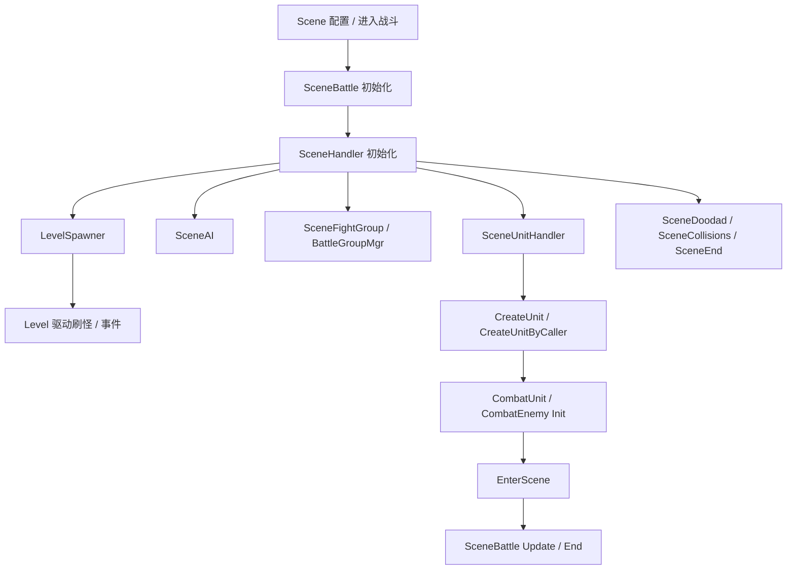

# 场景配置

场景配置不是只控制地图，它还决定场景 handler、关卡、单位创建、战斗组、事件和结算如何协作。
首轮排查先确认当前是否进入 `SceneBattle`，再看对应 handler 是否初始化。

## 配置明细

| 配置面 | 对应表 / 配置项 | 核心字段 | 字段用途 |
| --- | --- | --- | --- |
| 场景基础 | SceneBattle / Scene 配置 | scene id, map id, scene type, mode | 创建战斗场景容器，决定地图、类型和基础运行模式。 |
| Handler 集合 | SceneHandler | SceneAI, LevelSpawner, SceneFightGroup, BattleGroupMgr, SceneDoodad, SceneCollisions, SceneEnd | 给场景挂接 AI、关卡、战斗组、机关、碰撞和结算能力。 |
| 单位创建 | SceneUnitHandler | template id, unit type, caller, pos | 按模板创建怪物、可破坏物、召唤物或其他场景单位。 |
| 战斗组 | SceneFightGroup / BattleGroupMgr | Fightgroup, group id, relation | 决定敌我关系、分组和战斗目标关系。 |
| 场景事件 | SceneEvent / LevelEventHandler | event type, listener, unit uid | 驱动进场、离场、死亡、Buff、交互和关卡事件。 |
| 场景结算 | SceneEnd / Level::Victory / Level::Fail | end condition, result | 控制胜负、失败、超时和清理。 |

## 运行时链路

## 常见排查

| 现象 | 优先检查 |
| --- | --- |
| 场景没有战斗逻辑 | 是否进入 `SceneBattle`；`SceneHandler` 是否初始化。 |
| 关卡或刷怪没执行 | `LevelSpawner` 是否存在；Level 是否启动；触发器是否满足。 |
| 单位创建失败 | `SceneUnitHandler` 的模板 ID、Type、坐标和 caller 是否正确。 |
| 敌我关系异常 | `Fightgroup`、战斗组关系和 `BattleGroupMgr` 是否正确初始化。 |
| 场景不结算 | `SceneEnd`、Level 胜负条件、死亡队列和事件监听是否触发。 |

## 继续追问方向

- 问“场景有哪些模块”，应展开 handler 列表和职责边界。
- 问“场景怎么刷怪”，应转到 Level / SpawnEnemy 配置。
- 问具体崩溃或日志时，应先确认属于 SceneBattle 生命周期、handler 初始化还是 Unit 进出场。
