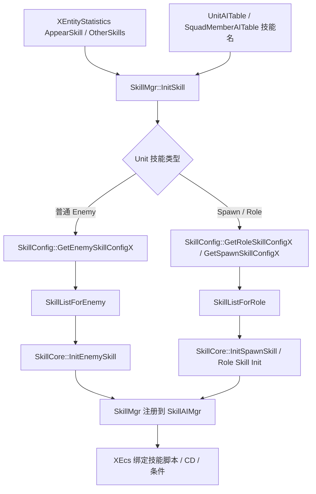

# Skill 配置

技能配置分两步看：单位先通过模板或 AI 拿到技能名 / 技能 ID，再由 `SkillConfig` 查对应技能表并创建 `SkillCore`。
首轮排查先区分是怪物技能、召唤物技能还是角色技能，因为它们查的表不同。

## 配置明细

| 配置面 | 对应表 / 配置项 | 核心字段 | 字段用途 |
| --- | --- | --- | --- |
| 怪物技能列表 | SkillListForEnemy | XEntityStatisticsID, SkillScript, SkillID / hash, InitCD, CDRatio, AttackRange, ModeUse | 普通怪物技能查表；可按模板 ID、SkillStatisticsID 或 fallback 0 匹配。 |
| 召唤物 / 角色技能 | SkillListForRole | SkillID, SkillLevel, SkillScript, Slot / Partner | `SkillListTable != 0` 的 Spawn 和角色技能会走角色技能表。 |
| 模板技能入口 | XEntityStatistics | AppearSkill, OtherSkills, SkillListTable, SkillStatisticsID | 配置登场技能、常规技能、技能表类型和技能统计 ID。 |
| AI 技能入口 | UnitAITable / SquadMemberAITable | MainSkillName, SkillComboID, HPSkills, StageSkills | AI 可选技能名、技能组合、血量条件技能和阶段技能。 |
| 伤害与命中 | SkillDamage / DamageSwitch / QteEvent | damage id, ratio, switch id, qte event | 定义技能伤害段、倍率、开关和 QTE 事件。 |
| 槽位与条件 | SkillSlotTable / SkillMgr | slot, level, HpMaxLimit, Stage | 角色槽位、技能等级、血量阈值和阶段触发。 |

## 运行时链路

## 常见排查

| 现象 | 优先检查 |
| --- | --- |
| 怪物技能找不到 | `AppearSkill` / `OtherSkills` / AI 技能名是否存在；`SkillListForEnemy` 是否有模板 ID + 技能 hash 对应行。 |
| Spawn 技能找不到 | `XEntityStatistics.SkillListTable` 是否非 0；`SkillListForRole` 是否有对应技能 ID 和等级。 |
| AI 不释放技能 | AI 表技能名是否注册到 `SkillAIMgr`；技能 CD、距离、条件是否满足。 |
| 技能伤害不对 | `SkillDamage`、倍率、DamageSwitch、技能等级和属性来源是否正确。 |
| HP / 阶段技能不触发 | `HpMaxLimit`、Stage、`SkillMgr::InitConditionSkills` 是否正确。 |

## 继续追问方向

- 问“怪物技能字段怎么配”，应展开 `SkillListForEnemy` 字段和 `GetEnemySkillConfigX` 查找规则。
- 问“角色技能怎么配”，应展开 `SkillListForRole`、槽位和等级。
- 问具体错误日志时，应优先匹配 `enemy conf skill not find`、`skill not find in conf` 这类日志。
