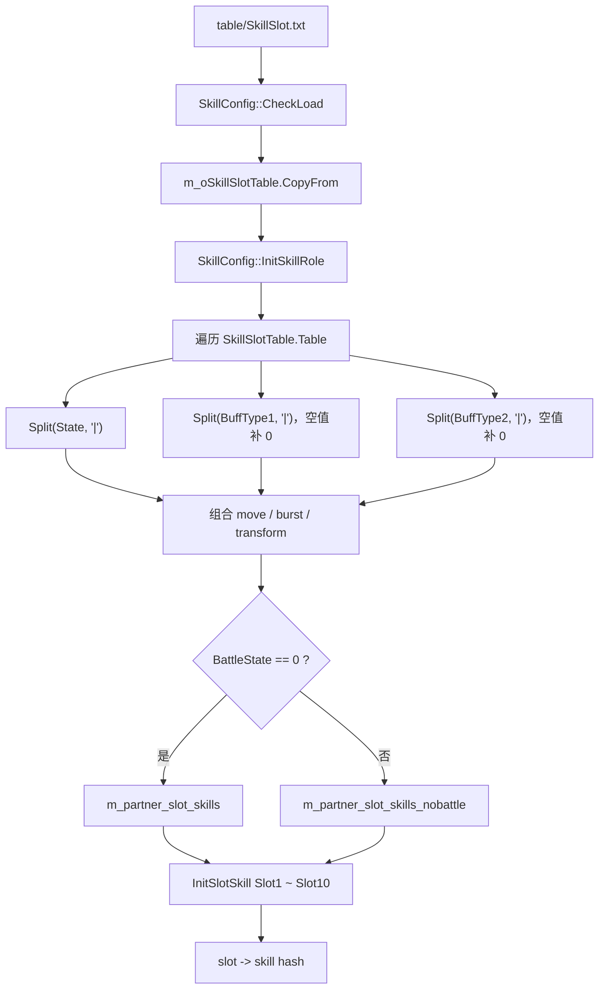
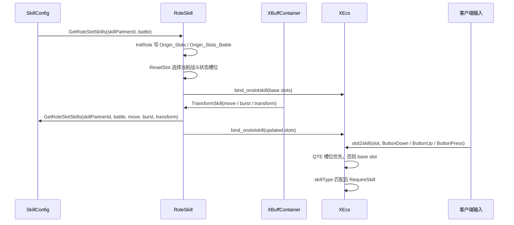

# SkillSlot 配置

`SkillSlot.txt` 控制角色 / 伙伴在不同状态下，每个输入槽位对应哪个技能。
它不是怪物技能表；主要服务于 Role 的按键槽位、战斗 / 非战斗槽位、移动状态、爆发状态和变身状态切换。

## 配置明细

| 配置面 | 字段 | 用途 | 注意点 |
| --- | --- | --- | --- |
| 角色技能模板 | SkillPartnerId | 指向角色技能模板 ID。运行时用 `PartnerConfig::GetSkillPartnerId(partner_id)` 取得。 | 必须能和该角色的 `SkillListForRole` / `SkillListForPartner` 对上。 |
| 移动状态 | State | 可用竖线分隔多个状态，运行时通过 `CGsDir::StateAbility` 转成 move。 | 每个 State 会展开成一组 `(move, burst, transform)` 索引。 |
| 战斗状态 | BattleState | 区分战斗 / 非战斗槽位。 | 当前代码 `BattleState == 0` 写入 battle 槽位；非 0 写入 non-battle 槽位。 |
| 爆发状态 | BuffType1 | 可用竖线分隔多个 burst 值。 | 空值会按 `0` 处理。运行时来自 `XBuffChangeSlot` 的 `SkillChangeBusrt`。 |
| 变身状态 | BuffType2 | 可用竖线分隔多个 transform 值。 | 空值会按 `0` 处理。运行时来自 `XBuffChangeSlot` 的 `SkillChangeTrans`。 |
| 槽位技能 | Slot1 ~ Slot10 | 每列填技能脚本名，运行时 `xecs::hash(skill)` 后绑定到对应槽位。 | `Slot1` 对内部 slot `0`，`Slot10` 对内部 slot `9`。空字段会尝试回退到 run / 非 burst / 非 transform 的同槽位技能。 |

## 槽位编号

| 内部 slot | 配置字段 | 含义 |
| --- | --- | --- |
| 0 | Slot1 | Normal |
| 1 | Slot2 | Dash |
| 2 | Slot3 | Ultimate |
| 3 | Slot4 | Skill 1 |
| 4 | Slot5 | Skill 2 |
| 5 | Slot6 | Skill 3 |
| 6 | Slot7 | Burst |
| 7 | Slot8 | Jump / Fly |
| 8 | Slot9 | Virtual Dash |
| 9 | Slot10 | Virtual Normal |

## 加载与索引展开

## 运行时链路

## QTE 与临时槽位

| 来源 | 机制 |
| --- | --- |
| `SkillListForRole.QTE` | 通过 `qte -> slot -> skill` 建索引。QTE 里配置的 slot 是 1-based，代码会减 `SkillSlot_Offset`。 |
| `RoleSkill::QTEChangeSlotSkill` | QTE add 时写入 `m_SlotsQTE[slot]`，QTE del 时恢复基础槽位。 |
| `RoleSkill::GetSlotSkill` | 优先返回 QTE 槽位技能；没有 QTE 时返回基础槽位技能。 |
| `XSkillSlotType` | 输入事件分 `ButtonDown`、`ButtonUp`、`ButtonPress`，XEcs 会检查技能 JSON 的 `skillType` 是否匹配。 |

## 常见排查

| 现象 | 优先检查 |
| --- | --- |
| 技能槽为空 / 按键没技能 | `SkillPartnerId` 是否正确；`BattleState` 是否写到当前战斗状态；`State` 是否匹配当前 move。 |
| 配了技能但释放不了 | `SlotN` 填的是技能脚本名；该技能是否存在于当前角色的技能集合；`RoleSkill::InitRole` 是否通过 `IsValidSkill`。 |
| 爆发 / 变身后槽位没切换 | `BuffType1` / `BuffType2` 是否和 `XBuffChangeSlot` 产出的 burst / transform 值一致。 |
| 技能按下无反应 | 客户端上报的 slot 是否 0-based；`XSkillSlotType` 是否和技能 JSON 的 `skillType` 一致。 |
| QTE 技能没覆盖槽位 | `SkillListForRole.QTE` 的 slot 是否按 1-based 配；QTE flag 为 2 时还会检查技能条件和 CD。 |
| 日志 slot out of range | slot 必须在 0 ~ 9；配置侧 `Slot1` 对内部 0，不要混用。 |

## 继续追问方向

- 问“某个角色技能槽不对”，应给出 `partner_id` / `SkillPartnerId`、当前战斗状态、move、burst、transform 和具体 slot。
- 问“按键技能放不出来”，应继续查 `XActionReceiver::OnSlotSync`、`XEcs slot2skill`、技能 JSON `skillType`。
- 问“变身后技能没换”，应继续查 `XBuffChangeSlot` 和 `RoleSkill::TransformSkill`。
