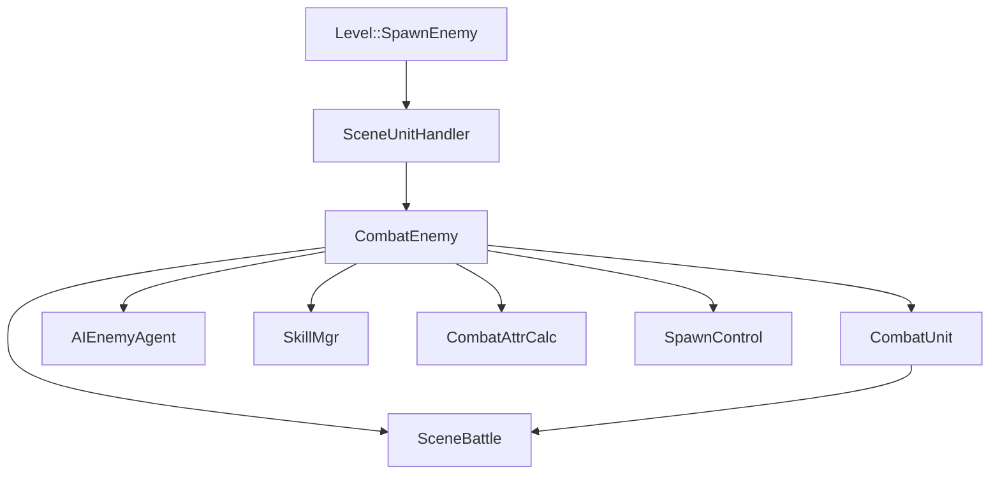
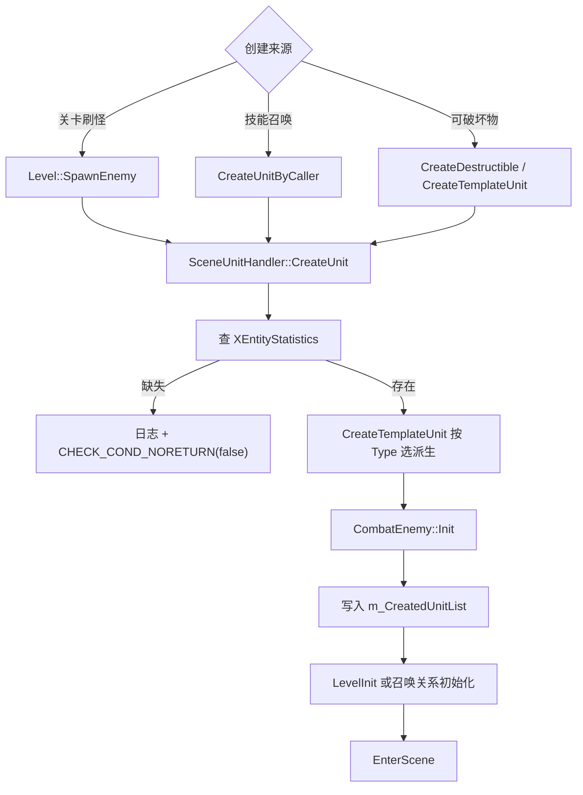
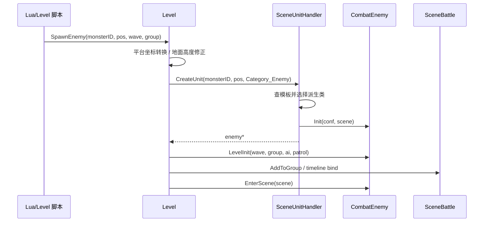
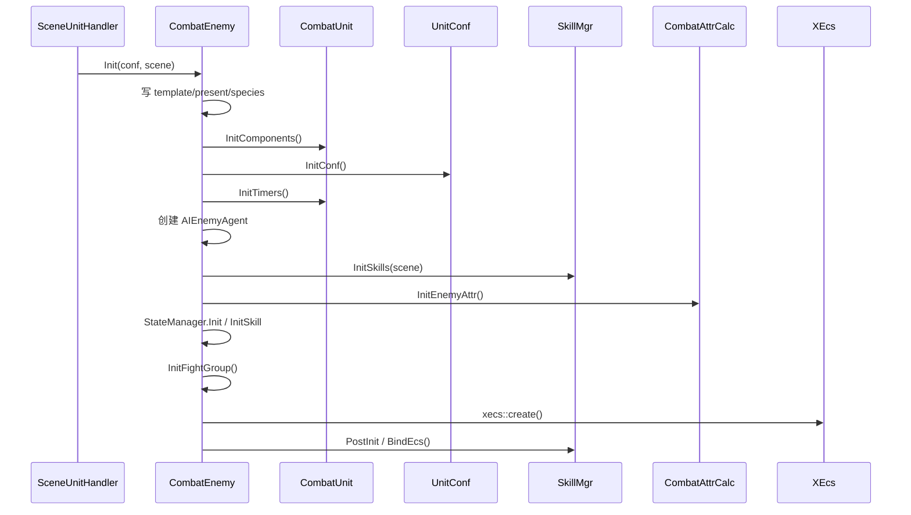
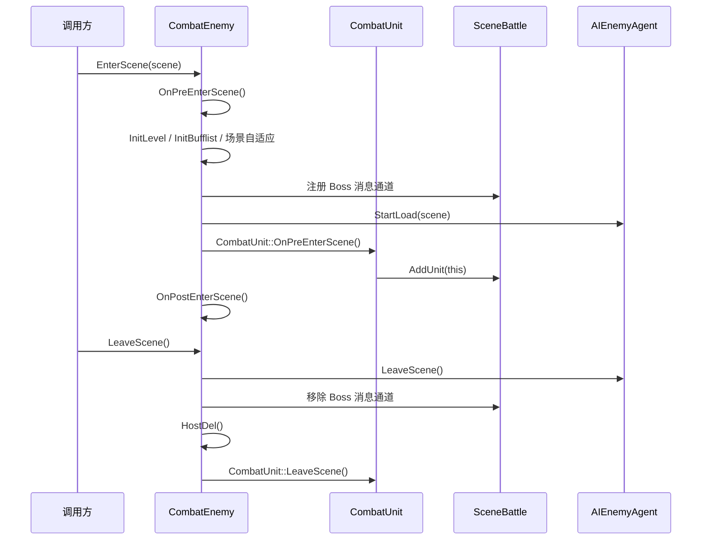
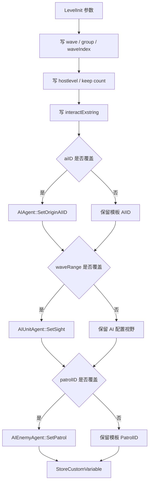
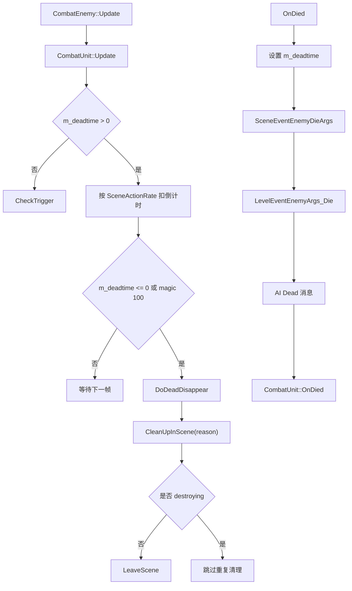

# Enemy 创建与生命周期

## 卡片说明

| 项 | 内容 |
| --- | --- |
| 用途 | 细化 `CombatEnemy` 生命周期和字段。 |
| 覆盖 | 创建入口、字段、初始化、Level 接入、死亡/清理。 |
| 不覆盖 | 技能/AI/属性配置细节，见配置子卡。 |

## 依赖边界

| 依赖 | 使用点 |
| --- | --- |
| `CombatUnit` | 继承 Unit 生命周期、组件、属性、Buff、AI。 |
| `SceneUnitHandler` | 创建 Enemy、召唤 Enemy、可破坏物。 |
| `Level` | 关卡刷怪、wave/group、timeline 绑定、平台关卡。 |
| `SceneBattle` | Boss 注册、场景自适应、AI 消息通道、场景 action rate。 |
| `AIEnemyAgent` | Enemy AI agent。 |
| `SkillMgr` | 技能初始化和 ECS 绑定。 |
| `CombatAttrCalc` | Enemy/Spawn 属性初始化。 |
| `SpawnConfig` | 召唤跟随和数量限制。 |

### 生命周期模块图

## CombatEnemy 字段

关卡字段：

| 字段 | 来源 | 用途 |
| --- | --- | --- |
| `m_WaveID` | `LevelInit(waveID)` | 关卡 wave。 |
| `m_GroupID` | `LevelInit(groupID)` | 关卡组。 |
| `m_hostlevel` | `LevelInit(level)` / 召唤继承 | 宿主 Level UID。 |
| `m_KeepCount` | `LevelInit(keepMapNum)` / 召唤继承 | keep count。 |
| `m_WaveIndex` | `LevelInit(waveIndex)` | wave 内索引。 |
| `m_interactExstring` | `LevelInit(interactExstring)` | 交互或关卡扩展字符串。 |
| `m_timelineBindMap` | `Level::SetTimelineBindInfo` | timeline hash 到 track order。 |
| `m_plotBindMap` | 关卡 plot 绑定 | plot id 到 track order。 |

身份和状态字段：

| 字段 | 来源 | 用途 |
| --- | --- | --- |
| `m_Tag` | 预留/历史 | Enemy tag。 |
| `m_Level` | `InitLevel` | Enemy 等级。 |
| `m_deadtime` | `OnDied` | 死亡消失倒计时。 |
| `m_dead_disappeartime` | `XEntityStatistics.DeadDisappearTime` 或全局兜底 | 死亡后多久离场。 |
| `m_bTriggerCheck` | 移动/传送逻辑 | 是否检查动态墙触发。 |
| `m_vec3LastPos` | 初始化/移动/传送 | 上次位置，用于墙触发。 |
| `m_autobind` | 运行时设置 | Enemy 是否自动绑定平台。 |

召唤字段：

| 字段 | 来源 | 用途 |
| --- | --- | --- |
| `m_host` | `CreateUnitByCaller` | 直接召唤者。 |
| `m_finalhost` | `CreateUnitByCaller` | 最终归属者。 |
| `m_spawn_follow.followid_` | `SpawnFollow` 分支 | 跟随绑定对象。 |

外观字段：

| 字段 | 类型 | 用途 |
| --- | --- | --- |
| `m_pOutLook` | `CEnemyOutLook*` | Doodad/Destructible outlook 扩展。 |

## 创建入口

`Level::SpawnEnemy`：

| 步骤 | 行为 |
| --- | --- |
| 1 | 接收 Lua/Level 传入的 monster ID、坐标、wave、AI、group 等参数。 |
| 2 | 平台关卡将局部坐标转换到平台。 |
| 3 | 非空中单位用 scene query 修正地面高度。 |
| 4 | 调 `SceneUnitHandler::CreateUnit(monsterID, pos, rotation, Category_Enemy, 0, isAir)`。 |
| 5 | 成功后调用 `CombatEnemy::LevelInit`。 |
| 6 | 设置 timeline bind、group、进场。 |
| 7 | 平台关卡绑定到平台；平台型 enemy 触发平台关卡。 |

`SceneUnitHandler::CreateUnit`：

| 步骤 | 行为 |
| --- | --- |
| 1 | 查 `XEntityStatistics`。 |
| 2 | 缺失打印 `can't find monster template id` 并 `CHECK_COND_NORETURN(false)`。 |
| 3 | 调 `CreateTemplateUnit` 选择派生类。 |
| 4 | 调 `CombatEnemy::Init`。 |
| 5 | 写入 `m_CreatedUnitList`。 |

`CreateTemplateUnit` 派生选择：

| `XEntityStatistics.Type` | 创建对象 |
| --- | --- |
| `Species_MovablePlat` | `PlatEntity` |
| `Species_Destructible` | `DestructibleUnit` |
| 其他 Enemy 类型 | `CombatEnemy` |

`CreateUnitByCaller`：

| 步骤 | 行为 |
| --- | --- |
| 1 | 校验 caller 和 caller scene。 |
| 2 | 查召唤模板。 |
| 3 | 创建 Enemy 并设置 `host`。 |
| 4 | caller 是 Enemy 时继承 final host、host level、keep。 |
| 5 | caller 不是 Enemy 时 final host 是 caller。 |
| 6 | `InheritFromHost` 复制技能 ratio 信息。 |
| 7 | 地面单位修正高度。 |
| 8 | `SpawnFollow` 有配置时改成相对 caller 坐标并 ECS bind。 |
| 9 | 模板 `Fightgroup == -1` 时继承 caller 阵营。 |
| 10 | `SetAttrByCaller` 初始化召唤属性。 |
| 11 | `EnterScene`。 |
| 12 | caller `OnCreateEnemyByCaller`。 |
| 13 | final host `SpawnControl::OnAdd`。 |

### 创建入口流程图

### 关卡刷怪时序图

## 初始化

`CombatEnemy::Init` 顺序：

| 顺序 | 函数/字段 | 说明 |
| --- | --- | --- |
| 1 | `m_uTemplateID = conf->ID` | 模板 ID。 |
| 2 | `m_uPresentID = conf->PresentID` | 表现 ID。 |
| 3 | `m_uEntitySpecies = conf->Type` | 决定组件 typelist。 |
| 4 | `InitComponents` | 继承 Unit 组件绑定。 |
| 5 | `InitConf` | 表现和模板配置。 |
| 6 | `InitTimers` | 注册 timer。 |
| 7 | `m_oAIEntity.SetAgent(new AIEnemyAgent(this, scene))` | 创建 Enemy AI。 |
| 8 | `InitSkills(scene)` | 创建技能对象。 |
| 9 | `mUnitCombatAttribute.Init` | 初始化属性容器。 |
| 10 | `CombatAttrCalc::InitEnemyAttr` | 加载属性。 |
| 11 | `m_StateManager.Init` / `InitSkill` | 初始化状态。 |
| 12 | `InitFightGroup` | 设置阵营。 |
| 13 | `xecs::create` | 创建 ECS 实体。 |
| 14 | `PostInit` | `_AttachBeHit` 和 `BindEcs`。 |

`InitConf`：

| 顺序 | 函数 | 说明 |
| --- | --- | --- |
| 1 | `GetConf().InitFromPresent(GetPresentID())` | 表现、体型、碰撞、Buff tag。 |
| 2 | `InitFromTemplate()` | 模板、死亡消失时间、feature、NoTargetBuff。 |

`InitFromTemplate`：

| 配置字段 | 行为 |
| --- | --- |
| `DeadDisappearTime` | 非 0 使用模板值，否则用 `GlobalConfig.Battle.DeadCleanTime`。 |
| `Feature` | 转成 `EntityFeature` tag。 |
| `Type == Species_Doodad` | 强制加 `Feature_NoTarget` 和 `Feature_NoHit`。 |
| `NoTargetBuff` | 写入 `m_uNoTargetBuff`。 |

### Enemy 初始化时序图

## 进场和离场

`OnPreEnterScene`：

| 顺序 | 行为 |
| --- | --- |
| 1 | `InitLevel(scene)` 设置等级。 |
| 2 | 打印 `pre enter scene`。 |
| 3 | 非 Destructible 初始化出生 Buff。 |
| 4 | Battle scene 中非 Destructible 走场景自适应属性。 |
| 5 | Boss 注册到 scene boss 消息通道。 |
| 6 | AI `StartLoad(scene)`。 |
| 7 | 调 `CombatUnit::OnPreEnterScene`。 |

`OnPostEnterScene`：

| 行为 |
| --- |
| 打印 `post enter scene`。 |
| 调 `CombatUnit::OnPostEnterScene`。 |

`OnLeaveScene`：

| 行为 |
| --- |
| 打印 `leave scene`。 |
| Boss 从 scene boss 消息通道移除。 |
| 调 `HostDel` 通知召唤关系删除。 |

### 进场和离场时序图

## LevelInit

字段写入：

| 参数 | 写入位置 | 作用 |
| --- | --- | --- |
| `waveID` | `m_WaveID` | wave 标识。 |
| `waveIndex` | `m_WaveIndex` | wave 内索引。 |
| `level` | `m_hostlevel` | 关联关卡。 |
| `keepMapNum` | `m_KeepCount` | keep 计数。 |
| `str` | `m_interactExstring` | 交互扩展字符串。 |
| `groupID` | `m_GroupID` | 关卡组。 |
| `aiID` | `AIAgent::SetOriginAIID` | 覆盖 AI。 |
| `waveRange` | `AIUnitAgent::SetSight` | 覆盖视野。 |
| `patrolID` | `AIEnemyAgent::SetPatrol` | 覆盖巡逻。 |
| `AICustom` | `AIAgent::StoreCustomVariable` | 自定义变量。 |

### LevelInit 流程图

## 更新和死亡

`Update`：

| 条件 | 行为 |
| --- | --- |
| `m_currScene == null` | 不更新。 |
| 正常 | 先 `CombatUnit::Update(delta)`。 |
| `m_deadtime > 0` | 按 `SceneActionRate` 扣倒计时。 |
| `m_deadtime == 100` | magic number，立即消失。 |
| `m_deadtime <= 0` | `DoDeadDisappear`。 |
| 未死亡倒计时 | `CheckTrigger`。 |

`OnDied`：

| 顺序 | 行为 |
| --- | --- |
| 1 | 设置死亡消失倒计时。 |
| 2 | `SceneEventEnemyDieArgs`。 |
| 3 | `LevelEventEnemyArgs_Die`。 |
| 4 | 计算 killer ID。 |
| 5 | 向全局 AI 发送 `"Dead"` 消息。 |
| 6 | 调 `CombatUnit::OnDied`。 |

`CleanUpInScene`：

| 行为 |
| --- |
| 打印 reason。 |
| Doodad 清理时触发 `SceneEventDoodadCleanArgs`。 |
| 非 destroying 时 `LeaveScene`。 |

### 死亡和清理流程图

## 常见排查

| 问题 | 优先看 |
| --- | --- |
| 刷怪失败 | `Level::SpawnEnemy`、`SceneUnitHandler::CreateUnit`、模板 ID。 |
| 进场后 AI 不加载 | `OnPreEnterScene` 是否执行、`StartLoad` 是否成功。 |
| wave/group 不对 | `LevelInit` 参数、`Level::AddToGroup`。 |
| 死亡后不消失 | `m_dead_disappeartime`、`m_deadtime`、`SceneActionRate`。 |
| 召唤物残留 | `HostDel`、`SpawnControl::OnDel`、final host 是否存在。 |

## 相关卡片

- [Enemy 层](enemy-framework.md)
- [Enemy 配置、AI、技能、召唤](enemy-config-ai-skill-spawn.md)
