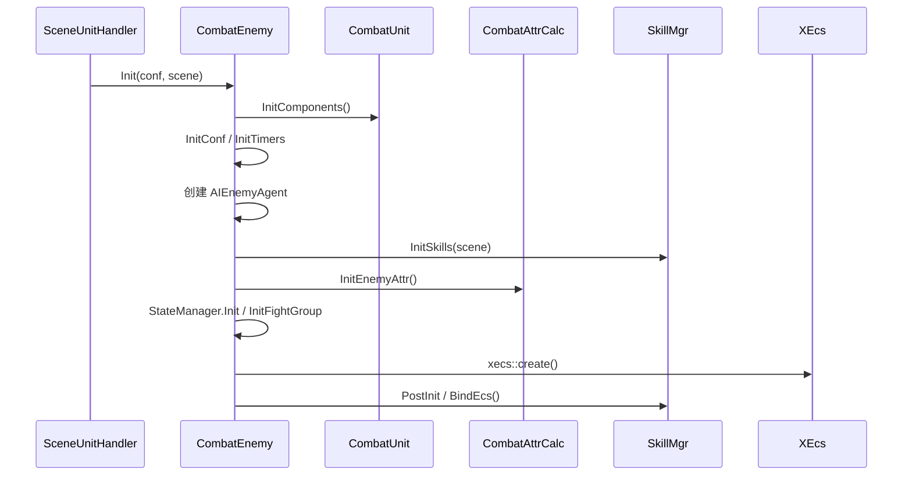
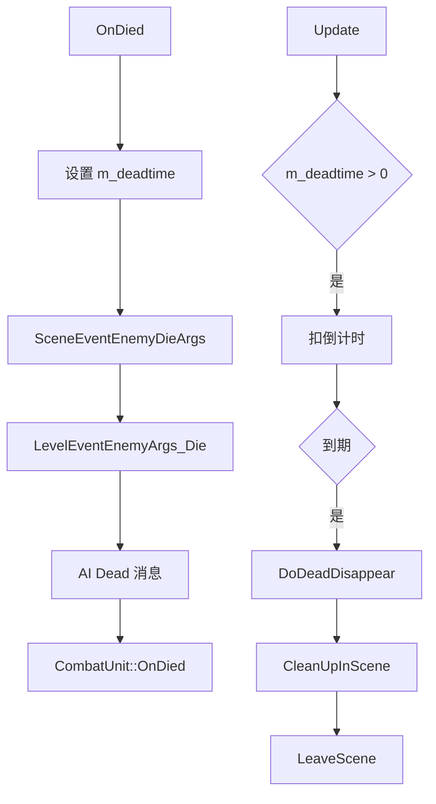

# CombatEnemy 生命周期

## 卡片说明

| 项 | 内容 |
| --- | --- |
| 模块 | `CombatEnemy`。 |
| 职责 | 怪物派生层字段、初始化、进离场、关卡参数、死亡清理。 |
| 边界 | 创建入口见 [SceneUnitHandler 创建入口](scene-unit-handler.md)。 |

## 字段

| 字段 | 用途 |
| --- | --- |
| `m_WaveID` / `m_GroupID` / `m_WaveIndex` | 关卡 wave/group 信息。 |
| `m_hostlevel` / `m_KeepCount` | 关卡宿主和 keep count。 |
| `m_deadtime` / `m_dead_disappeartime` | 死亡消失倒计时。 |
| `m_host` / `m_finalhost` | 召唤关系。 |
| `m_spawn_follow.followid_` | 跟随召唤绑定。 |

## 初始化时序

## 死亡清理流程

## 排查入口

| 现象 | 检查点 |
| --- | --- |
| 进场后 AI 不加载 | `OnPreEnterScene`、`StartLoad`。 |
| wave/group 不对 | `LevelInit` 参数。 |
| 死亡后不消失 | `m_dead_disappeartime`、`SceneActionRate`。 |

