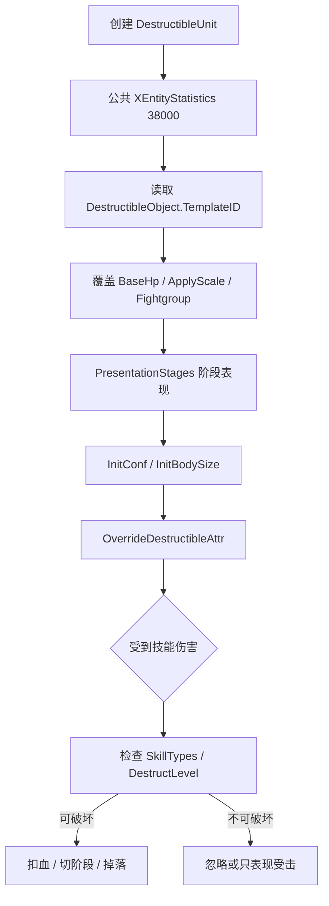

# DestructibleUnit 可破坏物

## 卡片说明

| 项 | 内容 |
| --- | --- |
| 模块 | `DestructibleUnit`。 |
| 职责 | 处理可破坏物模板覆盖、阶段表现、破坏规则和掉落。 |
| 配置 | `DestructibleObject.txt` 或 JSON override。 |

## 配置字段

| 字段 | 用途 |
| --- | --- |
| `TemplateID` | 可破坏物业务模板。 |
| `BaseHp` | 覆盖 HP。 |
| `PresentationStages` | 阶段表现和血量阶段。 |
| `RoleSkillTypes` | 可被哪些角色技能破坏。 |
| `MonsterMinSkillDestructLevel` | 怪物技能破坏等级门槛。 |
| `DropDoodadId` / `DropSourceID` | 掉落。 |

## 配置流程

## 排查入口

| 现象 | 检查字段 |
| --- | --- |
| 打不掉 | `RoleSkillTypes`, `MonsterMinSkillDestructLevel`, `DestructLevel`。 |
| HP 不对 | `BaseHp`, `ApplyScale`, 阶段配置。 |
| 掉落不对 | `DropDoodadId`, `DropSourceID`。 |

