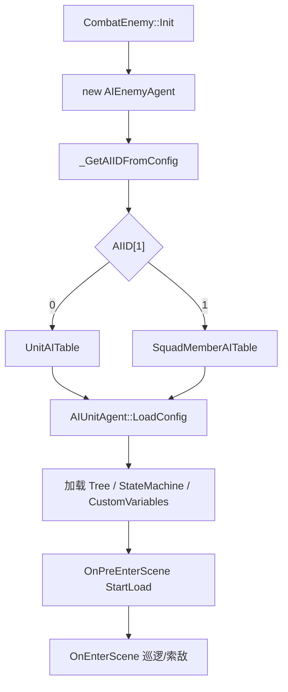

# AIEnemyAgent 怪物 AI

## 卡片说明

| 项 | 内容 |
| --- | --- |
| 模块 | `AIEnemyAgent` / `AIUnitAgent`。 |
| 职责 | 加载怪物 AI 配置，处理巡逻、索敌、进战和自定义变量。 |
| 配置 | `UnitAITable` 或 `SquadMemberAITable`。 |

## AI ID 选择

| 条件 | 行为 |
| --- | --- |
| `AIID[1] == 0` | 从 `UnitAITable` 读取 `AIID[0]`。 |
| `AIID[1] == 1` | 从 `SquadMemberAITable` 读取 `AIID[0]`。 |
| `LevelInit(aiID != 0)` | 覆盖 origin AI ID。 |

## 加载流程

## 排查入口

| 现象 | 检查字段 |
| --- | --- |
| 怪物不索敌 | `Sight`, `FightTogetherDis`, 战斗组。 |
| 行为树没跑 | `Tree`, `StateMachine`, `StartLoad`。 |
| 巡逻不对 | `PatrolID` 和 `LevelInit` 覆盖。 |

