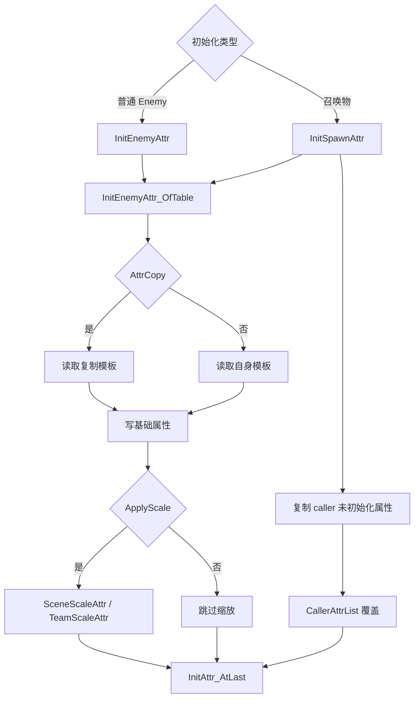

# Enemy 属性初始化

## 卡片说明

| 项 | 内容 |
| --- | --- |
| 模块 | Enemy 属性初始化链路。 |
| 职责 | 从模板和 caller 加载属性，应用场景/队伍缩放。 |
| 边界 | 通用属性容器见 [UnitCombatAttribute 属性容器](../unit/unit-combat-attribute.md)。 |

## 字段

| 字段 | 用途 |
| --- | --- |
| `BaseAtk` / `BaseDef` / `BaseHp` | 基础攻防血。 |
| `BaseAttr` | 额外属性。 |
| `AttrCopy` | 从另一个模板复制基础属性。 |
| `ApplyScale` | 是否走场景缩放。 |
| `CallerAttrList` | 召唤物按比例继承 caller 属性。 |

## 属性流程

## 排查入口

| 现象 | 检查字段 |
| --- | --- |
| 属性过高/过低 | `AttrCopy`, `ApplyScale`, `BaseAttr`, 场景缩放。 |
| 召唤物属性异常 | caller 属性、`CallerAttrList`、caller 等级。 |
| HP 初始化异常 | `InitAttr_AtLast` 顺序。 |

