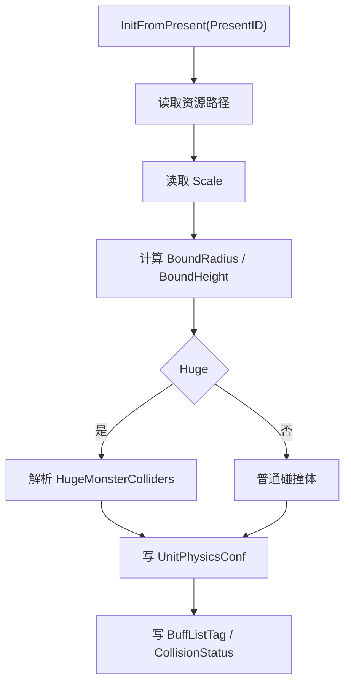

# XEntityPresentation 表现配置

## 卡片说明

| 项 | 内容 |
| --- | --- |
| 模块 | `XEntityPresentation` 表。 |
| 职责 | 提供模型资源、动作资源、体型缩放、碰撞体和 Buff tag。 |
| 下游 | `UnitConf::InitFromPresent`。 |

## 字段

| 字段 | 用途 |
| --- | --- |
| `Prefab` / `AnimLocation` / `SkillLocation` | 客户端表现资源。 |
| `Scale` | 体型缩放。 |
| `BoundRadius` / `BoundHeight` | 碰撞体基础尺寸。 |
| `Huge` / `HugeMonsterColliders` | 大体型多碰撞体。 |
| `CollisionStatus` | 技能碰撞状态。 |
| `BuffListTag` | Buff 目标 tag。 |

## 加载流程

## 排查入口

| 现象 | 检查字段 |
| --- | --- |
| Boss 碰撞体偏差 | `Scale`, `Huge`, `HugeMonsterColliders`。 |
| Buff 目标判断异常 | `BuffListTag`。 |
| 技能碰撞异常 | `CollisionStatus`。 |

