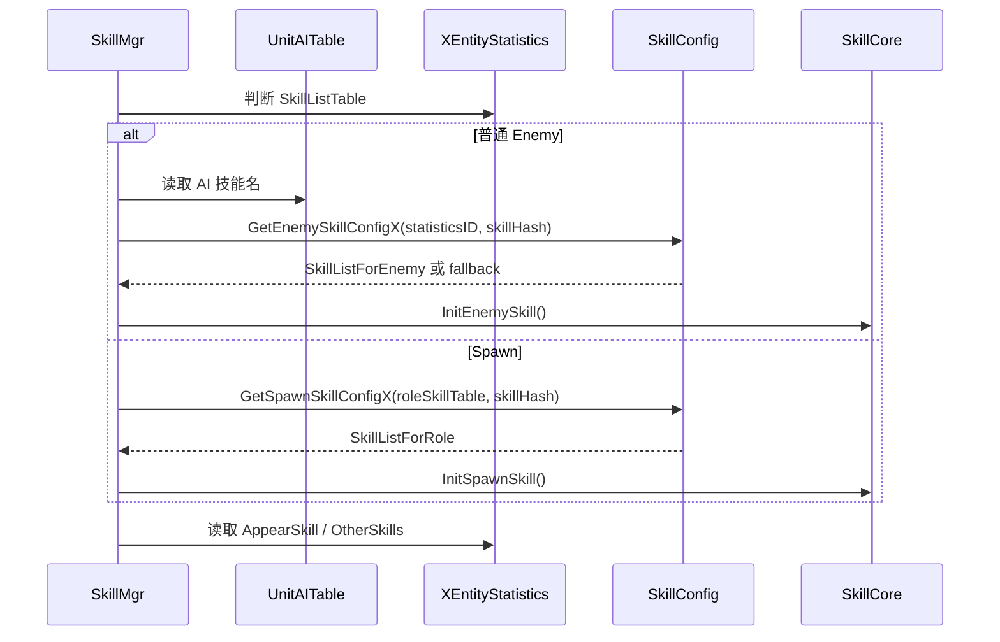

# Enemy 技能配置查表

## 卡片说明

| 项 | 内容 |
| --- | --- |
| 模块 | Enemy/Spawn 技能查表链路。 |
| 职责 | 把 AI 技能名和模板技能字段转成 `SkillCore` 配置。 |
| 关键风险 | 普通 Enemy 和 Spawn 查不同表。 |

## 回答要求

用户贴 `enemy conf skill` / `not find in conf` / `InitEnemySkill` / `GetEnemySkillConfigX` 日志时，最终答案必须原样列出：

- 配置查表函数：`SkillConfig::GetEnemySkillConfigX`。
- 技能初始化函数：`SkillCore::InitEnemySkill`。
- 配置表：`SkillListForEnemy`。
- 关键文件：`gameserver/tableload/skillconfig.cpp`、`gameserver/unit/skill/skillcore.cpp`、`gameserver/unit/skill/skillmgr.cpp`。
- 原始日志短语：`not find in conf`。

## 查表规则

| 类型 | 表 | 条件 |
| --- | --- | --- |
| 普通 Enemy | `SkillListForEnemy` | `SkillListTable == 0`。 |
| Spawn | `SkillListForRole` | `SkillListTable != 0`。 |
| fallback | `SkillListForEnemy` statistics ID 0 | 普通 Enemy 配置缺失时可能回退。 |

## 查表时序

## 日志定位

| 日志 | 常见原因 |
| --- | --- |
| `enemy conf skill:[...] not find` | `SkillListForEnemy` 缺 `(statisticsID, skillHash)`，fallback 也没有。 |
| `caster:%u skill:[%u %s] not find in conf` | `SkillCore::InitEnemySkill` 未拿到配置。 |
| `skill:[%u-%u %s] not find in conf` | Spawn 走 `SkillListForRole` 查不到。 |
