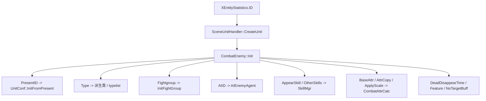

# XEntityStatistics 怪物模板配置

## 卡片说明

| 项 | 内容 |
| --- | --- |
| 模块 | `XEntityStatistics` 表。 |
| 职责 | Enemy 模板主配置，决定类型、表现、阵营、属性、AI、技能和死亡行为。 |
| 下游 | `CombatEnemy::Init`、`UnitConf`、`CombatAttrCalc`、`SkillMgr`、`AIEnemyAgent`。 |

## 字段

| 字段 | 用途 |
| --- | --- |
| `ID` | 模板 ID。 |
| `PresentID` | 表现 ID。 |
| `Type` | species 和派生类选择。 |
| `Fightgroup` | 阵营。 |
| `DefaultLevel` | 默认等级。 |
| `DeadDisappearTime` | 死亡消失时间。 |
| `AIID` | AI 配置 ID 和表类型。 |
| `AppearSkill` / `OtherSkills` | 技能配置入口。 |
| `AttrCopy` / `ApplyScale` / `BaseAttr` | 属性初始化入口。 |

## 字段到运行时流程

## 排查入口

| 现象 | 检查字段 |
| --- | --- |
| 模板不存在 | `ID` 和调用方传入 ID。 |
| 类型不对 | `Type`。 |
| 技能/AI/属性异常 | `AIID`, `OtherSkills`, `AttrCopy`, `ApplyScale`。 |

