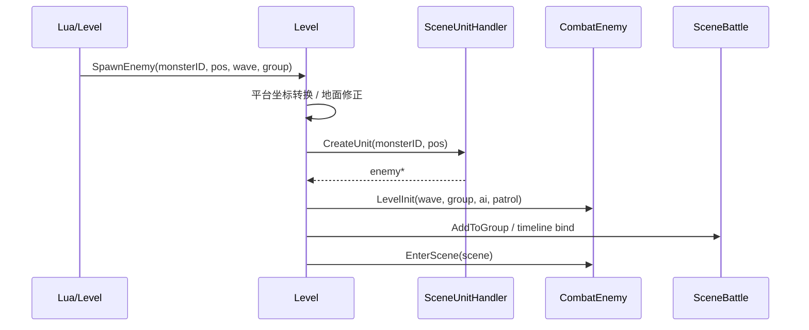

# Level::SpawnEnemy 刷怪入口

## 卡片说明

| 项 | 内容 |
| --- | --- |
| 模块 | 关卡刷怪入口。 |
| 职责 | 接收 Lua/Level 参数，做平台坐标和地面高度修正，然后创建并进场。 |
| 下游 | `SceneUnitHandler::CreateUnit`、`CombatEnemy::LevelInit`。 |

## 刷怪时序

## LevelInit 字段

| 参数 | 写入位置 |
| --- | --- |
| `waveID` / `waveIndex` | `m_WaveID` / `m_WaveIndex` |
| `groupID` | `m_GroupID` |
| `level` | `m_hostlevel` |
| `keepMapNum` | `m_KeepCount` |
| `aiID` | `AIAgent::SetOriginAIID` |
| `patrolID` | `AIEnemyAgent::SetPatrol` |

## 排查入口

| 现象 | 检查点 |
| --- | --- |
| 刷怪失败 | monster ID、坐标修正、CreateUnit 返回值。 |
| group 不对 | `LevelInit` 参数和 `Level::AddToGroup`。 |
| 巡逻不对 | `patrolID` 覆盖逻辑。 |

