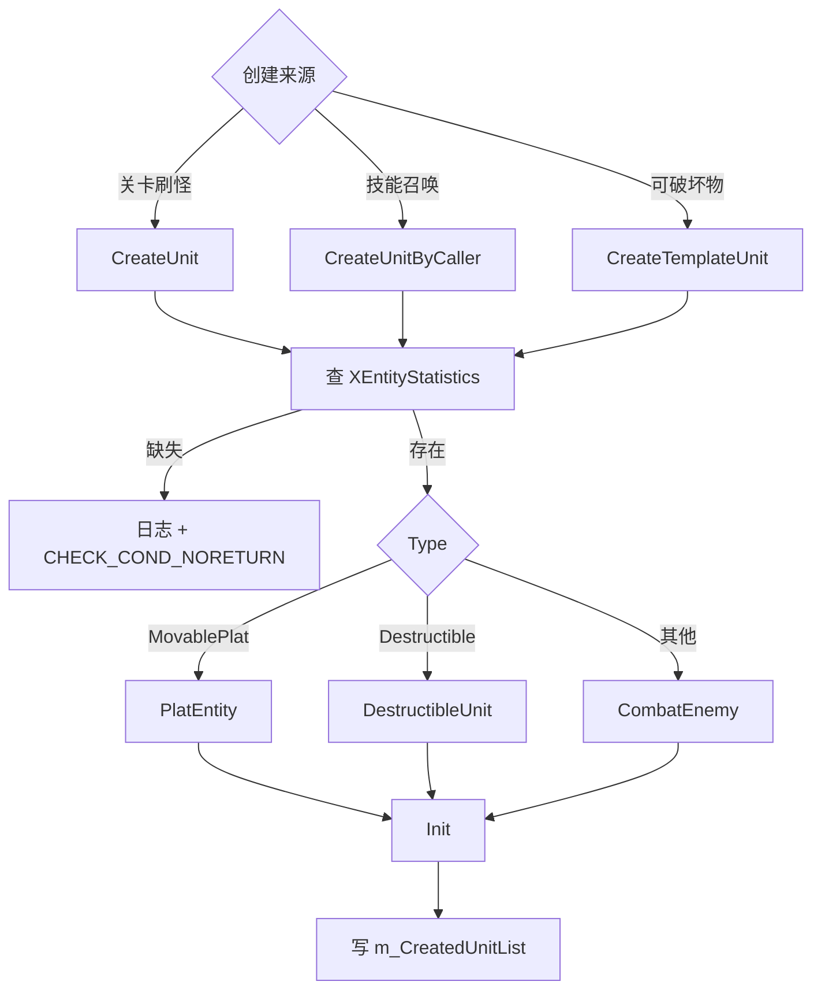

# SceneUnitHandler 创建入口

## 卡片说明

| 项 | 内容 |
| --- | --- |
| 模块 | `SceneUnitHandler` 创建接口。 |
| 职责 | 查模板、选择派生类、调用初始化、登记创建列表。 |
| 边界 | 关卡参数补充见 [Level::SpawnEnemy 刷怪入口](level-spawn-enemy.md)。 |

## 创建流程

## 排查入口

| 现象 | 检查点 |
| --- | --- |
| 模板找不到 | 传入 monster/template ID 和 `XEntityStatistics.ID`。 |
| 派生类不对 | `XEntityStatistics.Type`。 |
| 召唤失败 | caller 和 caller scene 是否有效。 |

