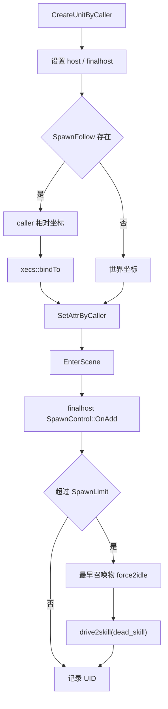

# SpawnControl 召唤控制

## 卡片说明

| 项 | 内容 |
| --- | --- |
| 模块 | `SpawnControl` 和召唤配置。 |
| 职责 | 管理 final host 召唤数量限制、跟随绑定和超限处理。 |
| 配置 | `SpawnFollow.txt`, `SpawnLimit.txt`。 |

## 字段

| 字段 | 用途 |
| --- | --- |
| `unit2group` | 召唤物 UID 到限制组。 |
| `group2units` | 限制组到召唤物列表和上限。 |
| `m_caller_uid` | 调试 caller。 |

## 召唤控制流程

## 排查入口

| 现象 | 检查字段 |
| --- | --- |
| 召唤数量不对 | `SpawnLimit.CountLimit`, `PassiveSkill`。 |
| 召唤不跟随 | `SpawnFollow.ID`, `xecs::bindTo`。 |
| 残留召唤物 | `OnDel`, final host 是否存在。 |

