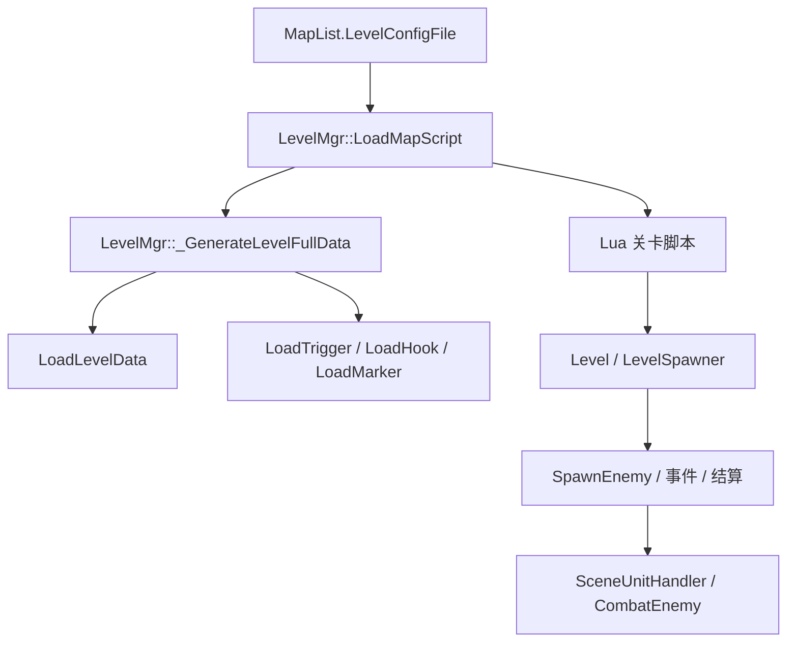

# Level 层索引

## 卡片说明

| 项 | 内容 |
| --- | --- |
| 用途 | 作为关卡层目录，指向关卡编辑器、刷怪和关卡配置知识。 |
| 覆盖 | `LevelMgr` 加载、`LevelEditorData` 数据结构、Trigger、Hook、Marker、Group、`LevelSpawner`、刷怪。 |
| 不展开 | 网络、登录、服务部署、客户端关卡表现。 |
| 使用要求 | 关卡编辑器节点要区分“服务端直接识别”和“通过 Lua / 客户端表现处理”。 |

## 范围

覆盖代码：

- `gameserver/level/`
- `gameserver/level/info/`
- `gameserver/scene/sceneunithandler.*`
- `gameserver/unit/enemy.*`
- `gameserver/ai/aimarker.*`

关联配置和文件：

- `Level/<LevelConfigFile>.cfg`
- `Level/<FuncName>.Func`
- `Level/<GroupConfigPath>.bp`
- `Trigger/<LevelConfigFile>_Trigger.json`
- `Trigger/<LevelConfigFile>_Hook.json`
- `Marker/<LevelConfigFile>.json`
- `MapList.LevelConfigFile`
- `MapList.GroupConfigPath`

## 细分卡片

| 子卡 | 重点 | 适用问题 |
| --- | --- | --- |
| [关卡编辑器节点枚举](level-editor-nodes.md) | Level 编辑器导出数据、服务端识别节点、Trigger / Hook / Wall 字段。 | 关卡节点含义、触发器不生效、Timeline 不同步。 |
| [关卡 Level 配置](../common-qa/level-config.md) | Level 配置总览、刷怪参数和结算链路。 | 关卡怎么配、刷怪怎么配。 |
| [Level::SpawnEnemy 刷怪入口](../enemy/level-spawn-enemy.md) | Lua/关卡参数、坐标修正、进场。 | 怪物刷不出来、波次和 group 异常。 |
| [SceneUnitHandler 创建入口](../enemy/scene-unit-handler.md) | 查模板、选择派生类、创建 Unit。 | 模板缺失、创建失败。 |

## 总体链路

## 排查入口

| 现象 | 优先看 |
| --- | --- |
| 关卡脚本加载失败 | `MapList.LevelConfigFile`、`LevelLua/<name>.lua`、`Level/<name>.cfg`。 |
| Trigger 不生效 | `Trigger/<name>_Trigger.json`、`triggerObjects`、`eventData`、`eventStartData`。 |
| Hook 不生效 | `Trigger/<name>_Hook.json`、`zipwirePoints`、半径、高度、目标点。 |
| Timeline 同步异常 | `LevelEditor.LevelSyncTimelineEndStateNode` / `LevelSyncPlotEndStateNode`。 |
| 初始剧情没播 | `BluePrint.ControllerStartNode` 首条连线是否指向 `LevelEditor.LevelCallFunctionNode`。 |
| 组关卡不加载 | `MapList.GroupConfigPath`、`Level/<group>.bp`、Group 条件。 |
