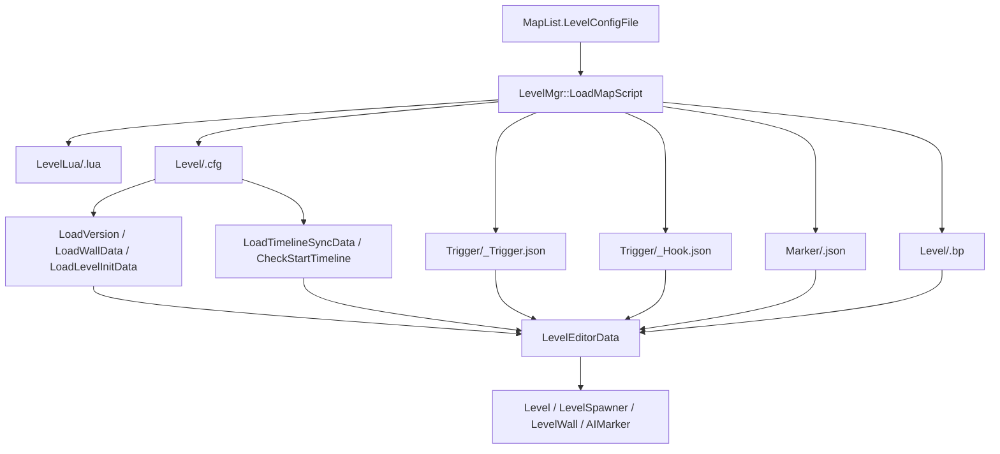

# 关卡编辑器节点枚举

## 卡片说明

| 项 | 内容 |
| --- | --- |
| 目标 | 建立“关卡编辑器导出内容 -> 服务端数据结构 -> 运行时用途”的索引。 |
| 覆盖 | Level cfg/Func、Trigger、Hook、Marker、Group、服务端直接识别的 `LevelEditor.*` 节点。 |
| 关键边界 | 服务端并不完整执行所有编辑器蓝图节点；它只直接读取少数节点和数据段，其余通过 Lua、客户端或其他系统处理。 |
| 使用要求 | 排查时先确认文件是否加载，再看字段是否被服务端读取。 |

## 运行模型

## 服务端直接识别的蓝图节点

| 节点 key | 读取入口 | 关键字段 | 用途 |
| --- | --- | --- | --- |
| `BluePrint.ControllerStartNode` | `CheckStartTimeline` | `nodeData.pinExecList[0].linkData[0].nodeID` | 只在 `graphID == 1` 中读取，用于找到关卡开始后第一个执行节点。 |
| `LevelEditor.LevelCallFunctionNode` | `CheckStartTimeline` | `InternalFuncName`, `nodeData.NodeID`, `nodeData.pinDataList[0].defaultValue` | 当首个执行节点是 `PlayTimeline` 或 `PlayPlot` 时，记录 `startTimeline.name` 或 `startTimeline.plotID`。 |
| `LevelEditor.LevelSyncTimelineEndStateNode` | `LoadTimelineSyncData` | `targetID`, `timelineName`, `trackOrder` | 将 wave / target ID 绑定到 Timeline 完成同步数据。 |
| `LevelEditor.LevelSyncPlotEndStateNode` | `LoadTimelineSyncData` | `targetID`, `plotID`, `trackOrder` | 将 wave / target ID 绑定到 Plot 完成同步数据。 |

## LevelCallFunction 函数名映射

这些名称由 `LevelMgr::InitScriptMap` 注册到 `ScriptType`。

| `InternalFuncName` | 运行时含义 | 常见用途 |
| --- | --- | --- |
| `PlayTimeline` | 播放 Timeline | 关卡开场或波次演出。 |
| `Notice` | 通知客户端节点 | 向客户端下发关卡表现参数。 |
| `SetFX` | 设置特效 | 开关场景特效。 |
| `BackToBattleCam` | 回到战斗相机 | 结束临时镜头。 |
| `CameraControlTemporarily` | 临时控制相机 | 关卡镜头控制。 |
| `SetBattleViewActiveState` | 设置战斗视图激活状态 | 隐藏或恢复战斗 UI / 视图。 |
| `PlaySceneObjectAnimation` | 播放场景物动画 | 机关、门、平台动画。 |
| `SetSceneObjectEnable` | 设置场景物启用 | 开关场景物。 |
| `PlayLevelAudio` | 播放关卡音频 | 音效或背景音。 |
| `ShowTarget` | 显示目标 | 关卡指引。 |
| `SetTriggerEntityActive` | 开关 Trigger 实体 | 控制触发器是否可用。 |
| `SetZipwirePointActive` | 开关 Hook / zipwire 点 | 控制滑索点是否可用。 |
| `MapFlip` | 地图翻转 | 特定关卡地图状态变化。 |
| `TutorialExString` | 教学文案 | 显示教程文本。 |
| `Checkpoint` | 检查点 | 记录关卡进度。 |
| `SetCameraLockState` | 设置相机锁定 | 控制相机锁定状态。 |
| `BattleTutorialTargetCompleted` | 战斗教学目标完成 | 教学任务回报。 |
| `PlayCameraShake` | 播放相机震动 | 表现反馈。 |
| `CancelCameraShake` | 取消相机震动 | 结束震动。 |
| `ModifyNpcPlot` | 修改 NPC 剧情 | 更新 NPC 剧情状态。 |

## Level cfg / Func 数据段

| 数据段 | 读取入口 | 字段 | 用途 |
| --- | --- | --- | --- |
| `version` | `LoadVersion` | `version` | 影响旧版触发墙兼容逻辑。 |
| `levelWallDataList` | `LoadWallData(loadCfg=true)` | 见下方 Wall 表 | `.cfg` 关卡墙、阻挡、触发墙。 |
| `wallDataList` | `LoadWallData(loadCfg=false)` | 见下方 Wall 表 | `.Func` 子脚本墙数据。 |
| `levelInitialConfig` | `LoadLevelInitData` | `startPos`, `startFace` | 关卡初始位置和朝向。 |
| `graphDataList` | `LoadTimelineSyncData`, `CheckStartTimeline` | `graphID`, `nodesData` | Timeline / Plot 同步和开场 Timeline 识别。 |

## Wall 数据字段

| 字段 | 类型 | 用途 |
| --- | --- | --- |
| `name` | string | 墙或触发墙名称。 |
| `position` | vec3 | 中心位置。 |
| `rotation` | float | 旋转。 |
| `on` | bool | 是否启用。 |
| `type` | int | 墙类型或编辑器类型。 |
| `size` | vec3 | 体积尺寸。 |
| `wallType` | int | 0 普通、1 boss、2 主角。 |
| `forward` | vec3 | 正方向。 |
| `sideLimit` | bool | 是否限制侧边。 |
| `leftdown` / `rightup` | vec3 | 区域边界。 |
| `exString` | string | 扩展字符串。 |
| `isTrigger` | bool | 是否触发墙。 |
| `isBulletBlock` | bool | 是否阻挡子弹。 |
| `once` | bool | 是否只触发一次。 |
| `target` | int | 触发目标类型。 |
| `aiID` | uint32 | 怪物消息触发墙中代表待检测怪物 tempID。 |
| `passFlag` | array | 通行方向，按玩家 / 怪物等维度读取 forward、backward。 |
| `buffIDList` | int array | 触发或限制相关 Buff。 |
| `typeList` | int array | 类型列表。 |
| `intParam` / `floatParam` / `strParam` | mixed | 扩展参数。 |

## Trigger 数据字段

触发器文件来自 `Trigger/<levelFileName>_Trigger.json`，根节点必须包含 `triggerObjects`。

| 层级 | 字段 | 用途 |
| --- | --- | --- |
| Trigger | `id` | 触发器 ID。 |
| Trigger | `position` | 触发器中心点。 |
| Trigger | `triggerSize` | 触发半径。 |
| Trigger | `isEnabledInBattle` | 战斗中是否启用。 |
| Event | `id` | 事件序号，服务端断言 `id <= EVENTID_MAX`。 |
| Event | `eventStartData` | 事件动作列表。 |
| Event | `repeatType` | 0 无限制、1 账号限制、2 关卡限制。 |
| Event | `repeatCount` | 触发次数，-1 表示无限。 |
| Event | `delayTime` | 延迟时间。 |
| Event | `moveType` | 玩家移动类型。 |
| Event | `playerDestination` | 玩家目标点。 |
| Event | `playerAnimationIndex` | 玩家表现类型。 |
| Action | `eventType` | 事件动作类型。 |
| Action | `eventArgs` | 事件参数字符串。 |

## Trigger eventType 枚举

| 枚举 | 值 | 含义 |
| --- | --- | --- |
| `Type_Null` | 0 | 空动作。 |
| `Type_Loot` | 1 | 掉落 / 奖励动作。 |
| `Type_Exstring` | 2 | 扩展字符串动作。 |
| `Type_Chat` | 3 | 对话动作。 |
| `Type_Teleport` | 4 | 传送动作。 |
| `Type_Elevator` | 5 | 电梯 / 机关动作。 |
| `Type_Buff` | 6 | Buff 动作。 |
| `Type_Unlock` | 7 | 解锁动作。 |
| `Type_UIOpen` | 10001 | 打开 UI。 |

## Hook / Marker / Group

| 数据 | 文件 | 字段 | 用途 |
| --- | --- | --- | --- |
| Hook | `Trigger/<name>_Hook.json` | `zipwirePoints[].id`, `radius`, `height`, `destination`, `triggerPos` | 滑索点或 Hook 点触发范围和目标位置。 |
| Marker | `Marker/<name>.json` | 由 `AIMarkerMgr::Load` 读取 | 给 AI / 关卡逻辑使用的空间标记。 |
| Group | `Level/<group>.bp` | `GroupDatas::Load` | 组关卡加载、卸载、运行条件。 |

## Group 条件结构

| 类型 | 字段 | 用途 |
| --- | --- | --- |
| `GroupData` | `ID`, `anchor`, `path`, `always_load` | 一个组关卡条目。 |
| `cond_load` | `RestrictData` | 何时加载组。 |
| `cond_unload` | `RestrictData` | 何时卸载组。 |
| `cond_run` | `RestrictData` | 何时运行组。 |
| `CondData` | `ALL`, `ANYX`, `NOT` | 组合条件。 |
| `RestrictData` | `INGAME_QUEST_STATE`, `PARTNER_TYPE_IN_GROUP`, `PARTNER_ID_IN_GROUP`, `PLAYER_POS` | 叶子条件类型。 |

## 常见排查

| 现象 | 优先检查 |
| --- | --- |
| `Load map failed` | `MapList.LevelConfigFile`、`LevelLua/<name>.lua`、`Level/<name>.cfg` 是否存在。 |
| `load level data failed` | `.cfg` / `.Func` 是否能解析为 JSON，根字段是否符合版本。 |
| Trigger 文件报 `required parameter does not exist` | 根节点是否有 `triggerObjects` 数组。 |
| Hook 文件报 `required parameter does not exist` | 根节点是否有 `zipwirePoints` 数组。 |
| 触发事件没执行 | `eventData`、`eventStartData`、`eventType`、`repeatCount`、`isEnabledInBattle`。 |
| 开场 Timeline 没识别 | `graphID == 1`、`ControllerStartNode` 首条连线、`LevelCallFunctionNode.InternalFuncName`。 |
| Timeline / Plot 等波次没同步 | `targetID` 是否非 0，`trackOrder` 是否能按 `|` 分割为整数。 |
| 触发墙对怪物无效 | `version < 3` 时触发墙会关闭怪物方向通行标记；同时检查 `passFlag`。 |

## 关键代码

| 文件 | 作用 |
| --- | --- |
| `gameserver/level/LevelMgr.cpp` | 加载 Level cfg/Func、Trigger、Hook、Marker、Group；注册关卡脚本函数名。 |
| `gameserver/level/LevelEditorData.h` | 服务端承接关卡编辑器导出数据的结构体。 |
| `gameserver/level/LevelExploreData.h` | Group 条件和 RestrictData 结构。 |
| `gameserver/level/info/LevelWall.cpp` | 墙、触发墙和动态阻挡运行逻辑。 |
| `gameserver/ai/aimarker.h` | Marker 管理器入口。 |
