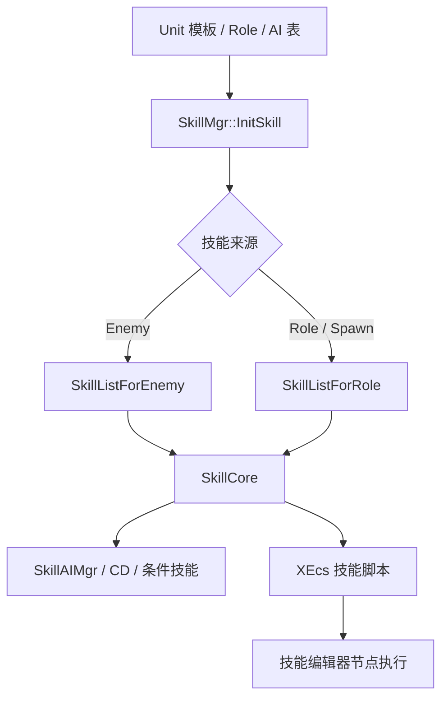

# Skill 层索引

## 卡片说明

| 项 | 内容 |
| --- | --- |
| 用途 | 作为 Skill 体系目录，指向技能运行时、配置问答和编辑器节点知识。 |
| 覆盖 | `SkillMgr`、`SkillCore`、Skill 配置查表、SkillSlot、QTE、XEcs 技能编辑器节点。 |
| 关联层 | Unit 持有 `SkillMgr`；Enemy / Role / Spawn 决定技能表来源；AI 负责选择技能。 |
| 使用要求 | 具体字段和行号需读取当前代码核实。 |

## 范围

覆盖代码：

- `gameserver/unit/skill/`
- `gameserver/tableload/skillconfig.*`
- `XEcsLib/XEcs/ecs/component/X*Data.h`
- `XEcsLib/XEcs/ecs/system/X*Sys*`
- `XEcsLib/XEcs/ecs/utility/utility2reader_json.hpp`
- `XEcsLib/XEcs/XSirius.cpp`

关联配置：

- `SkillListForEnemy`
- `SkillListForRole`
- `SkillDamage`
- `SkillChange`
- `SkillSlot`
- `QteEvent`
- `DamageSwitch`
- AI 表里的技能名、技能组合和条件技能。

## 细分卡片

| 子卡 | 重点 | 适用问题 |
| --- | --- | --- |
| [SkillMgr 技能管理](../unit/skill-mgr.md) | 技能创建、AI 注册、条件技能、ECS 绑定。 | 技能对象不存在、AI 不释放技能。 |
| [技能编辑器节点枚举](skill-editor-nodes.md) | 技能 JSON 节点、`XNodeData`、`XBPNodeSys` 映射。 | 编辑器节点含义、节点不执行。 |
| [Skill 配置](../common-qa/skill-config.md) | 技能配置总览和运行时查表链路。 | 技能怎么配置、怪物技能缺失。 |
| [SkillSlot 配置](../common-qa/skill-slot-config.md) | 槽位状态、SkillPartnerId、Slot1-10 映射。 | 技能槽位切换错误。 |
| [QTE 配置](../common-qa/qte-config.md) | QTE 表、技能节点和运行时触发链路。 | QTE 不出现、不触发。 |
| [Enemy 技能配置查表](../enemy/enemy-skill-config.md) | `SkillListForEnemy` / Spawn 技能查表。 | `enemy conf skill not find`。 |

## 总体链路

## 排查入口

| 现象 | 优先看 |
| --- | --- |
| 技能配置缺失 | `SkillConfig` 查表、技能 hash、模板 ID、SkillList 表。 |
| AI 不释放技能 | AI 表技能名、`SkillMgr::RegisterAIMgr`、CD、距离、条件技能。 |
| SkillSlot 不生效 | `SkillSlot` 表、`XBuffChangeSlot`、状态组合和 Slot1-10。 |
| QTE 不触发 | 技能节点 `qteData`、`qteDisplayData`、`QteEvent`、技能运行条件。 |
| 编辑器节点不执行 | JSON key 是否加载、系统是否注册、连线是否可达、端侧宏是否生效。 |
