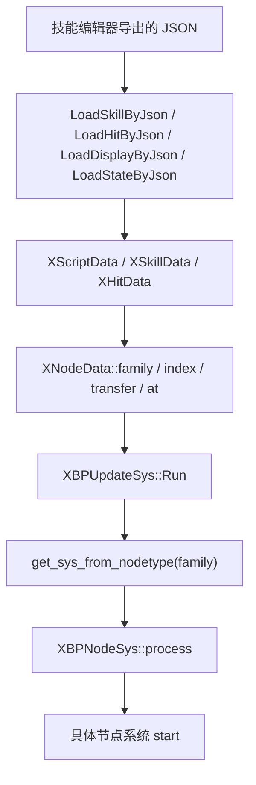
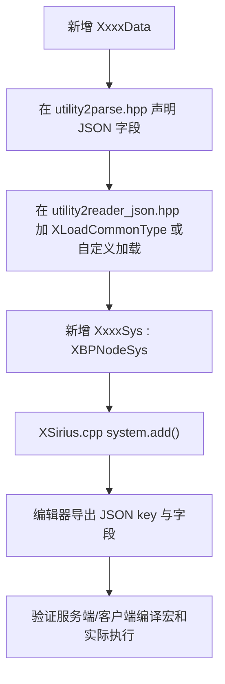

# 技能编辑器节点枚举

## 卡片说明

| 项 | 内容 |
| --- | --- |
| 目标 | 建立“技能编辑器 JSON 节点名 -> C++ 节点数据 -> 执行系统 -> 用途”的索引。 |
| 覆盖脚本 | Skill、Hit、Display、State 四类脚本。 |
| 核心代码 | `utility2reader_json.hpp` 负责加载节点，`XBPUpdateSys` 负责执行节点。 |
| 注意 | 有些节点只是辅助数据或仅客户端/服务端生效，不能只看 JSON key 判断一定会执行。 |

## 运行模型

## 基础结构

| 类型 | 作用 | 关键字段 |
| --- | --- | --- |
| `XNodeData` | 所有编辑器节点的基类。 | `family`、`at`、`transfer`、`instance`、`hash`、`index`、`timeBased`。 |
| `XTransferData` | 节点连线。 | `index` 指向下一个节点；`enable` 控制连线是否有效。 |
| `XScriptData` | 脚本级容器。 | `hash`、`version`、`headIndex`、`nodeCount`、`length`、`times`、`node[]`。 |
| `XSkillData` | 技能脚本头。 | `skillType`、`preCondition`、`blockSens`、`skillAttackField`、CD 和输入目标开关。 |
| `XHitData` | 受击脚本头。 | 继承 `XScriptData`，加载命中反馈相关节点。 |
| `XStateAbilityData` | 状态能力脚本头。 | 主要加载条件、特殊动作、Buff、函数和分支节点。 |
| `XBPNodeSys<Derived, Node>` | 节点系统模板。 | `config` 注册 node type 到 system；`process` 调用 `start`。 |

## 脚本类型

| 脚本类型 | 加载入口 | 典型用途 | 主要节点范围 |
| --- | --- | --- | --- |
| Skill | `LoadSkillByJson` | 主动技能、槽位技能、QTE 技能。 | 伤害、位移、子弹、预警、目标选择、Buff、QTE、表现节点。 |
| Hit | `LoadHitByJson` | 受击表现和受击逻辑。 | 击退、受击状态、命中方向、Buff、QTE、表现代理。 |
| Display | `LoadDisplayByJson` | 状态表现脚本。 | 动作、轻量位移、轻量旋转、相机和表现节点。 |
| State | `LoadStateByJson` | 状态能力脚本。 | 条件、分支、特殊动作、Buff、函数节点。 |

## 节点枚举

### 控制流节点

| JSON key | 数据结构 | 执行系统 | 脚本范围 | 用途 |
| --- | --- | --- | --- | --- |
| `emptyData` | `XEmptyData` | `XEmptyNodeSys` | Skill、Hit | 空节点或连接占位。 |
| `endData` | `XEndData` | `XEndNodeSys` | Skill、Hit、Display | 脚本结束；服务端可携带 `offstage`。 |
| `timerData` | `XTimerData` | `XTimerNodeSys` | Skill、Hit、Display | 等待时间后继续走 transfer。 |
| `loopData` | `XLoopData` | `XLoopNodeSys` | Skill、Hit、Display | 循环执行，核心字段是 `count`。 |
| `breakData` | `XBreakData` | `XLoopBreakNodeSys` | Skill、Hit、Display | 跳出循环。 |
| `continueData` | `XContinueData` | `XLoopContinueNodeSys` | Skill、Hit、Display | 进入下一轮循环。 |
| `untilData` | `XUntilData` | `XUntilNodeSys` | Skill、Hit | 持续执行直到时间或条件结束。 |
| `conditionData` | `XConditionData` | `XConditionNodeSys` | Skill、Hit、State | 单条件分支。 |
| `multiConditionData` | `XMultiConditionData` | `XMultiConditionNodeSys` | Skill、Hit、State | 多条件组合，支持 AND/OR 和取反。 |
| `preConditionData` | `XMultiConditionData` | `XMultiConditionNodeSys` | Skill | 技能前置条件集合。 |
| `switchData` | `XSwitchData` | `XSwitchNodeSys` | Skill、Hit、State | 按函数返回或枚举值进行分支。 |
| `interruptReturnData` | `XInterruptReturnData` | `XInterruptReturnNodeSys` | Skill | 中断返回，服务端注册。 |

### 技能执行节点

| JSON key | 数据结构 | 执行系统 | 脚本范围 | 用途 |
| --- | --- | --- | --- | --- |
| `resultData` | `XResultData` | `XSkillResultSys` | Skill | 结算技能结果，包含范围、伤害段、击退参数、物理曲线等。 |
| `resultPresentData` | `XResultPresentData` | 无直接节点系统 | Skill | Result 的表现/轨迹辅助数据，通过 `resultPresentIndex` 引用。 |
| `chargeData` | `XChargeData` | `XSkillChargeSys` | Skill | 技能位移/冲锋，支持 duration、速度、曲线、目标点和碰撞检查。 |
| `liteChargeData` | `XLiteChargeData` | `XLiteChargeSys` | Display | 表现用轻量位移，主要客户端/表现脚本使用。 |
| `rotateData` | `XRotateData` | `XRotateSys` | Skill | 技能期间旋转，服务端可使用旋转曲线。 |
| `liteRotateData` | `XLiteRotateData` | `XLiteRotateSys` | Display | 表现用轻量旋转，客户端加载。 |
| `lookAtData` | `XLookAtData` | `XSkillLookAtSys` | Skill | 技能期间面向目标或计算位置。 |
| `aimTargetData` | `XAimTargetData` | `XSkillTargetAimSys` | Skill | 目标瞄准，控制最大角度和瞄准速度。 |
| `targetSelectData` | `XTargetSelectData` | `XSkillTargetSelectSys` | Skill | 选择目标集合，支持范围、扇形、随机数、阵营和条件过滤。 |
| `warningData` | `XWarningData` | `XSkillWarningSys` | Skill | 技能预警区域，可绑定子弹、位置和方向计算。 |
| `bulletData` | `XBulletData` | `XSkillBulletSys` | Skill | 发射子弹/弹道，包含生命周期、碰撞、速度、范围和命中次数。 |
| `mobUnitData` | `XMobUnitData` | `XSkillMobSys` | Skill | 服务端召唤单位，配置模板、偏移、绑定和生命周期。 |
| `bindData` | `XBindData` | `XSkillBindNodeSys` | Skill | 服务端绑定/解绑目标或自身。 |

### Buff、QTE、状态节点

| JSON key | 数据结构 | 执行系统 | 脚本范围 | 用途 |
| --- | --- | --- | --- | --- |
| `buffData` | `XBuffData` | `XBuffNodeSys` | Skill、Hit、State | 添加、叠层或清理 Buff；可指定目标类型、多目标索引和参数索引。 |
| `qteData` | `XQTEData` | `XSkillQteSys` | Skill、Hit | 打开 QTE 状态，支持 `qteID`、`duration`、`cacheTime`、`self`。 |
| `qteDisplayData` | `XQTEDisplayData` | `XSkillQteDisSys` | Skill、Hit | 展示 QTE，字段 `qteIndex` 指向一个 `XQTEData`。 |
| `actionStatusData` | `XActionStatusData` | `XActionNodeSys` | Skill、Hit | 改变动作状态能力，例如能否移动、能否旋转、动作缩放。 |
| `scriptTransData` | `XScriptTransData` | `XScriptTransSys` | Skill、Hit | 切换到其他脚本，可继承目标或强制切换。 |
| `specialActionData` | `XSpecialActionData` | `XSpecialActionSys` | Skill、Hit、State | 特殊动作入口，使用 type 和参数驱动服务端或客户端扩展行为。 |

### 表现节点

| JSON key | 数据结构 | 执行系统 | 脚本范围 | 用途 |
| --- | --- | --- | --- | --- |
| `animationData` | `XAnimationData` | `XAnimSys` | Skill、Hit、Display | 播放动作，支持 blendIn 和 ratio。 |
| `audioData` | `XAudioData` | `XAudioSys` | Skill、Hit、Display | 播放音频。 |
| `fxData` | `XFxData` | `XFxSys` | Skill、Hit、Display | 客户端特效节点，可绑定位置和方向计算。 |
| `cameraMotionData` | `XCameraMotionData` | `XCameraMotionSys` | Skill | 相机运动表现。 |
| `cameraStretchData` | `XCameraStretchData` | `XCameraStretchSys` | Skill、Display | 相机拉伸表现。 |
| `cameraShakeData` | `XCameraShakeData` | `XCameraShakeSys` | Skill | 相机震动表现。 |
| `cameraLayerMaskData` | `XCameraLayerMaskData` | `XCameraLayerMaskSys` | Skill | 相机层级遮罩表现。 |
| `cameraPostEffectData` | `XCameraPostEffectData` | `XCameraPostEffectSys` | Skill | 相机后处理表现。 |
| `shaderEffectData` | `XShaderEffectData` | `XShaderEffectSys` | Skill、Hit | Shader 表现节点。 |
| `fxProxyData` | `XFxProxyData` | `XFxProxySys` | Hit | 命中脚本里的特效代理。 |
| `audioProxyData` | `XAudioProxyData` | `XAuProxySys` | Hit | 命中脚本里的音频代理。 |

### 命中反馈节点

| JSON key | 数据结构 | 执行系统 | 脚本范围 | 用途 |
| --- | --- | --- | --- | --- |
| `knockedBackData` | `XKnockedBackData` | `XHitKnockedBackSys` | Hit | 受击击退，支持持续时间、速度、曲线、重力和朝施法者移动。 |
| `hitStatusData` | `XHitStatusData` | `XHitStatusSys` | Hit | 设置受击状态。 |
| `adjustHitDirectionData` | `XAdjustHitDirectionData` | `XHitDirectionAdjustSys` | Hit | 调整受击方向，核心字段是 `hitDirectionType`。 |

### 计算和辅助节点

| JSON key | 数据结构 | 执行系统 | 脚本范围 | 用途 |
| --- | --- | --- | --- | --- |
| `doFunctionData` | `XDoFunctionData` | `XDoFunctionNodeSys` | Skill、Hit、State | 执行函数列表，函数参数可引用运行时参数。 |
| `paramData` | `XParamData` | `XScriptParamsSys` | Skill、Hit | 计算脚本参数。 |
| `algorithmData` | `XAlgorithmData` | `XScriptAlgorithmSys` | Skill、Hit | 定义位置/方向/数值算法描述。 |
| `randomData` | `XRandomData` | `XScriptRandomSys` | Skill、Hit | 随机参数节点。 |
| `messageData` | `XMessageData` | `XScriptMessageSys` | Skill、Hit | 输出或上报消息。 |
| `getPositionData` | `XGetPositionData` | `XPositionGetterSys` | Skill、Hit | 计算位置，可按目标、本地坐标、偏移和算法索引生成。 |
| `getDirectionData` | `XGetDirectionData` | `XDirectionGetterSys` | Skill、Hit | 计算方向，可按目标、多目标和方向算法生成。 |

## 加载差异

| JSON key | Skill | Hit | Display | State |
| --- | --- | --- | --- | --- |
| `resultData` | 是 | 否 | 否 | 否 |
| `bulletData` | 是 | 否 | 否 | 否 |
| `chargeData` | 是 | 否 | 否 | 否 |
| `targetSelectData` | 是 | 否 | 否 | 否 |
| `mobUnitData` | 是，服务端 | 否 | 否 | 否 |
| `knockedBackData` | 否 | 是 | 否 | 否 |
| `hitStatusData` | 否 | 是 | 否 | 否 |
| `liteChargeData` | 否 | 否 | 是 | 否 |
| `liteRotateData` | 否 | 否 | 是，客户端 | 否 |
| `conditionData` / `switchData` | 是 | 是 | 否 | 是 |
| `buffData` / `specialActionData` / `doFunctionData` | 是 | 是 | 否 | 是 |
| `timerData` / `loopData` / `endData` | 是 | 是 | 是 | 否 |

## 执行要点

| 机制 | 说明 |
| --- | --- |
| 节点注册 | `XSirius.cpp` 通过 `system.add<...Sys>()` 注册节点系统。系统注册后 `XBPNodeSys::config` 会建立 node type 到 system 的映射。 |
| 节点分发 | `XBPUpdateSys::Run` 根据 `root->family` 查系统，找到后调用对应系统的 `process/start`。 |
| 连线执行 | 每个节点先把 `transfer` 里的目标 index 压入蓝图栈，再执行当前节点系统。 |
| 时间节点 | `timeBased` 节点会写入 `XScriptData::times`，由 `XTimerData` 按时间触发。 |
| 虚拟节点 | `XLoadCharge`、`XLoadUntil`、`XLoadKnockedBack` 会追加内部 timer；`XAppendEndingNode` 会追加脚本结束节点。 |
| 辅助节点 | `resultPresentData` 这类节点没有直接执行系统，主要通过 index 被其他节点引用。 |
| 端侧差异 | `XFxData`、相机、音频、动画多为客户端表现；`XResultData`、`XMobUnitData`、`XBindData` 等主要服务端生效。 |

## 扩展新节点流程

## 常见排查

| 现象 | 优先检查 |
| --- | --- |
| 节点在 JSON 里但没执行 | `utility2reader_json.hpp` 是否加载该 JSON key；`XSirius.cpp` 是否注册对应系统；节点是否连到执行链。 |
| 节点只在客户端生效 | 检查数据结构和系统是否被 `_Client_Ecs_` 包住，例如相机、音频、特效、动画类节点。 |
| 节点只在服务端生效 | 检查是否被 `_Server_Ecs_` 包住，例如结果结算、召唤、绑定、QTE 部分逻辑。 |
| 时间点不触发 | 检查 `timeBased`、`at`、`XScriptData::times` 和自动追加的 `XTimerData`。 |
| 连线走错 | 检查 `transferData.index` 是否小于 `nodeCount + XVirtualNodeMax`，以及分支节点是否刷新了蓝图栈。 |
| 辅助数据误认为节点 | `resultPresentData`、`preConditionData` 等可能被其他节点引用，不一定会作为普通节点执行。 |
| 技能脚本加载失败 | 查 `LoadSkillByJson` 的 parse error、node exceeded、duplicate pool，以及服务端 `fetch_skill_load_addr`。 |
| Hit 脚本加载失败 | 查 `LoadHitByJson`、common hit header、hit header 地址和 duplicate pool。 |

## 关键代码

| 文件 | 作用 |
| --- | --- |
| `XEcsLib/XEcs/ecs/component/XNodeData.h` | 节点基类、连线、运行类型和 family 类型。 |
| `XEcsLib/XEcs/ecs/component/XNodeCommon.h` | 控制流、条件、函数、参数、位置方向等通用节点数据。 |
| `XEcsLib/XEcs/ecs/component/XSkillData.h` | 技能节点数据：结果、位移、旋转、QTE、子弹、预警、目标选择等。 |
| `XEcsLib/XEcs/ecs/component/XNodeAction.h` | Buff、冻结、绑定、特效、特殊动作、动画、音频和相机节点数据。 |
| `XEcsLib/XEcs/ecs/component/XHitData.h` | Hit 专用节点：击退、受击状态、命中方向、代理表现。 |
| `XEcsLib/XEcs/ecs/utility/utility2reader_json.hpp` | JSON key 到节点对象的加载入口。 |
| `XEcsLib/XEcs/ecs/utility/utility2parse.hpp` | 节点字段的 JSON 反序列化定义。 |
| `XEcsLib/XEcs/ecs/system/XBPUpdateSys.hpp` | 蓝图执行、连线栈、节点分发和暂停/中断控制。 |
| `XEcsLib/XEcs/ecs/system/XBPNodeSys.hpp` | 节点系统模板和 node type 到 system 的注册。 |
| `XEcsLib/XEcs/XSirius.cpp` | XEcs 系统注册总入口，决定哪些节点系统实际可执行。 |

## 继续追问方向

- 问“某个节点字段含义”，应先定位对应 `X*Data` 结构，再读 `utility2parse.hpp` 的字段映射和节点系统实现。
- 问“某个节点为什么没生效”，应按“JSON key 是否加载 -> system 是否注册 -> transfer 是否可达 -> server/client 宏 -> 节点系统条件”排查。
- 问“技能编辑器新增节点怎么接入”，应按扩展流程逐步检查 Data、parse、reader、system、XSirius 注册和编辑器导出。
