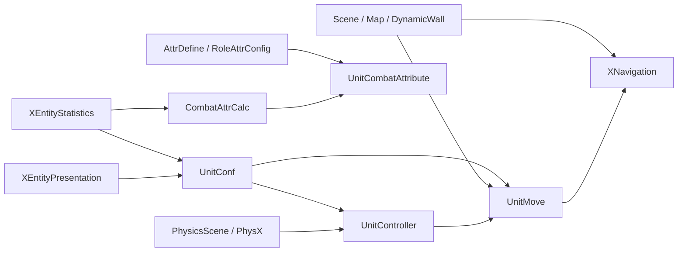
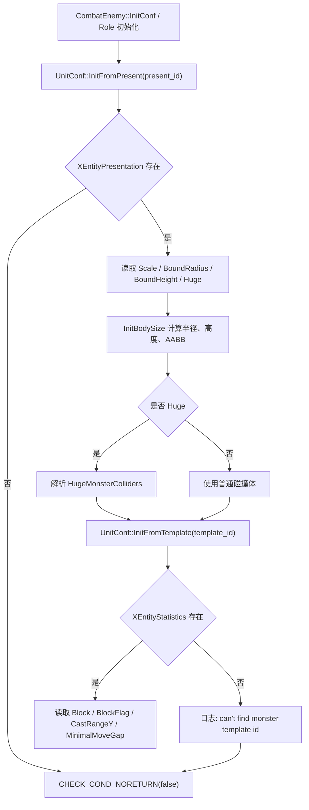
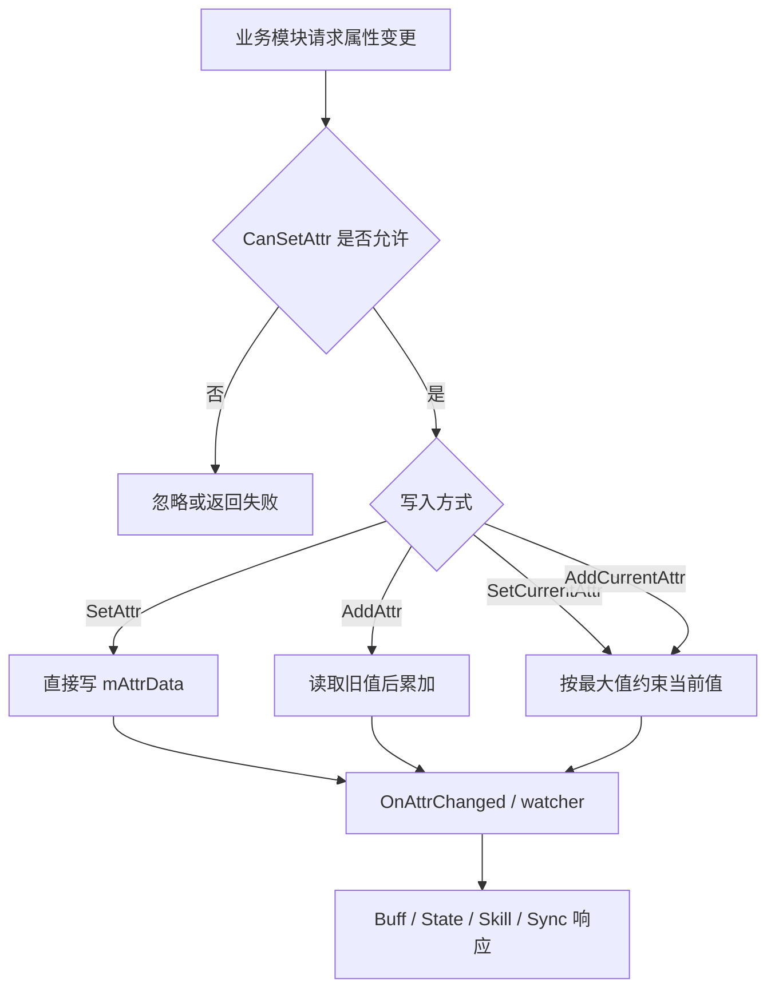
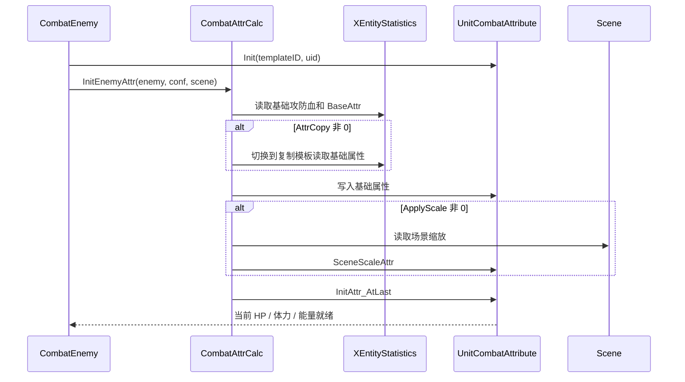
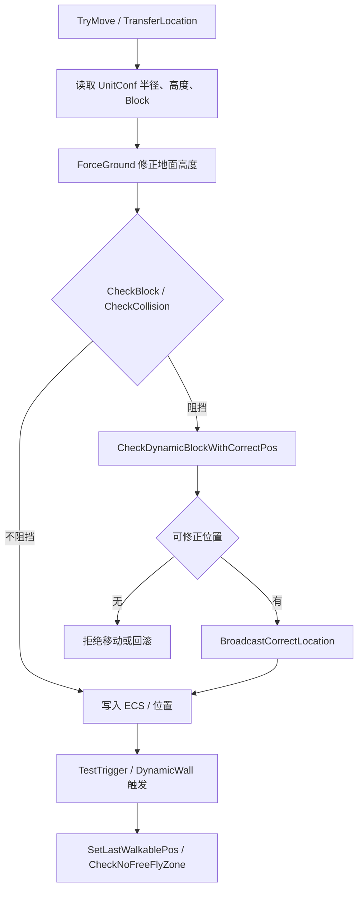
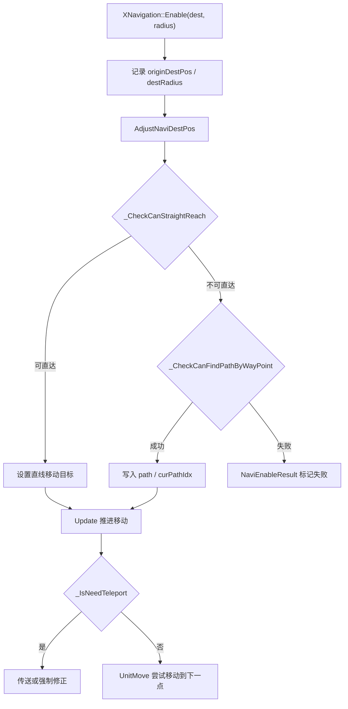
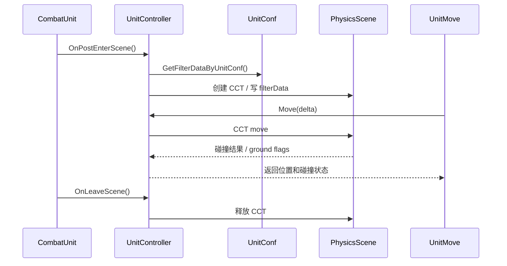

# Unit 配置、属性、移动

## 卡片说明

| 项 | 内容 |
| --- | --- |
| 用途 | 细化 Unit 的配置、属性和移动模块。 |
| 覆盖 | 字段、配置表、实现函数、常见故障。 |
| 不覆盖 | Enemy/Role 如何选择具体模板。 |

## 依赖关系

| 模块 | 上游依赖 | 下游使用 |
| --- | --- | --- |
| `UnitConf` | `XEntityInfoLibrary`, `PartnerConfig` | `UnitMove`, `UnitController`, `XNavigation`, `CombatUnit` 外观和碰撞。 |
| `UnitCombatAttribute` | `CombatAttrDef`, `AttrDefine` | 伤害、Buff、状态、技能 CD、同步。 |
| `CombatAttrCalc` | Unit 配置、场景配置、队伍、Buff、技能 | 初始化属性、缩放属性、运行时派生值。 |
| `UnitMove` | `UnitConf`, `SceneQuery`, `WallConfig`, `UnitController` | 位置校正、墙触发、可行走区。 |
| `XNavigation` | 场景 WaypointGraph、`UnitMove`、Unit 半径 | AI 导航和目的点移动。 |
| `UnitController` | PhysX、`UnitConf`, `PhysicsScene` | CCT 创建、碰撞过滤、控制器移动。 |

### 模块依赖图

## UnitConf

代码：

- `gameserver/unit/conf/unitconf.h`
- `gameserver/unit/conf/unitconf.cpp`

字段：

| 字段 | 类型 | 来源 | 作用 |
| --- | --- | --- | --- |
| `phys_conf_` | `UnitPhysicsConf` | 模板/表现/伙伴配置 | 运行时物理参数。 |
| `present_conf_` | `XEntityPresentation::RowData*` | `InitFromPresent` | 表现、体型、碰撞、Buff tag。 |
| `template_conf_` | `XEntityStatistics::RowData*` | `InitFromTemplate` | 模板、属性、AI、技能、阵营。 |
| `bound_aabb_conf_` | `physx::PxBounds3` | `InitBodySize` | Unit AABB。 |
| `m_BuffListTags` | `UnitTags` | `XEntityPresentation.BuffListTag` | Buff 目标/标签判断。 |

`UnitPhysicsConf` 字段：

| 字段 | 配置来源 | 用途 |
| --- | --- | --- |
| `m_huge` | `XEntityPresentation.Huge` | 是否大体型。 |
| `m_scale` | `XEntityPresentation.Scale` | 缩放速度/碰撞/包围盒。 |
| `m_collider` | `XEntityStatistics.Block` | 是否作为阻挡体。 |
| `m_skill_collider` | `XEntityPresentation.CollisionStatus` | 技能碰撞判定。 |
| `m_blockflags` | `XEntityStatistics.BlockFlag` | 死亡是否阻挡、是否总阻挡。 |
| `m_boundRadius` | `XEntityPresentation.BoundRadius * Scale` | 移动/碰撞半径。 |
| `m_boundHeight` | `XEntityPresentation.BoundHeight * Scale` | 碰撞高度。 |
| `m_castrange_Y` | `XEntityStatistics.CastRangeY` | 技能/AI 纵向范围。 |
| `m_MinimalMoveGap` | `XEntityStatistics.MinimalMoveGap` / `PartnerBattleTable.MinimalMoveGap` | 移动最小间隔。 |
| `m_oHugeColliderList` | `XEntityPresentation.HugeMonsterColliders` | 大体型多碰撞体。 |

实现：

| 函数 | 行为 |
| --- | --- |
| `InitFromTemplate(template_id)` | 查 `XEntityStatistics`。缺失打印 `can't find monster template id` 并 `CHECK_COND_NORETURN(false)`。 |
| `InitFromPresent(present_id)` | 查 `XEntityPresentation`，初始化技能碰撞、Huge、体型、Buff tag。 |
| `InitFromPartner(partner_id)` | 查 `PartnerBattleTable`，用于伙伴物理参数。 |
| `InitBodySize(scale, data)` | 计算半径/高度/AABB；Huge 时解析多碰撞体。 |
| `ModifyScale` / `ResetScale` | 重新计算体型。 |

### UnitConf 配置加载流程图

## UnitCombatAttribute

代码：

- `gameserver/unit/attr/combatattribute.h`
- `gameserver/unit/attr/combatattribute.cpp`

字段：

| 字段 | 类型 | 用途 |
| --- | --- | --- |
| `AttrData::mAttrData` | `double[CA_NAME_COUNT]` | 所有战斗属性值。 |
| `AttrData::mAttrDataMax` | `AttrChangeList[CA_MAXTYPE_ATTR_SIZE]` | 多来源最大值类属性。 |
| `AttrData::mUId` | `UINT64` | Unit UID。 |
| `AttrData::mUnitId` | `UINT32` | 模板或伙伴 ID。 |
| `UnitCombatAttribute::mAttrData` | `AttrData` | 属性容器主体。 |

实现：

| 函数 | 行为 |
| --- | --- |
| `Init(unitId, uid)` | 初始化属性容器归属。 |
| `GetAttr` | 读取属性。 |
| `SetAttr` | 设置属性。 |
| `AddAttr` | 增量加属性。 |
| `AddCurrentAttr` / `SetCurrentAttr` | 当前值受最大值约束。 |
| `CanSetAttr` | 判断属性是否允许被设置。 |

配置：

| 配置 | 作用 |
| --- | --- |
| `AttrDefine.txt` | 属性 ID、类型、同步标记。 |
| `RoleAttrConfig::GetAttrDefineNeedSysClient` | 决定哪些属性填给客户端。 |

### 属性读写流程图

## CombatAttrCalc

代码：

- `gameserver/unit/attr/combatattrcalc.h`
- `gameserver/unit/attr/combatattrcalc.cpp`

功能：

| 功能 | 函数 | 输入 |
| --- | --- | --- |
| Enemy 属性初始化 | `InitEnemyAttr` | `CombatEnemy`, `XEntityStatistics`, `Scene`。 |
| 召唤物属性初始化 | `InitSpawnAttr` | `CombatEnemy`, caller, `Scene`。 |
| 表属性加载 | `InitEnemyAttr_OfTable` | `XEntityStatistics`。 |
| 可破坏物覆盖 | `OverrideDestructibleAttr` | `DestructibleObjectTable`。 |
| 场景缩放 | `SceneScaleAttr` | scene conf 比率。 |
| 队伍缩放 | `TeamScaleAttr` | `SceneTeam` 比率。 |
| 最终当前值 | `InitAttr_AtLast` | 当前 HP、体力、能量、机制条。 |
| 运行时派生 | `GetRunSpeed`, `GetFlySpeed`, `GetAttackSpeed` | 属性 + scale。 |

实现要点：

- `AttrCopy` 非 0 时基础攻防血和 `BaseAttr` 从另一个模板复制。
- `ApplyScale` 非 0 时才走场景基础属性缩放。
- 召唤物先读自己的表，再从 caller 复制未初始化属性。
- `CallerAttrList` 可按比例复制 caller 指定属性。
- `InitAttr_AtLast` 必须在基础属性、缩放、Buff 初始化之后。

### 属性初始化时序图

## UnitMove

代码：

- `gameserver/unit/move/unitmove.h`
- `gameserver/unit/move/unitmove.cpp`

字段：

| 字段 | 用途 |
| --- | --- |
| `unit_` | 宿主 Unit。 |
| `scene_` | 当前战斗场景缓存。 |
| `m_lastWalkablePos` | 最近可行走位置。 |
| `m_lastWalkablePosFace` | 最近可行走朝向。 |
| `m_returnWalkableArea` | 是否处于非可行走区，需要返回。 |
| `m_inNoFreeFlyZone` | 是否处于禁自由飞区域。 |
| `m_lastCheckWalkablePosTime` | 可行走区检查节流。 |

功能：

| 功能 | 函数 |
| --- | --- |
| 移动入口 | `TryMove` |
| 地面修正 | `ForceGround` |
| 碰撞检查 | `CheckBlock`, `CheckCollision` |
| 动态阻挡 | `CheckDynamicBlock`, `CheckDynamicBlockWithCorrectPos` |
| 直线可达 | `CheckStraightLineReach` |
| 传送位置 | `TransferLocation` |
| 位置纠正广播 | `BroadcastCorrectLocation` |
| 墙触发 | `TestTrigger`, `CheckInRectWallTrigger`, `CheckInCircleWallTrigger` |
| 可行走区 | `CheckOnNonWalkableArea`, `SetLastWalkablePos` |
| 禁飞区 | `CheckNoFreeFlyZone` |

配置：

| 配置 | 用途 |
| --- | --- |
| `XEntityStatistics.Block` | 是否阻挡。 |
| `XEntityStatistics.BlockFlag` | 死亡阻挡和总阻挡。 |
| `XEntityPresentation.BoundRadius/BoundHeight` | 碰撞体大小。 |
| `XEntityPresentation.HugeMonsterColliders` | 大体型碰撞体。 |
| `SceneList` / `MapList` | 地图、阻挡、导航数据。 |
| `DynamicWall.txt` | 动态墙和触发墙。 |

### 移动与碰撞流程图

## XNavigation

代码：

- `gameserver/combat/XNavigation.h`
- `gameserver/combat/XNavigation.cpp`

字段：

| 字段 | 用途 |
| --- | --- |
| `m_originDestPos` | 原始目标点。 |
| `m_adjustedDestPos` | 修正目标点。 |
| `m_destRadius` | 到达半径。 |
| `m_isMultiModePath` | 是否多模式路径。 |
| `m_teleLimit` | 传送阈值。 |
| `m_moveType` | 当前移动类型。 |
| `m_naviMode` | WaypointGraph 导航模式。 |
| `m_path` / `m_pathCount` / `m_curPathIdx` | 当前路径点。 |
| `m_nResult` | 导航结果。 |

功能：

| 函数 | 行为 |
| --- | --- |
| `Enable` | 初始化导航目标、半径、路径模式、传送限制。 |
| `Disable` | 停止导航。 |
| `Update` | 推进路径。 |
| `AdjustNaviDestPos` | 修正目标点。 |
| `_CheckCanFindPathByWayPoint` | Waypoint 可达检查。 |
| `_CheckCanStraightReach` | 直线可达检查。 |
| `_IsNeedTeleport` | 判断是否需要传送。 |

排查日志：

- 日志前缀是 `[Navi]`。
- `NaviEnableResult` 可区分目标为 0、路径失败、跨图、直线不可达、调用过频等。

### 导航流程图

## UnitController

代码：

- `gameserver/physx/UnitController.h`
- `gameserver/physx/UnitController.cpp`

字段：

| 字段 | 用途 |
| --- | --- |
| `m_controller` | PhysX CCT 指针。 |
| `m_filterData` | 碰撞过滤数据。 |
| `m_queryCache` | PhysX 查询缓存。 |
| `m_curGroundHeight` | 当前地面高度。 |
| `m_curGroundFlags` | 当前地面过滤标记。 |

功能：

| 函数 | 行为 |
| --- | --- |
| `OnPostEnterScene` | 创建或绑定控制器。 |
| `OnLeaveScene` | 清理控制器。 |
| `Move` | CCT 移动。 |
| `UpdateFilterData` | 按 Unit 状态更新碰撞过滤。 |
| `GetFilterDataByUnitConf` | 从 fight group 和物理配置生成过滤数据。 |
| `CanBlock` | 判断两个 Unit/shape 是否阻挡。 |

排查要点：

- 移动问题先判断是 `UnitMove` 逻辑修正还是 `UnitController` 物理碰撞。
- 碰撞过滤依赖 fight group、always collider、skill collider。
- 位置纠正后要看 `OnCorrectPosition` 是否同步到 controller。

### 物理控制器时序图

## 常见问题入口

| 现象 | 优先模块 | 核心字段 |
| --- | --- | --- |
| 怪物穿墙 | `UnitMove`, `UnitController` | `Block`, `BlockFlag`, `BoundRadius`, dynamic wall。 |
| Boss 碰撞体偏差 | `UnitConf::InitBodySize` | `Huge`, `HugeMonsterColliders`, `Scale`。 |
| 移动速度异常 | `CombatAttrCalc::GetRunSpeed` | `RunSpeed`, speed percent, `Scale`。 |
| 当前 HP 异常 | `CombatAttrCalc::InitAttr_AtLast` | `ATTR_MaxHp`, `ATTR_CurrentHp`。 |
| 导航失败 | `XNavigation::Enable` | WaypointGraph、目标点、半径、`teleLimit`。 |

## 相关卡片

- [Unit 运行骨架与组件系统](unit-runtime-components.md)
- [Unit 通用层](unit-framework.md)
