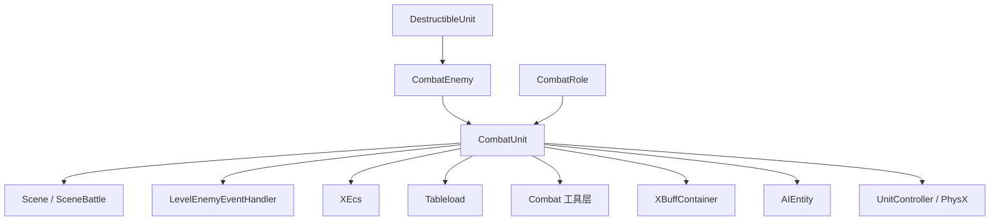
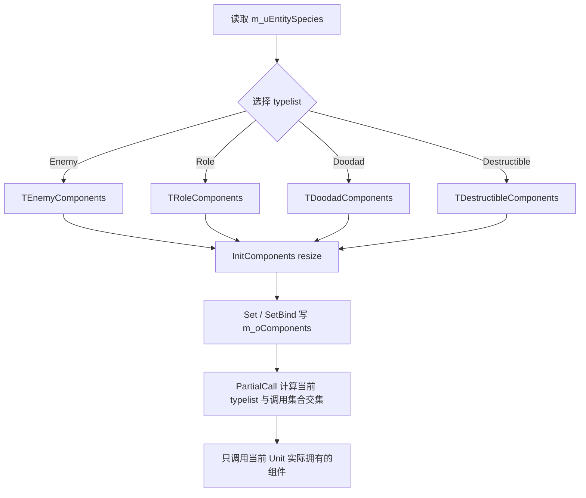
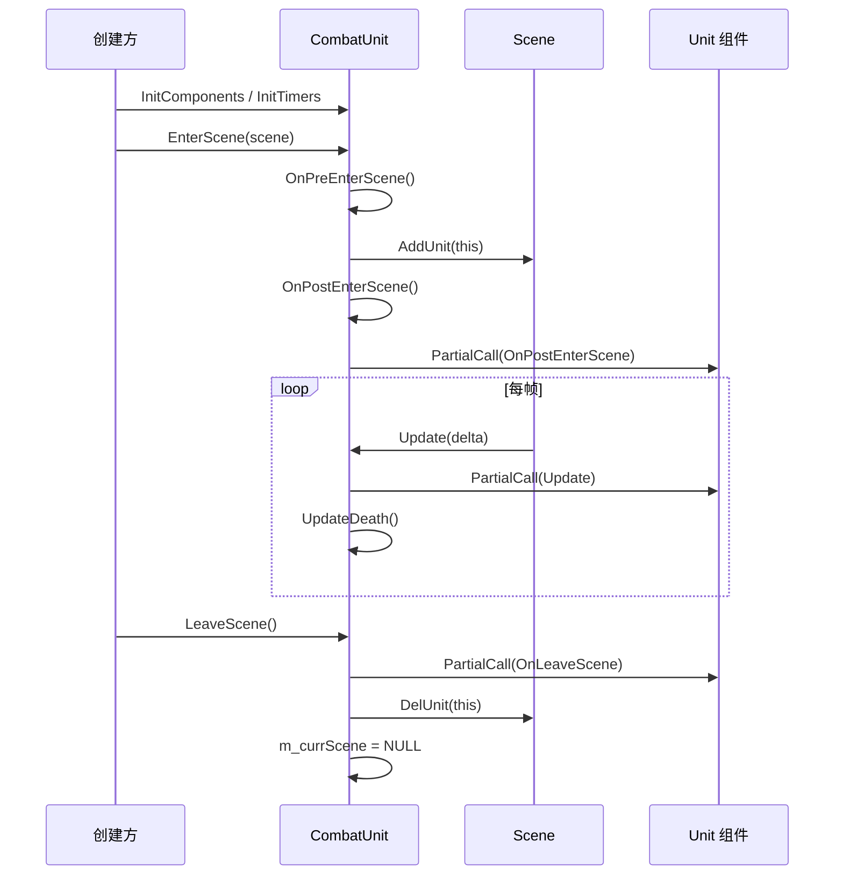
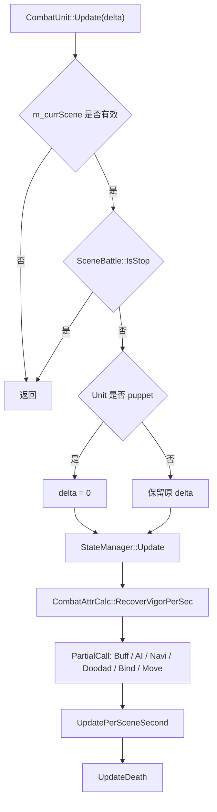
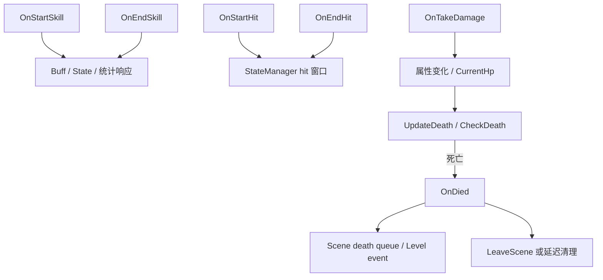

# Unit 运行骨架与组件系统

## 卡片说明

| 项 | 内容 |
| --- | --- |
| 用途 | 细化 `CombatUnit` 运行骨架。 |
| 覆盖 | 字段、依赖、组件容器、生命周期、事件入口。 |
| 不覆盖 | Enemy/Role 派生业务。 |
| 使用方式 | 查 crash 栈时先用本卡判断对象生命周期和组件是否有效。 |

## 依赖边界

`CombatUnit` 不是单一模块。

它依赖：

| 依赖模块 | 依赖对象 | 使用目的 |
| --- | --- | --- |
| Scene | `Scene`, `SceneBattle` | 进入/离开场景、死亡队列、场景暂停、地图/场景 ID。 |
| Level | `LevelEnemyEventHandler` | Enemy/关卡事件回调容器，基类持有。 |
| XEcs | `xecs::create`, `getState_ecs`, `drive2death`, `drive2skill` | 状态、移动、技能、死亡、位置同步。 |
| Tableload | `XEntityInfoLibrary`, `RoleAttrConfig` | 属性同步字段、模板/表现间接读取。 |
| Combat | `UnitBattleGroup`, `KillerWatcher`, `XNavigation` | 分组、击杀记录、导航。 |
| Buff | `XBuffContainer` | Buff 生命周期和事件。 |
| AI | `AIEntity` | AI agent 生命周期。 |
| PhysX | `UnitController` | CCT、碰撞、控制器进出场。 |

它被这些派生层依赖：

| 派生层 | 依赖方式 |
| --- | --- |
| `CombatEnemy` | 继承 Unit 生命周期，补怪物配置、AI、技能、死亡事件。 |
| `CombatRole` | 继承 Unit 生命周期，补玩家/伙伴、网络会话、切人。 |
| `DestructibleUnit` | 继承 Enemy/Unit，但裁剪组件和覆盖配置。 |

### 模块依赖图

## 核心字段

身份和配置字段：

| 字段 | 类型 | 来源 | 用途 |
| --- | --- | --- | --- |
| `m_uID` | `UINT64` | `CombatUnit::NewId` 或外部传入 | Unit 逻辑 UID。 |
| `m_uEcsID` | `UINT64` | `xecs::create` | ECS 实体 ID。 |
| `m_currScene` | `Scene*` | `EnterScene` / `LeaveScene` | 当前所在场景。 |
| `m_uPresentID` | `UINT32` | 模板或派生初始化 | 原始表现 ID。 |
| `m_uTemplateID` | `UINT32` | 模板或派生初始化 | 模板 ID。 |
| `m_uSkillPartnerID` | `UINT32` | 角色技能模板逻辑 | 技能模板 ID，Role 侧更常用。 |
| `m_uEntitySpecies` | `UINT32` | 模板 `Type` | 选择 typelist。 |

组件字段：

| 字段 | 类型 | 说明 |
| --- | --- | --- |
| `m_conf` | `UnitConf` | 模板/表现/物理配置封装。 |
| `m_oNavi` | `XNavigation` | 导航和寻路。 |
| `m_skillMgr` | `SkillMgr` | 技能管理。 |
| `m_StateManager` | `StateManager` | 阶段、Mode、机制条、状态技能。 |
| `m_killer` | `KillerWatcher` | 击杀来源记录。 |
| `m_oAIEntity` | `AIEntity` | AI agent 容器。 |
| `m_oBuffContainer` | `XBuffContainer` | Buff 容器。 |
| `mUnitCombatAttribute` | `UnitCombatAttribute` | 属性容器。 |
| `m_oBattleGroup` | `UnitBattleGroup` | 战斗组。 |
| `m_move` | `UnitMove` | 移动和碰撞校正。 |
| `m_oDoodad` | `DoodadInfo` | Doodad/drop 信息。 |
| `m_oBindInfo` | `BindInfo` | 平台绑定检查。 |
| `m_oController` | `UnitController` | PhysX 控制器。 |
| `m_uniteffect` | `UnitEffect` | Affix effect 运行时数据。 |
| `m_oComponents` | `std::vector<IUnitComponent*>` | typelist 下标到组件指针的映射。 |

状态和战斗字段：

| 字段 | 类型 | 用途 |
| --- | --- | --- |
| `m_fightgroup` | `UINT32` | 当前战斗阵营。 |
| `m_origin_fightgroup` | `UINT32` | 初始战斗阵营。 |
| `m_unit_states` | `TagList<UnitStateType>` | 冻结、木偶、无输入等状态标签。 |
| `m_unit_features` | `TagList<EntityFeature>` | NoTarget、NoHit、NoEnterFight 等特性。 |
| `m_spawn_control` | `SpawnControl` | 召唤数量控制，Enemy/Role 调用都通过 Unit 持有。 |
| `m_eventHandler` | `LevelEnemyEventHandler` | 关卡 Enemy 事件。 |
| `m_oWatcherStack` | `vector<AttributeWatcher*>` | 属性变化 watcher 栈。 |

死亡和时间字段：

| 字段 | 类型 | 用途 |
| --- | --- | --- |
| `m_TimerToken` | `HTIMER` | 秒级 timer。 |
| `m_fTimeDeltaSum` | `float` | 场景秒级 Update 累计。 |
| `m_fSlowDownRate` | `float` | Unit 自身慢动作倍率。 |
| `m_fActionRatio` | `float` | 行动倍率。 |
| `m_bDeathFlag` | `bool` | 死亡触发标记。 |
| `m_bDeathECSIgnore` | `bool` | 是否跳过 ECS death。 |
| `m_IsDead` | `bool` | 已死亡状态。 |
| `m_bDestroying` | `bool` | 销毁中，避免重复清理。 |

## 组件系统

组件基类：

| 成员 | 说明 |
| --- | --- |
| `IUnitComponent::Update(float)` | 每帧或指定集合调用。 |
| `OnPostEnterScene` | Unit 进入场景后回调。 |
| `OnLeaveScene` | Unit 离场前回调。 |
| `m_pUnit` | 反向指向宿主 `CombatUnit`。 |

组件集合：

| 集合 | 组件 | 触发场景 |
| --- | --- | --- |
| `TEnemyComponents` | `UnitMove`, `AIEntity`, `XNavigation`, `XBuffContainer`, `PlatInfo`, `Attachment`, `SkillMgr`, `UnitCombatAttribute`, `TransformInfo`, `BindInfo`, `UnitController` | Enemy 默认完整集合。 |
| `TRoleComponents` | `UnitMove`, `XNavigation`, `SkillMgr`, `AIEntity`, `UnitCombatAttribute`, `XBuffContainer`, `BindInfo`, `UnitController` | Role 集合。 |
| `TDoodadComponents` | Enemy 集合裁剪后追加 `DoodadInfo` | Doodad。 |
| `TDestructibleComponents` | Enemy 集合裁剪 AI、导航、平台、绑定、控制器等 | Destructible。 |
| `TComponentsWithUpdatorPerFrame` | `XBuffContainer`, `AIEntity`, `XNavigation`, `DoodadInfo`, `BindInfo`, `UnitMove` | `CombatUnit::Update` 每帧。 |
| `TComponentsWithEnterSceneFunctor` | `UnitMove`, `UnitController` | `OnPostEnterScene` / `OnLeaveScene`。 |

实现要点：

- `GetComIndex<T>` 根据 `m_uEntitySpecies` 选择 typelist。
- `Set<T>` 按 typelist 下标写入 `m_oComponents`。
- `SetBind<T>` 额外执行 `component->SetUnit(this)`。
- `PartialCall<CallList>` 会先取调用集合和当前 Unit 集合的交集。

排查要点：

- 组件拿不到时，先确认 `m_uEntitySpecies` 是否正确。
- Doodad/Destructible 不是完整 Enemy 组件集，不能假设有所有组件。
- `PartialCall` 不会调用不在当前 typelist 中的组件。

### 组件选择流程图

## 生命周期实现

构造：

| 步骤 | 说明 |
| --- | --- |
| 成员构造 | `XNavigation`, `AIEntity`, `XBuffContainer`, `UnitBattleGroup`, `UnitMove`, `BindInfo`, `UnitController` 绑定 `this`。 |
| 默认倍率 | `m_fSlowDownRate = 1.0f`, `m_fActionRatio = 1.0f`。 |

初始化：

| 入口 | 动作 |
| --- | --- |
| `InitComponents` | `m_oComponents.resize(GetComLength())`，绑定 AI、导航、Buff、技能、属性、移动、Doodad、Bind、Controller。 |
| `InitTimers` | 注册 `_OneSecondTimer`。 |
| `KillTimers` | 清理 timer。 |
| `Uninit` | 当前只清理 timer，派生类负责 ECS destroy 等。 |

进场：

| 顺序 | 函数 | 约束 |
| --- | --- | --- |
| 1 | `EnterScene` 校验 scene | scene 空会 `CHECK_COND_NORETURN(false)`。 |
| 2 | `OnPreEnterScene` | 还不能依赖自己已经在 scene 容器中。 |
| 3 | 设置 `m_currScene` | 后续可通过 `GetCurrScene` 访问。 |
| 4 | `Scene::AddUnit(this)` | 写入场景 Unit 容器。 |
| 5 | `OnPostEnterScene` | 可以发送协议或广播。 |
| 6 | `UnitMove` / `UnitController` 回调 | 通过 `PartialCall<TComponentsWithEnterSceneFunctor>`。 |

更新：

| 顺序 | 函数 | 说明 |
| --- | --- | --- |
| 1 | 场景存在检查 | 不在场景不更新。 |
| 2 | `SceneBattle::IsStop` | 场景停止直接返回。 |
| 3 | puppet 检查 | puppet 时 `delta = 0`。 |
| 4 | `StateManager::Update` | 状态优先。 |
| 5 | `CombatAttrCalc::RecoverVigorPerSec` | 体力恢复。 |
| 6 | `PartialCall<TComponentsWithUpdatorPerFrame>` | Buff、AI、导航、Doodad、Bind、Move。 |
| 7 | `UpdatePerSceneSecond` | 受 slowdown 影响的秒级逻辑。 |
| 8 | `UpdateDeath` | 最后检查死亡。 |

离场：

| 顺序 | 函数 | 说明 |
| --- | --- | --- |
| 1 | AI agent `LeaveScene` | 停止 AI 场景状态。 |
| 2 | `UnitBattleGroup::Leave(false)` | 离开战斗组。 |
| 3 | 派生类 `OnLeaveScene` | Enemy/Role 扩展清理。 |
| 4 | `UnitMove` / `UnitController` 离场回调 | 清移动/物理状态。 |
| 5 | `Scene::DelUnit(this)` | 从场景容器删除。 |
| 6 | `m_currScene = NULL` | 标记离场完成。 |

### 生命周期时序图

### 每帧更新流程图

## 事件入口

| 事件 | 函数 | 默认行为 |
| --- | --- | --- |
| 技能开始 | `OnStartSkill` | 通知 Buff、状态、统计等下游。 |
| 技能结束 | `OnEndSkill` | 通知 Buff、状态。 |
| Hit 开始 | `OnStartHit` | 状态/攻击窗口。 |
| Hit 结束 | `OnEndHit` | 状态/攻击窗口结束。 |
| 受伤 | `OnTakeDamage` | 基类空实现，Enemy/Role 可覆盖。 |
| 创建召唤物 | `OnCreateEnemyByCaller` | 基类空实现。 |
| 最后一击 | `OnHitByLastHit` | 基类空实现，Enemy Boss 集火会覆盖。 |

### 事件与死亡流程图

## 排查清单

| 问题 | 先看 |
| --- | --- |
| crash 在 `Get<T>` 或组件调用 | `m_uEntitySpecies`、typelist、`InitComponents` 是否执行。 |
| 离场后对象仍被访问 | `LeaveScene` 顺序、AI/Buff/ECS 是否还引用 UID。 |
| 更新逻辑没跑 | `m_currScene`、`SceneBattle::IsStop`、puppet 状态。 |
| 死亡没触发 | `UpdateDeath`、`CheckDeath`、`m_bDeathFlag`、`ATTR_CurrentHp`。 |
| 属性变更递归异常 | `m_oWatcherStack`、`OnAttrChanged`。 |

## 相关卡片

- [Unit 通用层](unit-framework.md)
- [Unit 配置、属性、移动](unit-config-attr-move.md)
- [Unit 状态、技能、AI、同步](unit-state-skill-ai-sync.md)
