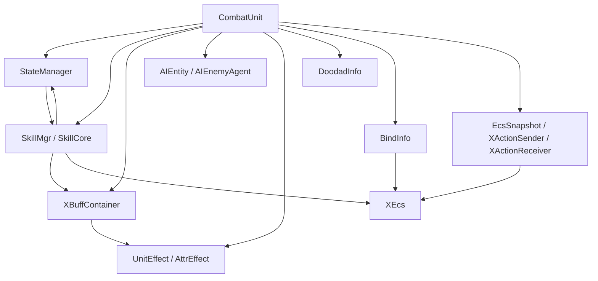
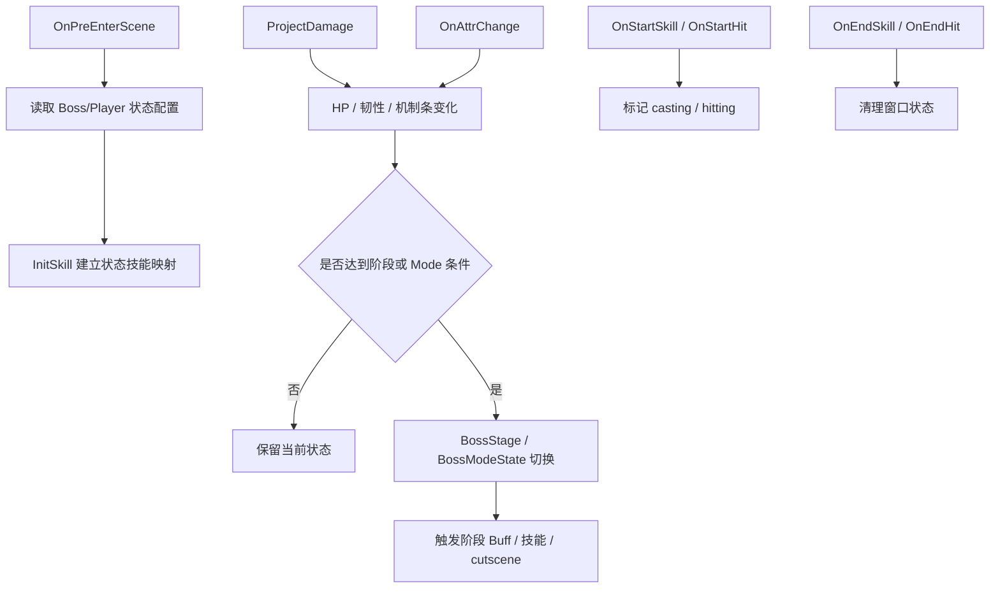
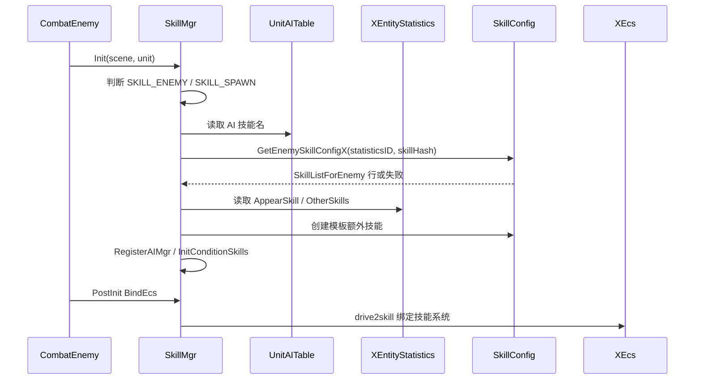
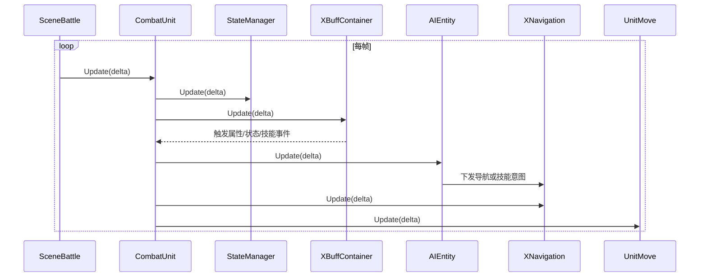
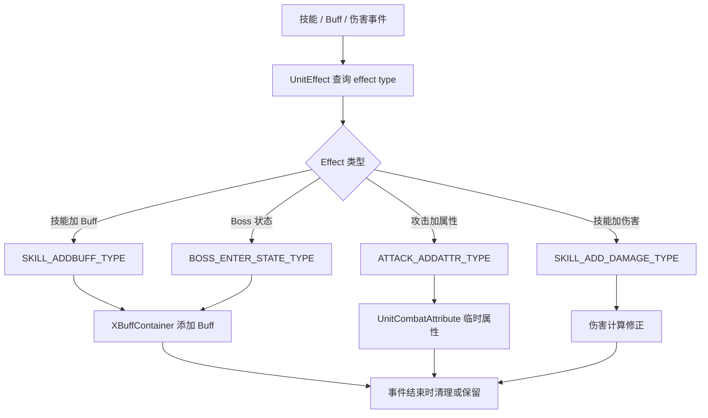
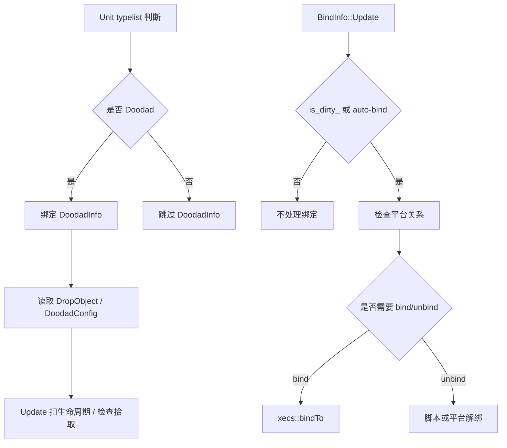
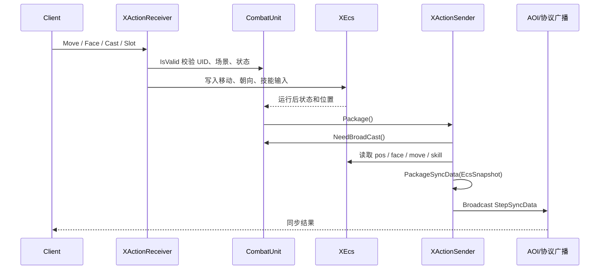

# Unit 状态、技能、AI、同步

## 卡片说明

| 项 | 内容 |
| --- | --- |
| 用途 | 细化 Unit 的运行时行为组件。 |
| 覆盖 | 状态、技能、Buff/AI 接入、同步、Effect、Doodad、Bind。 |
| 边界 | Buff/AI 内部细节后续可再拆专卡。 |

## 依赖关系

| 模块 | 依赖 | 被谁使用 |
| --- | --- | --- |
| `StateManager` | `CombatUnit`, `BossStateConfig`, `SkillMgr` | 伤害、技能、属性变化、进场。 |
| `SkillMgr` | `SkillConfig`, `XEntityStatistics`, AI 配置, XEcs | AI、输入、状态技能、ECS 技能系统。 |
| `XBuffContainer` | `BuffConfig`, Unit 标签, 伤害/技能事件 | 属性、伤害、状态、技能生命周期。 |
| `AIEntity` | `AIConfig`, YBehavior, `SkillMgr`, `TargetMgr` | Unit 每帧 Update、进场启动。 |
| `UnitEffect` | `AffixEffectConfig`, `AttrEffect` | 技能、Buff、伤害、属性和状态事件。 |
| `DoodadInfo` | `DoodadConfig`, `DropObject` | Doodad 生命周期和拾取。 |
| `BindInfo` | 平台、ECS bind、Unit 自动绑定标记 | 每帧检查平台绑定。 |
| `EcsSnapshot` / `XActionSender` / `XActionReceiver` | XEcs、协议、AOI | 状态同步和客户端输入。 |

### 模块关系图

## StateManager

代码：

- `gameserver/unit/state/StateManager.h`
- `gameserver/unit/state/StateManager.cpp`

字段：

| 字段 | 类型 | 用途 |
| --- | --- | --- |
| `mpUnit` | `CombatUnit*` | 宿主 Unit。 |
| `mPresentID` | `UINT32` | 当前表现 ID。 |
| `mBossModeState` | `BossModeState` | Boss Mode 状态。 |
| `mBossResistState` | `BossResistState` | 韧性/异常状态。 |
| `mBossJZState` | `BossJZState` | Boss 机制条。 |
| `mPlayerJZState` | `PlayerJZState` | 玩家机制条。 |
| `mBossStage` | `BossStage` | 阶段。 |
| `mAllSkillType` | `map<UINT32, BOSS_STATE>` | 技能 hash 到状态技能类型。 |
| `m_isSkillCasting` | `bool` | 当前是否放技能。 |
| `m_isHiting` | `bool` | 当前是否 hit 中。 |

配置：

| 配置 | 用途 |
| --- | --- |
| `EnemyStage.txt` | 阶段技能、阶段 Buff、cutscene。 |
| `EnemyModeState.txt` | Mode 状态。 |
| `EnemyResist.txt` | 韧性/异常。 |
| `EnemyJZ.txt` | Boss 机制条。 |
| `PlayerJZ.txt` | 玩家机制条。 |
| `SkillListForEnemy.ModeUse` | 阶段或 Mode 技能可用性。 |

实现入口：

| 函数 | 行为 |
| --- | --- |
| `Init` | 绑定 Unit，初始化状态子模块。 |
| `OnPreEnterScene` | 进场前处理状态配置。 |
| `Update` | 更新状态。 |
| `UpdatePerSecond` | 秒级状态更新。 |
| `ProjectDamage` | 伤害前后影响状态。 |
| `OnAttrChange` | 属性变化驱动状态。 |
| `InitSkill` | 绑定状态技能。 |
| `OnStartSkill` / `OnEndSkill` | 技能窗口状态。 |
| `OnStartHit` / `OnEndHit` | hit 窗口状态。 |

排查：

- 阶段不切换：看 `BossStage`、当前 HP、`EnemyStage.StaticsID`。
- 状态技能不放：看 `mAllSkillType`、`SkillListForEnemy.ModeUse`。
- 受击/放技能时延迟切状态：看 `HandleDelay`。

### 状态事件流程图

## SkillMgr

代码：

- `gameserver/unit/skill/skillmgr.h`
- `gameserver/unit/skill/skillmgr.cpp`
- `gameserver/unit/skill/skillcore.h`
- `gameserver/unit/skill/skillcore.cpp`

字段：

| 字段 | 类型 | 用途 |
| --- | --- | --- |
| `m_uid` | `UINT64` | 宿主 UID。 |
| `m_type` | `SkillUnitType` | `SKILL_ROLE` / `SKILL_ENEMY` / `SKILL_SPAWN`。 |
| `m_unit` | `CombatUnit*` | 宿主。 |
| `m_scene` | `Scene*` | 初始化场景。 |
| `m_ai_mgr` | `SkillAIMgr` | AI 技能分类。 |
| `m_skill_template` | `UINT32` | 角色技能模板。 |
| `m_AllSkills` | `vector<SkillCore*>` | 所有技能对象。 |
| `m_SkillMap` | `map<UINT32, SkillCore*>` | skill hash 到技能对象。 |
| `m_Appear` | `SkillCore*` | 登场技能。 |
| `m_HpMaxSkills` | `vector<SkillCore*>` | HP 阈值技能。 |
| `m_StageSkills` | `vector<SkillCore*>` | 阶段技能。 |
| `m_ratio_info` | `DamageRatioInfo` | 被动/召唤继承的伤害比例信息。 |

配置入口：

| Unit 类型 | 技能配置 |
| --- | --- |
| Role | `SkillListForRole`, `SkillSlot`, `PartnerBattleTable.SkillPartnerID`。 |
| Enemy | `SkillListForEnemy`, `XEntityStatistics.OtherSkills`, `AppearSkill`, AI 技能名。 |
| Spawn | `SkillListForRole` 的 spawn 查法，`XEntityStatistics.SkillListTable != 0`。 |

实现入口：

| 函数 | 行为 |
| --- | --- |
| `Init` | 判断技能类型并绑定 Unit/scene。 |
| `CreateSkill` | 按类型创建 `SkillCore`。 |
| `InitSkill(UnitAITable)` | 从 AI 技能字段创建技能。 |
| `InitSkill(XEntityStatistics)` | 创建 `AppearSkill` 和 `OtherSkills`。 |
| `RegisterAIMgr` | 把技能按 Main/Left/Right/Move 等分类注册给 AI。 |
| `InitConditionSkills` | 建立 HP 阈值和阶段技能索引。 |
| `BindEcs` | 绑定技能到 ECS。 |
| `SetInitCDAll` | 初始化或清理技能 CD。 |
| `OnAttributeChange` | HP 和 CD 属性变化触发技能逻辑。 |
| `OnStageChange` | 阶段切换触发阶段技能初始 CD。 |

排查：

- 技能对象不存在：查 `m_SkillMap` 是否创建。
- 创建失败：看 `SkillCore::InitEnemySkill` / `InitRoleSkill` / `InitSpawnSkill`。
- AI 不会用技能：查 `RegisterAIMgr` 是否注册到对应 `AISkillType`。
- HP 阈值技能不触发：查 `m_HpMaxSkills` 和 `HpMaxLimit`。

### 技能初始化时序图

## Buff 和 AI 接入

`XBuffContainer`：

| 接入点 | Unit 行为 |
| --- | --- |
| `CombatUnit::InitComponents` | 绑定到 `m_oComponents`。 |
| `CombatUnit::Update` | 每帧调用。 |
| `CombatEnemy::InitBufflist` | 加出生 Buff。 |
| 技能/伤害事件 | 通过 `OnStartSkill`, `OnEndSkill`, `OnHurt`, `OnAttrChange` 等参与。 |

`AIEntity`：

| 接入点 | Unit 行为 |
| --- | --- |
| 构造 | `m_oAIEntity(this)`。 |
| Enemy 初始化 | `SetAgent(new AIEnemyAgent(...))`。 |
| 进场前 | `StartLoad(scene)`。 |
| 场景就绪 | agent `EnterScene`。 |
| 每帧 | `AIEntity::Update`。 |
| 离场 | agent `LeaveScene`。 |

### Buff 与 AI 每帧时序图

## UnitEffect 和 AttrEffect

代码：

- `gameserver/unit/affixeffect/uniteffect.h`
- `gameserver/unit/affixeffect/uniteffect.cpp`
- `gameserver/affixeffect/attreffect.*`

字段：

| 字段 | 用途 |
| --- | --- |
| `m_affixEffect` | effect id/level 到数值。 |
| `m_effectData` | `EEffectType` 到参数列表。 |
| `m_affixlevel` | affix 等级记录。 |
| `m_tempAffixAttr` | 临时属性加成。 |
| `m_tempUSCnt` | 临时技能使用次数。 |

主要 effect 类型：

| 类型 | 含义 |
| --- | --- |
| `SKILL_ADDBUFF_TYPE` | 技能开始/结束加 Buff。 |
| `CALL_PET_ADDBUFF` | 召唤物加 Buff。 |
| `ATTACK_ADDATTR_TYPE` | 攻击时加属性。 |
| `SKILL_ADD_DAMAGE_TYPE` | 技能加伤害。 |
| `BOSS_ENTER_STATE_TYPE` | Boss 进入状态时加 Buff。 |
| `CASTER_DOT_SCALE` / `TARGET_DOT_SCALE` | DOT 缩放。 |
| `CASTER_BUFF_CHANGETIME_*` / `TARGET_BUFF_CHANGETIME_*` | Buff 时间变化。 |

配置：

- `AffixEffect.txt`
- 运行时通过 `AffixEffectConfig` 查询。

### Affix Effect 流程图

## DoodadInfo

代码：

- `gameserver/unit/doodadinfo/doodad.h`
- `gameserver/unit/doodadinfo/doodad.cpp`

字段：

| 字段 | 来源 | 用途 |
| --- | --- | --- |
| `m_row` | `DropObject::RowData*` | 掉落物配置行。 |
| `m_creatorUid` | 创建者 | 追踪来源。 |
| `m_livetime` | 配置/运行时 | 生命周期。 |
| `m_buffIndex` | 初始化参数 | Buff 组索引。 |
| `m_pickRoleID` | 拾取时设置 | 记录拾取角色。 |

配置：

- `DropObject.txt`
- `DoodadConfig` 解析 doodad Buff group。

## BindInfo

代码：

- `gameserver/unit/plat/bindinfo.h`
- `gameserver/unit/plat/bindinfo.cpp`

字段：

| 字段 | 用途 |
| --- | --- |
| `is_dirty_` | 标记绑定状态需要检查。 |

实现：

- 每帧 `Update` 检查自动绑定/解绑。
- 自动绑定只对启用 auto-bind 的 Unit 生效。
- 脚本绑定的 Unit 应由脚本解绑。
- Enemy 默认不是自动绑定，通常通过技能或关卡脚本绑定。

### Doodad 和 Bind 流程图

## 同步

`EcsSnapshot` 字段：

| 字段 | 来源 | 用途 |
| --- | --- | --- |
| `uid` | Unit | 逻辑 UID。 |
| `ecs_id` | Unit | ECS ID。 |
| `face` | Unit/ECS | 朝向。 |
| `pos` | Unit/ECS | 世界坐标。 |
| `binded` | `GetBindeePlat` | 是否绑定平台。 |
| `local_pos` | 平台变换 | 绑定平台后的局部坐标。 |
| `move_type` | ECS | 移动类型。 |
| `state_type` | ECS | 状态类型。 |
| `scrpit` | `xecs::getCurSkill` | 当前技能 hash。 |

`XActionSender`：

| 函数 | 行为 |
| --- | --- |
| `NeedBroadCast` | 判断是否需要同步。 |
| `PackageSyncData` | 把 Unit 状态打入 `StepSyncData`。 |
| `Package` | 跳过 client-action role，必要时打包。 |
| `Broadcast` | 广播同步协议。 |

`XActionReceiver`：

| 函数 | 行为 |
| --- | --- |
| `OnFaceReceived` | 处理朝向。 |
| `OnMoveReceived` | 处理移动输入。 |
| `OnSlotSync` | 处理槽位同步。 |
| `OnCastSync` | 处理技能释放同步。 |
| `OnPositionCheck` | 位置校验。 |
| `IsValid` | 输入对象有效性校验。 |

### 同步发送与接收时序图

## 常见问题入口

| 现象 | 优先模块 | 核心检查 |
| --- | --- | --- |
| 状态切换不对 | `StateManager` | 阶段、Mode、受击/技能延迟。 |
| 技能缺失 | `SkillMgr`, `SkillCore`, `SkillConfig` | 技能类型、表、hash、等级。 |
| Buff 没触发 | `XBuffContainer`, `UnitEffect` | Buff 配置、事件入口、effect 类型。 |
| AI 没运行 | `AIEntity` | agent 是否创建、是否进场、是否 enabled。 |
| 同步位置错 | `EcsSnapshot`, `XActionSender` | binded、local_pos、move/state/script。 |
| 平台绑定异常 | `BindInfo`, `UnitController` | auto-bind、dirty 标记、脚本绑定。 |

## 相关卡片

- [Unit 运行骨架与组件系统](unit-runtime-components.md)
- [Unit 配置、属性、移动](unit-config-attr-move.md)
- [Unit 通用层](unit-framework.md)
