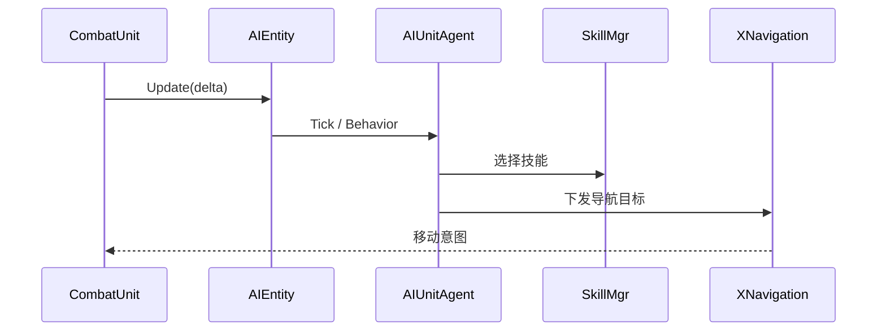

# AIEntity AI 容器

## 卡片说明

| 项 | 内容 |
| --- | --- |
| 模块 | `AIEntity`。 |
| 职责 | 持有 AI agent，并接入 Unit 进场、更新、离场。 |
| 下游 | `SkillMgr`、`XNavigation`、目标选择。 |

## 生命周期

| 阶段 | 行为 |
| --- | --- |
| 构造 | `m_oAIEntity(this)`。 |
| Enemy 初始化 | `SetAgent(new AIEnemyAgent(...))`。 |
| 进场前 | `StartLoad(scene)`。 |
| 场景就绪 | agent `EnterScene`。 |
| 每帧 | `AIEntity::Update`。 |
| 离场 | agent `LeaveScene`。 |

## 每帧时序

## 排查入口

| 现象 | 检查点 |
| --- | --- |
| AI 不运行 | agent 是否创建、`StartLoad` 是否执行。 |
| 不索敌 | 视野、战斗组、目标管理。 |
| 不放技能 | `SkillMgr::RegisterAIMgr` 和 AI 技能配置。 |

