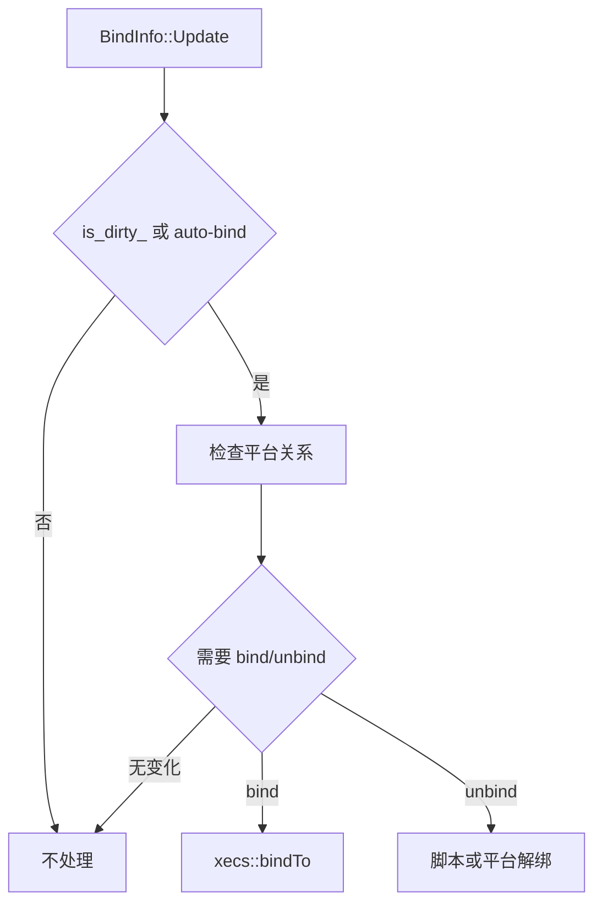

# BindInfo 平台绑定

## 卡片说明

| 项 | 内容 |
| --- | --- |
| 模块 | `BindInfo`。 |
| 职责 | 检查 Unit 与平台的绑定/解绑状态。 |
| 边界 | Enemy 默认不是自动绑定，通常由技能或关卡脚本绑定。 |

## 字段

| 字段 | 用途 |
| --- | --- |
| `is_dirty_` | 标记绑定状态需要检查。 |

## 绑定流程

## 排查入口

| 现象 | 检查点 |
| --- | --- |
| 平台绑定错位 | ECS bind、local_pos、平台 transform。 |
| 解绑失败 | 脚本解绑和 `is_dirty_`。 |
| Enemy 意外绑定 | auto-bind 标记来源。 |

