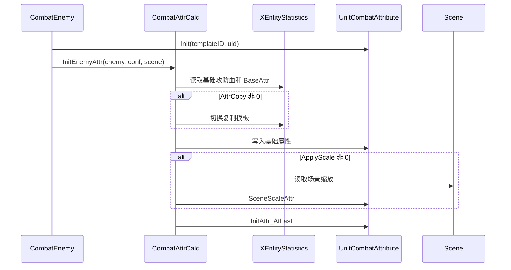

# CombatAttrCalc 属性初始化

## 卡片说明

| 项 | 内容 |
| --- | --- |
| 模块 | `CombatAttrCalc`。 |
| 职责 | 从表和场景读取基础属性，处理复制、缩放和当前值初始化。 |
| 下游 | 伤害、移动速度、Buff、技能 CD、同步。 |

## 功能

| 功能 | 函数 |
| --- | --- |
| Enemy 属性初始化 | `InitEnemyAttr` |
| 召唤物属性初始化 | `InitSpawnAttr` |
| 表属性加载 | `InitEnemyAttr_OfTable` |
| 场景缩放 | `SceneScaleAttr` |
| 队伍缩放 | `TeamScaleAttr` |
| 最终当前值 | `InitAttr_AtLast` |
| 运行时派生速度 | `GetRunSpeed`, `GetFlySpeed`, `GetAttackSpeed` |

## 初始化时序

## 排查入口

| 现象 | 检查字段 |
| --- | --- |
| 属性过高/过低 | `AttrCopy`, `ApplyScale`, `BaseAttr`, 场景/队伍缩放。 |
| 召唤物属性异常 | caller 复制、`CallerAttrList`、caller 等级。 |
| 速度异常 | `RunSpeed`, `FlySpeed`, speed percent, scale。 |

