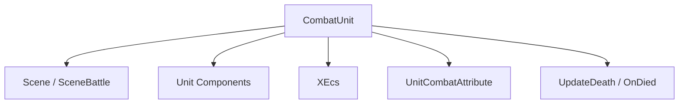
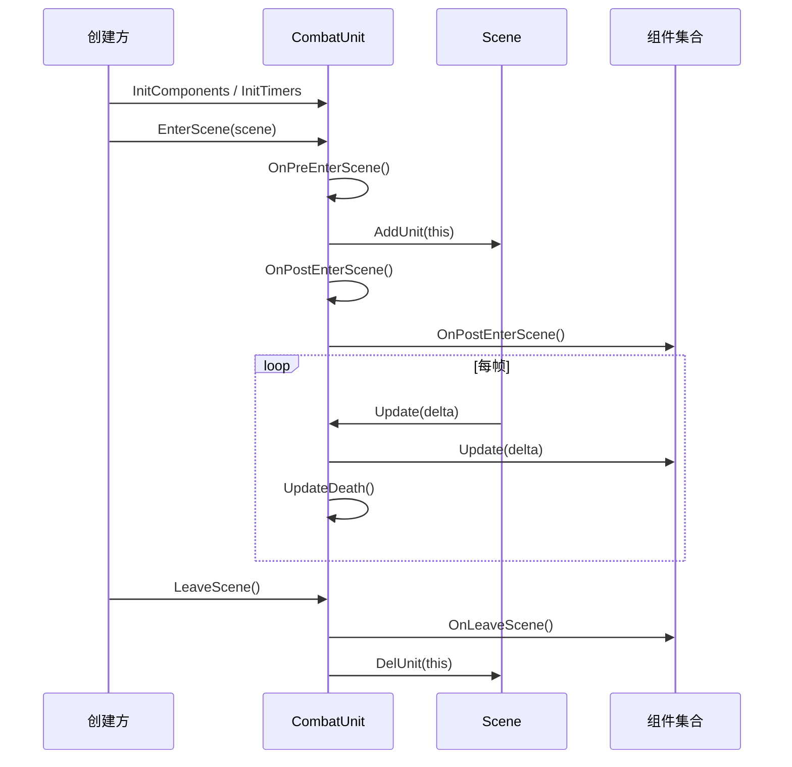
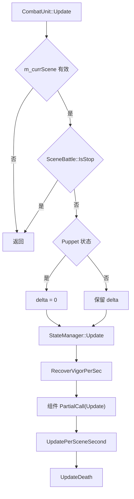

# CombatUnit 运行骨架

## 卡片说明

| 项 | 内容 |
| --- | --- |
| 模块 | `CombatUnit` 基类。 |
| 职责 | 保存 Unit 身份、场景指针、生命周期状态和通用事件入口。 |
| 边界 | 不展开具体组件内部逻辑；组件见 [Unit 组件系统](unit-components.md)。 |

## 核心字段

| 字段 | 来源 | 用途 |
| --- | --- | --- |
| `m_uID` | `CombatUnit::NewId` 或外部传入 | Unit 逻辑 UID。 |
| `m_uEcsID` | `xecs::create` | ECS 实体 ID。 |
| `m_currScene` | `EnterScene` / `LeaveScene` | 当前场景。 |
| `m_uTemplateID` | 模板初始化 | 配置模板 ID。 |
| `m_uPresentID` | 模板初始化 | 表现 ID。 |
| `m_uEntitySpecies` | `XEntityStatistics.Type` | 决定组件 typelist。 |
| `m_bDeathFlag` / `m_IsDead` | 死亡流程 | 防重复死亡和清理。 |
| `m_bDestroying` | 销毁流程 | 防重复释放。 |

## 模块关系图

## 生命周期时序图

## 更新流程

## 排查入口

| 现象 | 优先检查 |
| --- | --- |
| 离场后访问 crash | `m_currScene`、`LeaveScene` 顺序、组件是否仍持有 UID。 |
| 不更新 | 场景暂停、puppet 状态、是否进场。 |
| 死亡没触发 | `m_bDeathFlag`、`ATTR_CurrentHp`、`UpdateDeath`。 |

