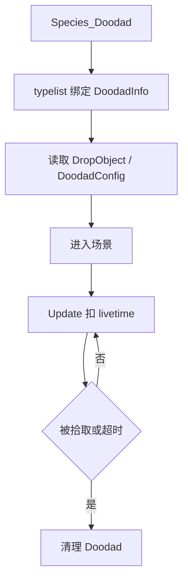

# DoodadInfo 掉落物信息

## 卡片说明

| 项 | 内容 |
| --- | --- |
| 模块 | `DoodadInfo`。 |
| 职责 | 管理 Doodad/drop 的配置行、生命周期和拾取状态。 |
| 配置 | `DropObject.txt` 和 `DoodadConfig`。 |

## 字段

| 字段 | 用途 |
| --- | --- |
| `m_row` | `DropObject` 配置行。 |
| `m_creatorUid` | 创建者 UID。 |
| `m_livetime` | 生命周期。 |
| `m_buffIndex` | Buff 组索引。 |
| `m_pickRoleID` | 拾取角色。 |

## 生命周期流程

## 排查入口

| 现象 | 检查点 |
| --- | --- |
| 掉落物不出现 | species、typelist、DropObject。 |
| 拾取异常 | `m_pickRoleID` 和生命周期。 |
| 清理异常 | Doodad 清理事件和场景删除。 |

