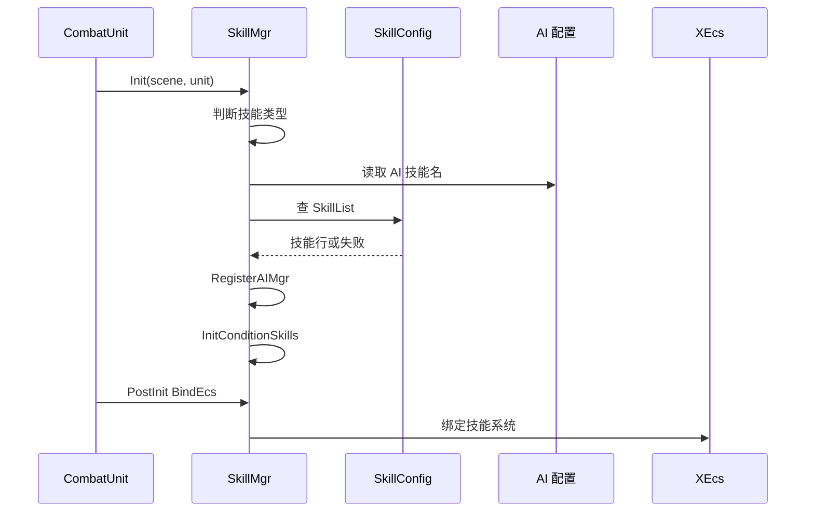

# SkillMgr 技能管理

## 卡片说明

| 项 | 内容 |
| --- | --- |
| 模块 | `SkillMgr` / `SkillCore`。 |
| 职责 | 创建技能对象，注册 AI 技能分类，绑定 ECS 技能系统。 |
| 配置 | Role、Enemy、Spawn 分别走不同技能表。 |

## 字段

| 字段 | 用途 |
| --- | --- |
| `m_type` | `SKILL_ROLE` / `SKILL_ENEMY` / `SKILL_SPAWN`。 |
| `m_AllSkills` | 所有技能对象。 |
| `m_SkillMap` | skill hash 到 `SkillCore`。 |
| `m_ai_mgr` | AI 技能分类。 |
| `m_HpMaxSkills` / `m_StageSkills` | 条件技能索引。 |

## 初始化时序

## 排查入口

| 现象 | 检查点 |
| --- | --- |
| 技能对象不存在 | `m_SkillMap`、`CreateSkill`、技能类型。 |
| AI 不用技能 | `RegisterAIMgr` 和 `AISkillType`。 |
| HP 阈值技能不触发 | `m_HpMaxSkills`、`HpMaxLimit`。 |

