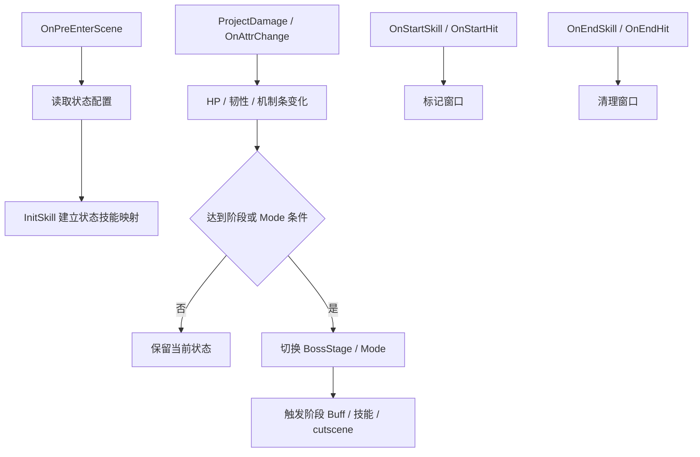

# StateManager 状态管理

## 卡片说明

| 项 | 内容 |
| --- | --- |
| 模块 | `StateManager`。 |
| 职责 | 驱动阶段、Mode、韧性/异常、机制条和技能/hit 窗口状态。 |
| 配置 | `EnemyStage`, `EnemyModeState`, `EnemyResist`, `EnemyJZ`, `PlayerJZ`。 |

## 字段

| 字段 | 用途 |
| --- | --- |
| `mBossModeState` | Boss Mode 状态。 |
| `mBossStage` | 阶段。 |
| `mAllSkillType` | 技能 hash 到状态技能类型。 |
| `m_isSkillCasting` / `m_isHiting` | 技能和 hit 窗口。 |

## 状态事件流程

## 排查入口

| 现象 | 检查点 |
| --- | --- |
| 阶段不切 | 当前 HP、`EnemyStage.StaticsID`、BossStage 条件。 |
| 状态技能不放 | `mAllSkillType`、`SkillListForEnemy.ModeUse`。 |
| 状态延迟 | `HandleDelay` 和技能/hit 窗口。 |

