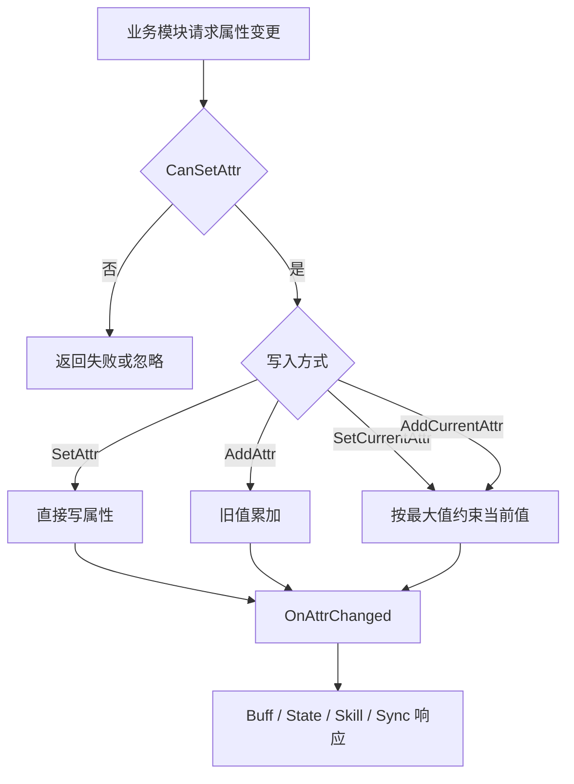

# UnitCombatAttribute 属性容器

## 卡片说明

| 项 | 内容 |
| --- | --- |
| 模块 | `UnitCombatAttribute` / `AttrData`。 |
| 职责 | 保存所有战斗属性，提供读写和当前值约束。 |
| 配置 | `AttrDefine.txt` 决定属性类型和同步标记。 |

## 字段

| 字段 | 用途 |
| --- | --- |
| `AttrData::mAttrData` | 所有属性值。 |
| `AttrData::mAttrDataMax` | 多来源最大值类属性。 |
| `AttrData::mUId` | Unit UID。 |
| `AttrData::mUnitId` | 模板或伙伴 ID。 |

## 属性读写流程

## 排查入口

| 现象 | 检查点 |
| --- | --- |
| 当前 HP 异常 | 当前值是否被最大值约束；初始化顺序是否正确。 |
| 属性不同步 | `AttrDefine` 同步标记和 `RoleAttrConfig`。 |
| 属性递归变化 | `m_oWatcherStack` 和 `OnAttrChanged` 调用链。 |

