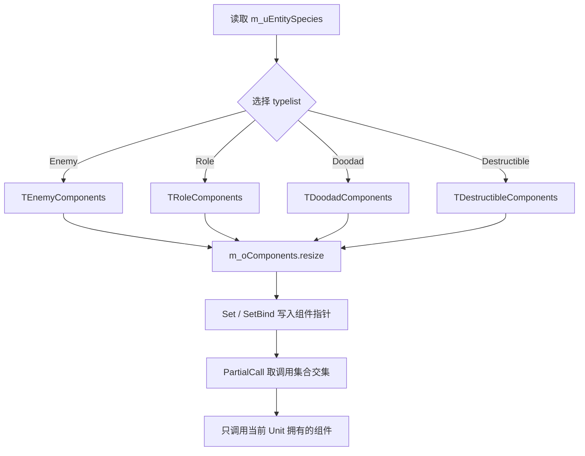

# Unit 组件系统

## 卡片说明

| 项 | 内容 |
| --- | --- |
| 模块 | Unit 组件容器和 typelist。 |
| 职责 | 根据 `m_uEntitySpecies` 选择组件集合，并按集合调用生命周期函数。 |
| 边界 | 只讲组件装配和调用；具体组件见各自卡片。 |

## 组件集合

| 集合 | 组件 |
| --- | --- |
| `TEnemyComponents` | `UnitMove`, `AIEntity`, `XNavigation`, `XBuffContainer`, `PlatInfo`, `Attachment`, `SkillMgr`, `UnitCombatAttribute`, `TransformInfo`, `BindInfo`, `UnitController` |
| `TRoleComponents` | `UnitMove`, `XNavigation`, `SkillMgr`, `AIEntity`, `UnitCombatAttribute`, `XBuffContainer`, `BindInfo`, `UnitController` |
| `TDoodadComponents` | Enemy 集合裁剪后追加 `DoodadInfo` |
| `TDestructibleComponents` | Enemy 集合裁剪 AI、导航、平台、绑定、控制器等 |

## 组件选择流程

## 调用规则

| 规则 | 说明 |
| --- | --- |
| `Set<T>` | 按 typelist 下标写入 `m_oComponents`。 |
| `SetBind<T>` | 写入后调用 `component->SetUnit(this)`。 |
| `PartialCall` | 只调用当前 typelist 和调用集合的交集。 |
| `Get<T>` crash | 优先查 species、typelist 和 `InitComponents`。 |

