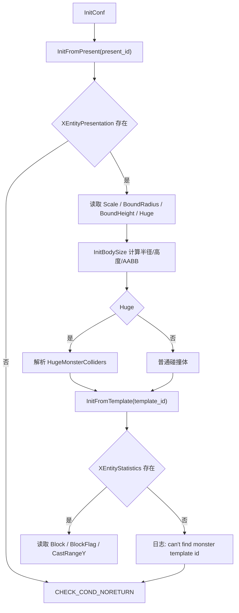

# UnitConf 配置封装

## 卡片说明

| 项 | 内容 |
| --- | --- |
| 模块 | `UnitConf` / `UnitPhysicsConf`。 |
| 职责 | 聚合模板、表现、体型、碰撞和 Buff tag 配置。 |
| 下游 | `UnitMove`、`UnitController`、`XNavigation`、Buff 目标判断。 |

## 字段

| 字段 | 来源 | 用途 |
| --- | --- | --- |
| `present_conf_` | `XEntityPresentation` | 表现、体型、碰撞、Buff tag。 |
| `template_conf_` | `XEntityStatistics` | 模板、属性、AI、技能、阵营。 |
| `phys_conf_` | 模板/表现组合 | 运行时物理参数。 |
| `bound_aabb_conf_` | `InitBodySize` | Unit AABB。 |
| `m_BuffListTags` | `BuffListTag` | Buff 目标匹配。 |

## 配置加载流程

## 排查入口

| 现象 | 检查字段 |
| --- | --- |
| 怪物体型异常 | `Scale`, `BoundRadius`, `BoundHeight`, `HugeMonsterColliders`。 |
| 碰撞状态异常 | `Block`, `BlockFlag`, `CollisionStatus`。 |
| 模板缺失 crash | `XEntityStatistics.ID` 和调用方传入模板 ID。 |

