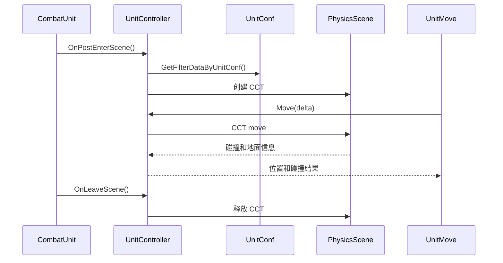

# UnitController 物理控制器

## 卡片说明

| 项 | 内容 |
| --- | --- |
| 模块 | `UnitController`。 |
| 职责 | 将 Unit 物理参数转成 PhysX CCT，并执行碰撞移动。 |
| 上游 | `UnitConf`, fight group, physics scene。 |

## 字段

| 字段 | 用途 |
| --- | --- |
| `m_controller` | PhysX CCT 指针。 |
| `m_filterData` | 碰撞过滤数据。 |
| `m_queryCache` | PhysX 查询缓存。 |
| `m_curGroundHeight` | 当前地面高度。 |

## 控制器时序

## 排查入口

| 现象 | 检查点 |
| --- | --- |
| 物理碰撞异常 | fight group、always collider、skill collider。 |
| 位置纠正后偏差 | `OnCorrectPosition` 是否同步 controller。 |
| 离场 crash | `OnLeaveScene` 是否释放 CCT。 |

