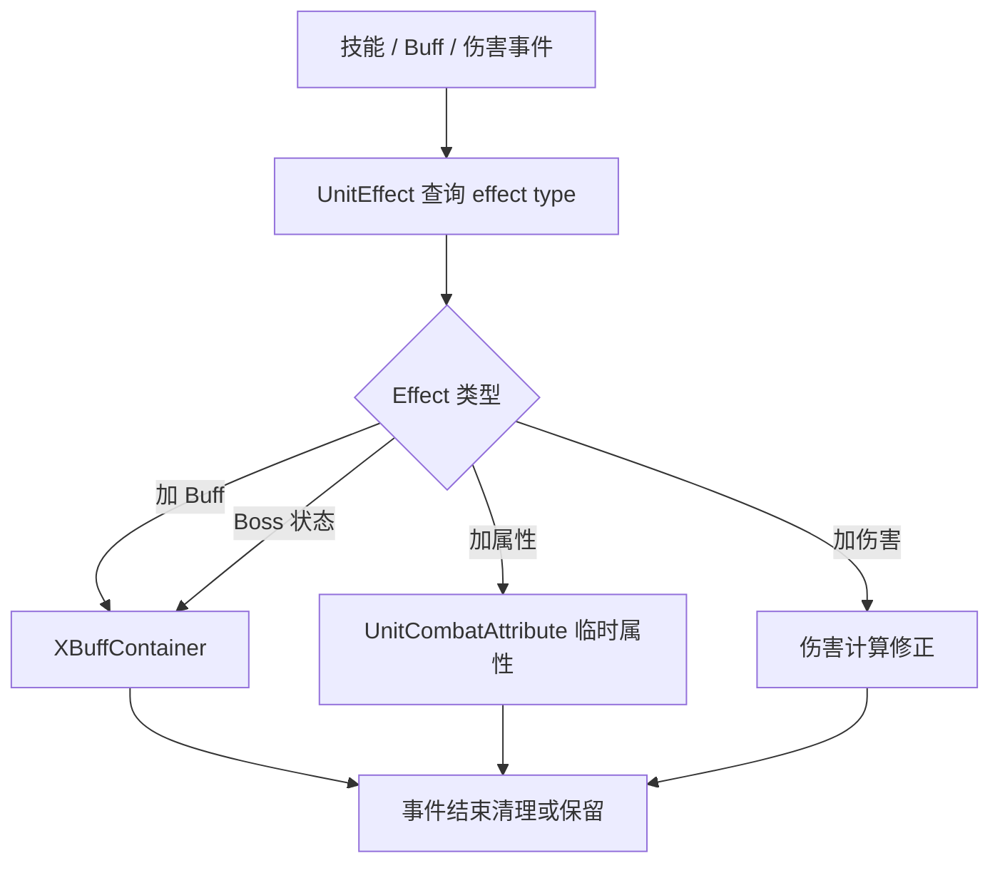

# UnitEffect Affix Effect

## 卡片说明

| 项 | 内容 |
| --- | --- |
| 模块 | `UnitEffect` / `AttrEffect`。 |
| 职责 | 按 `AffixEffect` 配置在事件中加 Buff、改属性或修正伤害。 |
| 配置 | `AffixEffect.txt`。 |

## 主要类型

| 类型 | 含义 |
| --- | --- |
| `SKILL_ADDBUFF_TYPE` | 技能开始/结束加 Buff。 |
| `CALL_PET_ADDBUFF` | 召唤物加 Buff。 |
| `ATTACK_ADDATTR_TYPE` | 攻击时加属性。 |
| `SKILL_ADD_DAMAGE_TYPE` | 技能加伤害。 |
| `BOSS_ENTER_STATE_TYPE` | Boss 进入状态加 Buff。 |

## Effect 流程

## 排查入口

| 现象 | 检查点 |
| --- | --- |
| Effect 没触发 | 事件入口和 `AffixEffectConfig`。 |
| Buff 时间异常 | Buff changetime effect。 |
| 伤害倍率异常 | `SKILL_ADD_DAMAGE_TYPE` 和 DOT scale。 |

