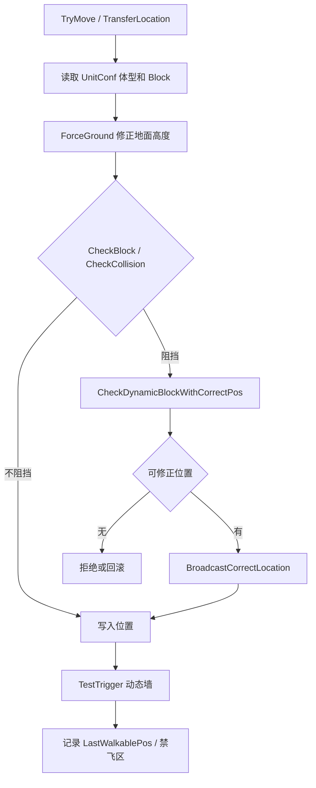

# UnitMove 移动与碰撞修正

## 卡片说明

| 项 | 内容 |
| --- | --- |
| 模块 | `UnitMove`。 |
| 职责 | 处理移动、地面高度、阻挡碰撞、墙触发和位置纠正。 |
| 配置 | `Block`, `BlockFlag`, `BoundRadius`, `DynamicWall.txt`, 场景地图数据。 |

## 字段

| 字段 | 用途 |
| --- | --- |
| `scene_` | 当前战斗场景缓存。 |
| `m_lastWalkablePos` | 最近可行走位置。 |
| `m_returnWalkableArea` | 是否需要返回可行走区。 |
| `m_inNoFreeFlyZone` | 是否在禁自由飞区域。 |

## 移动流程

## 排查入口

| 现象 | 检查点 |
| --- | --- |
| 穿墙 | `CheckBlock`、`DynamicWall`、`BlockFlag`。 |
| 被拉回 | `m_lastWalkablePos`、非可行走区检查。 |
| 高度异常 | `ForceGround`、地图 query、空中单位标记。 |

