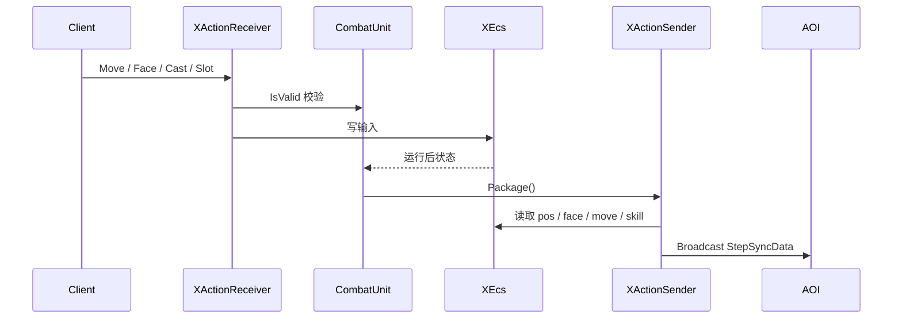

# Unit 同步模块

## 卡片说明

| 项 | 内容 |
| --- | --- |
| 模块 | `EcsSnapshot` / `XActionSender` / `XActionReceiver`。 |
| 职责 | 接收客户端输入，读取 ECS 状态并广播同步数据。 |
| 关键风险 | 平台绑定、本地坐标、技能状态和移动状态不一致。 |

## Snapshot 字段

| 字段 | 来源 |
| --- | --- |
| `uid` / `ecs_id` | Unit。 |
| `pos` / `face` | Unit/ECS。 |
| `binded` / `local_pos` | 平台绑定。 |
| `move_type` / `state_type` | ECS。 |
| `scrpit` | 当前技能 hash。 |

## 同步时序

## 排查入口

| 现象 | 检查点 |
| --- | --- |
| 位置同步错 | `binded`, `local_pos`, ECS pos。 |
| 技能状态错 | `scrpit` 和 `state_type`。 |
| 输入无效 | `XActionReceiver::IsValid`。 |

