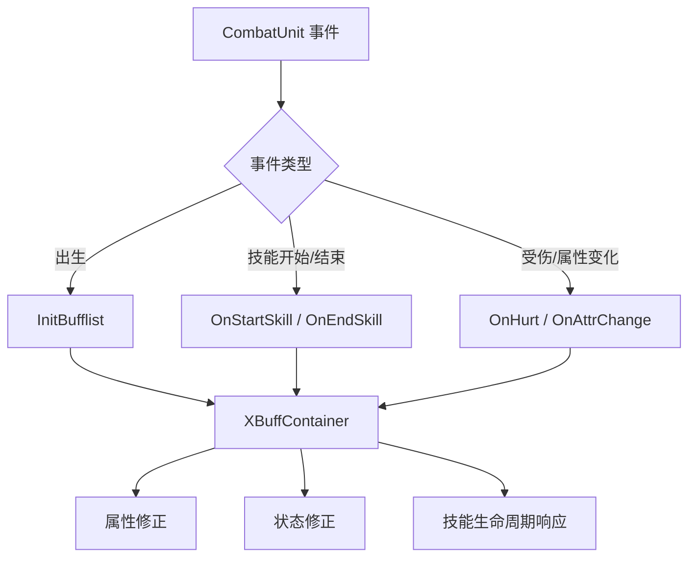

# XBuffContainer Buff 容器接入

## 卡片说明

| 项 | 内容 |
| --- | --- |
| 模块 | `XBuffContainer` 在 Unit 层的接入。 |
| 职责 | 承接 Buff 生命周期、技能事件、伤害事件和属性变化。 |
| 边界 | Buff 内部公式和具体 Buff 配置后续可独立拆卡。 |

## 接入点

| 接入点 | Unit 行为 |
| --- | --- |
| `CombatUnit::InitComponents` | 绑定到组件集合。 |
| `CombatUnit::Update` | 每帧更新。 |
| `CombatEnemy::InitBufflist` | 加出生 Buff。 |
| 技能事件 | `OnStartSkill`, `OnEndSkill`。 |
| 伤害/属性事件 | 影响属性、状态和技能。 |

## 事件流程

## 排查入口

| 现象 | 检查点 |
| --- | --- |
| 出生 Buff 没有 | `InBornBuff`、`InitBufflist` 是否执行。 |
| 技能 Buff 不触发 | 技能事件是否传到 Buff 容器。 |
| 属性被异常修改 | Buff 事件和 `UnitEffect`。 |

