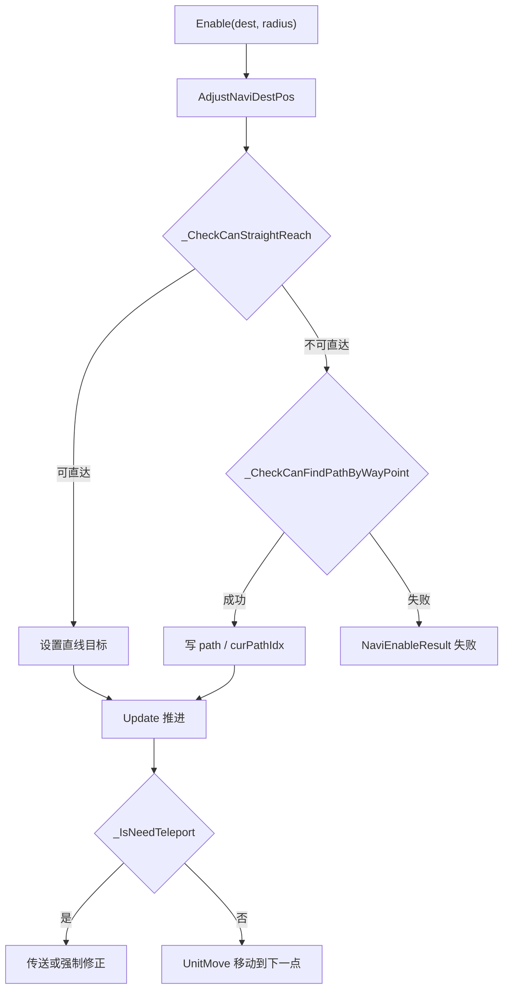

# XNavigation 导航模块

## 卡片说明

| 项 | 内容 |
| --- | --- |
| 模块 | `XNavigation`。 |
| 职责 | 给 AI 和移动提供目的点导航、路径推进和失败原因。 |
| 下游 | `UnitMove` 执行实际移动。 |

## 字段

| 字段 | 用途 |
| --- | --- |
| `m_originDestPos` / `m_adjustedDestPos` | 原始和修正目标点。 |
| `m_path` / `m_curPathIdx` | 当前路径点。 |
| `m_naviMode` | WaypointGraph 导航模式。 |
| `m_nResult` | 导航结果。 |

## 导航流程

## 排查入口

| 现象 | 检查点 |
| --- | --- |
| AI 不追人 | `Enable` 是否成功、目标点和半径。 |
| 导航失败 | `[Navi]` 日志和 `NaviEnableResult`。 |
| 频繁传送 | `teleLimit`、路径点、可达检查。 |

